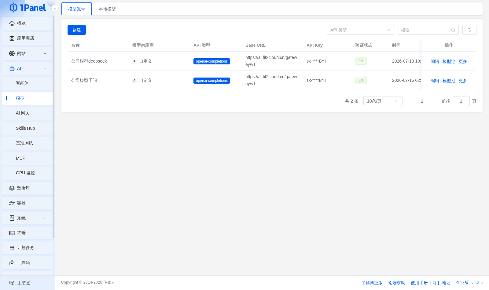
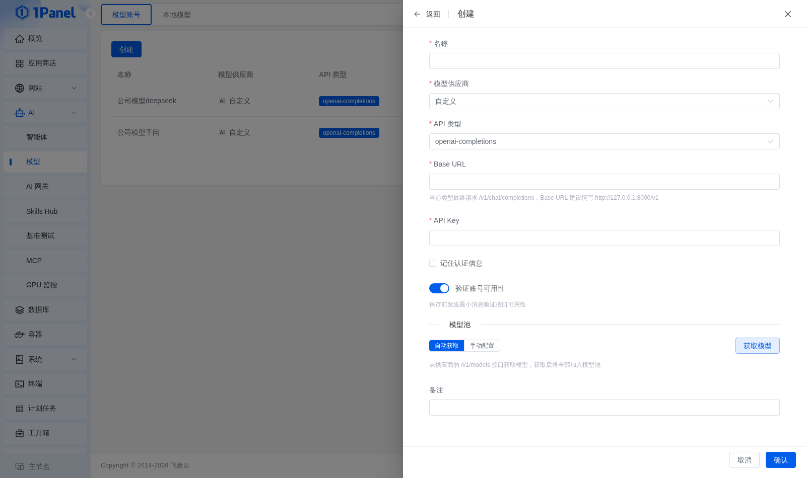
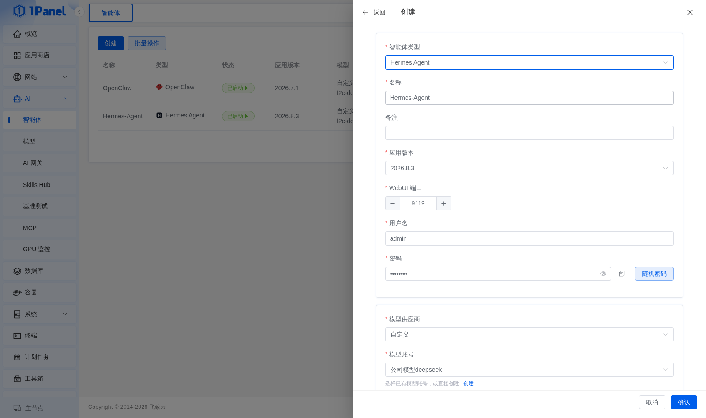
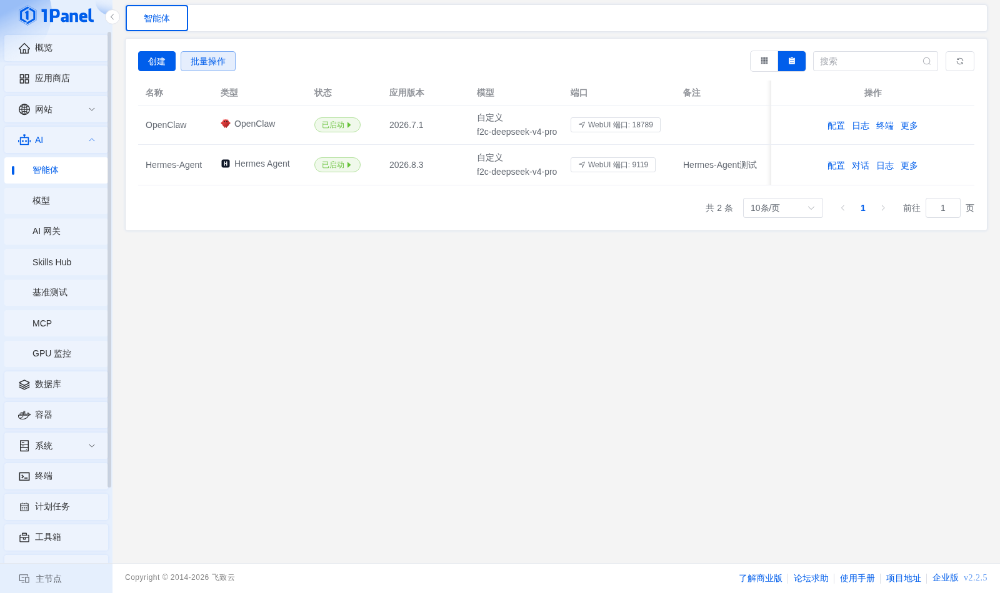
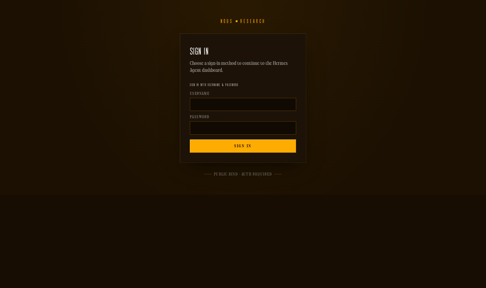
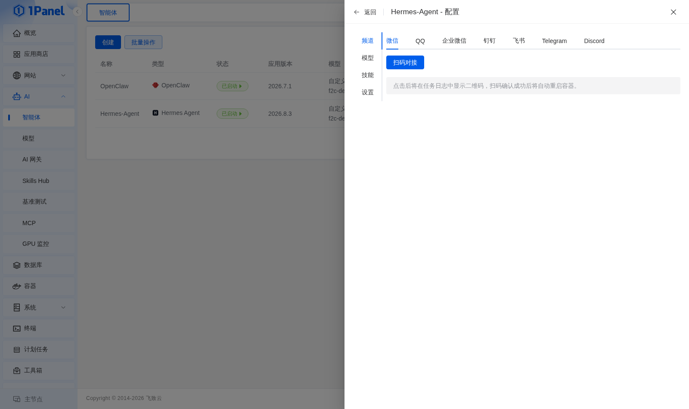
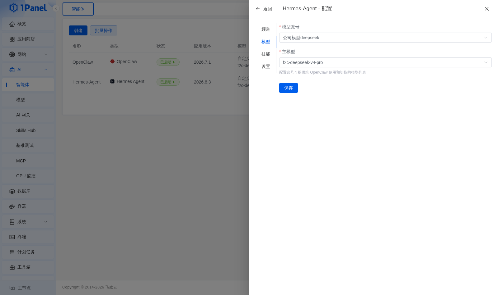
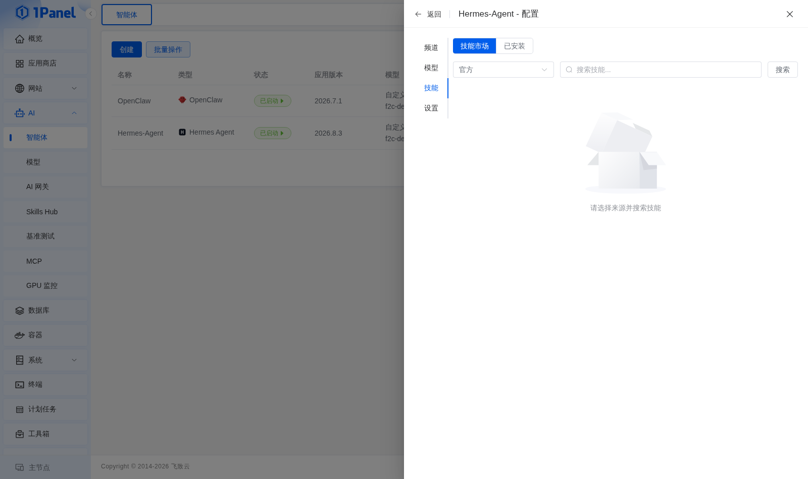
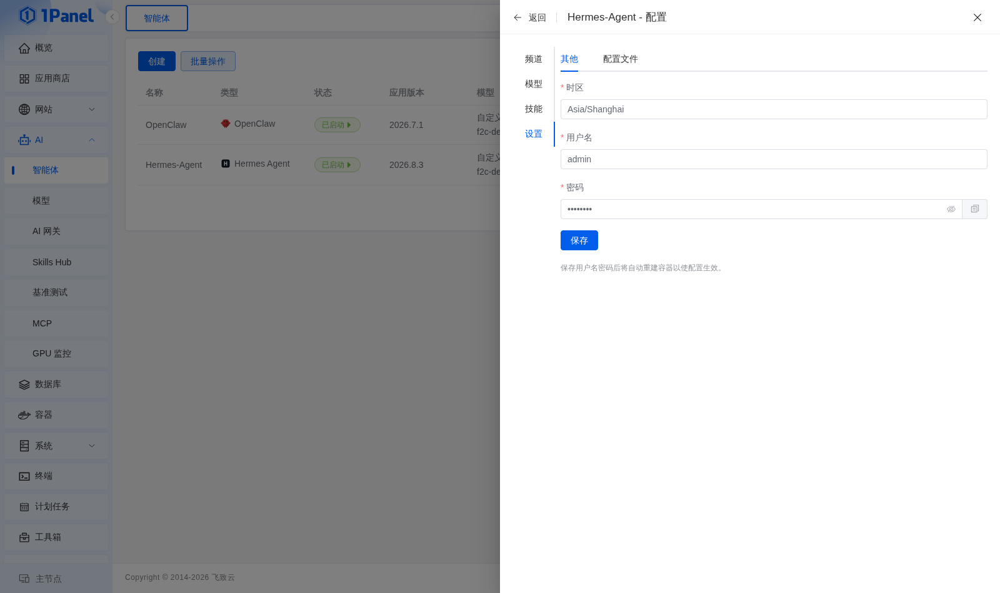

# Hermes Agent 安装部署

## 产品介绍

!!! note ""
    **Hermes Agent** 是 Nous Research 构建的自我改进型 AI Agent。它内置学习循环，可以从使用经验中创建和改进技能，保留长期记忆，检索历史会话，并在多次会话之间持续建立对用户的理解。

    Hermes Agent 不绑定在本地电脑上，既可以运行在 VPS、GPU 集群等环境中，也可以通过命令行、Web UI 或消息平台与用户交互。1Panel 安装包提供浏览器 Web UI，用于管理配置、API Key，并查看运行状态和会话信息。

    本文档基于 1Panel 的 **AI -> 智能体** 功能，介绍如何完成 Hermes Agent 的安装部署与基础验证。

    **扫码加入交流群**

    

## 前提准备

!!! note ""
    部署前请先确认以下条件：

    - 已安装并可正常访问 1Panel
    - 已准备可用的大语言模型 API Key，或已在 1Panel 中接入本地模型
    - 服务器可正常访问互联网

## 1. 添加模型账号

!!! note ""
    进入 1Panel 面板后，打开 **AI** 菜单，进入 **模型账号** 页面。

    点击 **添加模型账号**，根据实际使用的模型供应商填写对应信息并保存。

!!! note ""
    保存成功后，可在模型账号列表中确认新建账号是否已正常显示。

## 2. 创建 Hermes Agent 智能体

!!! note ""
    完成模型账号创建后，进入 **AI** 菜单下的 **智能体** 页面，点击 **创建**。

    在智能体类型中选择 **Hermes Agent**，然后按页面要求填写部署参数。

!!! note "参数说明"
    - **智能体类型**：选择 `Hermes Agent`
    - **名称**：默认可填写为 `hermes-agent`，也可按需自定义
    - **应用版本**：选择需要安装的 Hermes Agent 版本
    - **WebUI 端口**：按照页面默认值或实际需求配置
    - **用户名 / 密码**：设置 WebUI 的访问凭据，也可以使用 **随机密码** 自动生成
    - **模型供应商**：选择前面已创建的模型账号对应供应商
    - **模型账号 / 模型**：根据实际场景选择具体模型
    - **其他参数**：一般保持默认即可

!!! note ""
    选择模型供应商后，系统会自动加载已维护的模型账号。

    如已配置多个模型，可在创建页面中选择具体模型；如有额外配置项，请按页面提示填写。

    参数填写完成后，建议再次核对名称、版本、端口及模型配置是否正确，再提交安装。

## 3. 开始安装并确认完成

!!! note ""
    参数确认无误后，点击 **确认** 开始安装。

    当页面显示安装完成后，即表示 Hermes Agent 已成功部署。安装完成后，智能体列表中会显示对应的运行状态和 WebUI 端口。

!!! note ""
    安装过程中如需查看进度，可留意页面中的状态变化，等待任务执行完成。

## 4. 访问 Hermes Agent WebUI

!!! note ""
    安装完成后，返回 **智能体** 列表页面，找到 Hermes Agent，点击 **WebUI 端口** 即可直接跳转访问。

    首次打开时，如页面仍在初始化，可稍等片刻后再刷新访问。

## 5. 后续配置说明

!!! note ""
    完成基础部署后，你还可以继续在 1Panel 中根据实际业务场景调整 Hermes Agent 的模型、访问方式或其他运行参数。

