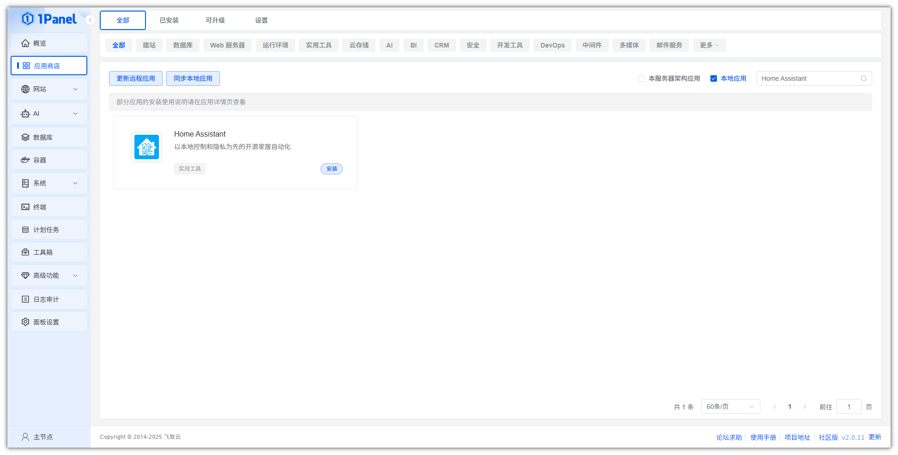
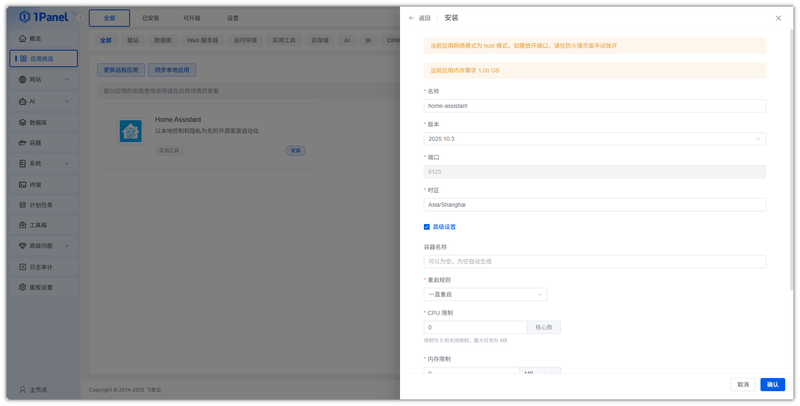
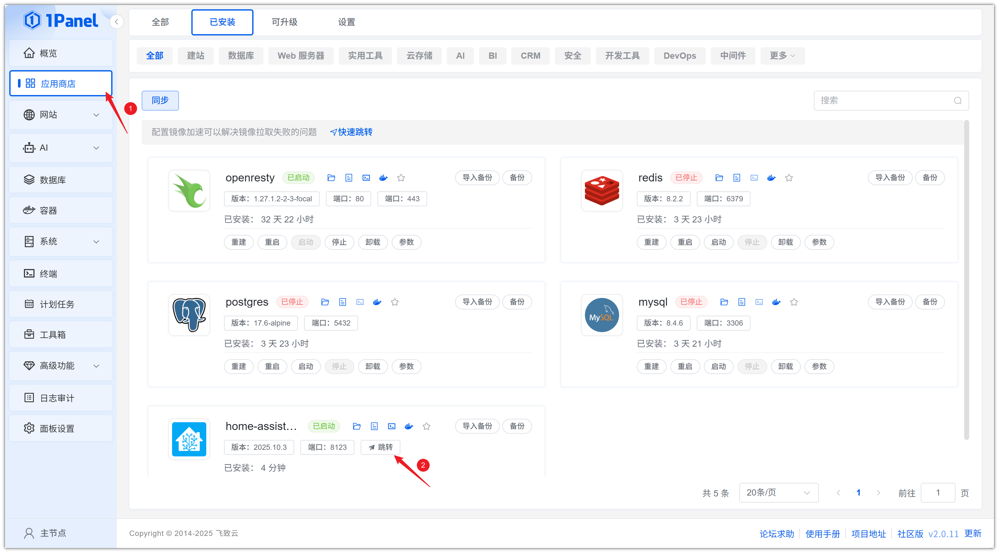
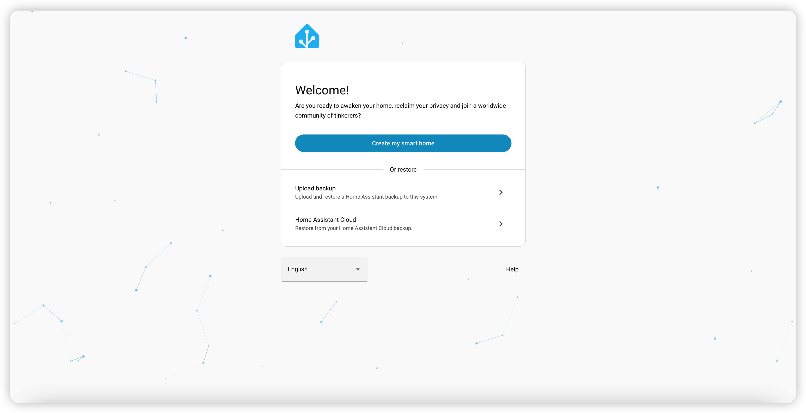

# Install Home Assistant Visually Using 1Panel

!!! note ""
    **Home Assistant** is a smart home automation platform that offers rich features and flexibility for controlling and automating various smart devices and services in your home.

## 1. Open the App Store

!!! note ""
    After entering the 1Panel console, click **App Store** in the left menu.

{: .browser-mockup}

## 2. Search for Home Assistant and Install

!!! note ""
    Enter **Home Assistant** in the search box in the upper right corner, click the application card to go to the details page, then select **Install**.

{: .browser-mockup}

## 3. Configure Installation Parameters

!!! note ""
    You can configure the following as needed:

    - **Name**: Customize the application name (default: home-assistant)
    - **Version**: Select the desired Home Assistant version from the dropdown
    - **Port**: Access port for the application (default: 8123)
    - **Timezone**: Set the container runtime timezone (default: Asia/Shanghai)

    After confirming the settings are correct, click the **Confirm** button to start installation.

{: .browser-mockup}

!!! note ""
    Wait for the installation to complete.

## 4. Access the Home Assistant Service

!!! note ""
    After installation, confirm the default access address in 1Panel. Skip this step if already configured.

{: .browser-mockup}

!!! note ""
    Return to the App Store and click **Jump** to access the Home Assistant service.

{: .browser-mockup}

!!! note ""
    Complete the initial configuration to start using the service.

{: .browser-mockup}
