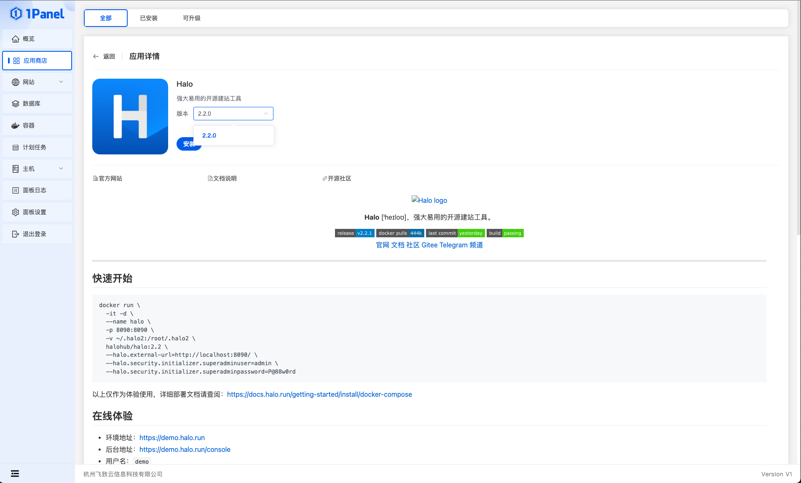
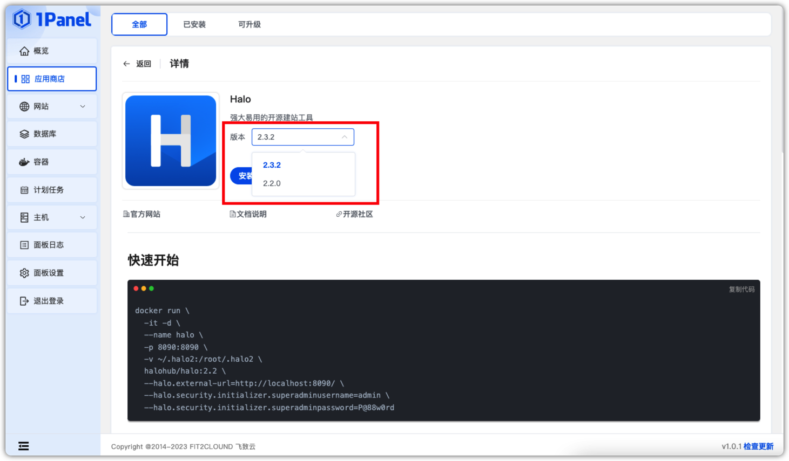
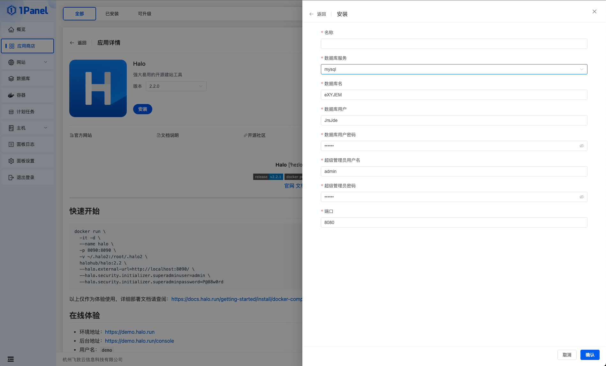
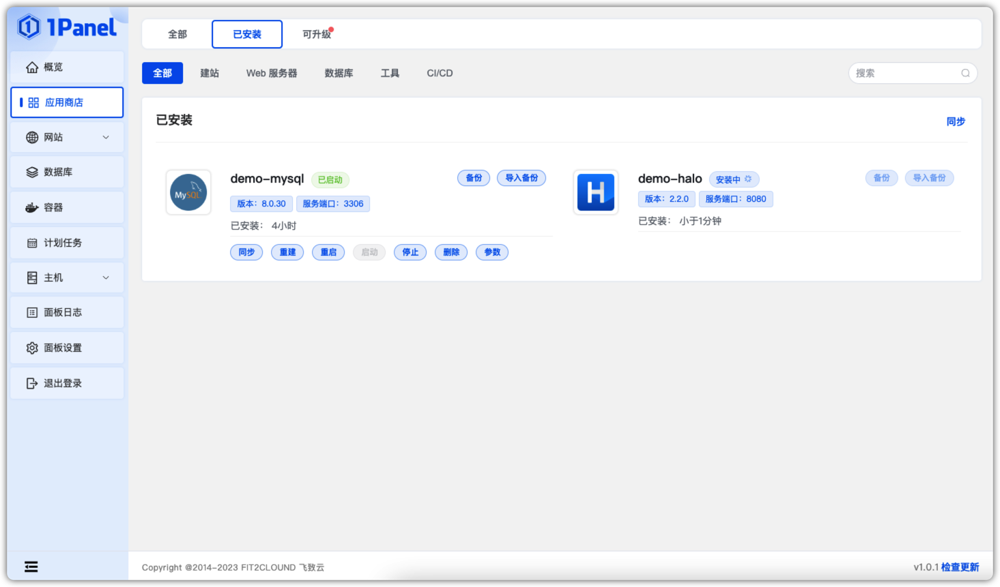

!!! Abstract ""

    在应用商店列表中选择应用进行安装，本文将以安装 Halo 为例进行示范。

## 安装步骤

!!! Abstract ""

    1、点击【安装】进入应用详情。

!!! Abstract ""

    2、选择一个版本，点击安装。
    

!!! Abstract ""
    
    3、填写相关参数。

!!! Abstract ""
    
    4、点击确认，等待应用安装结束。

