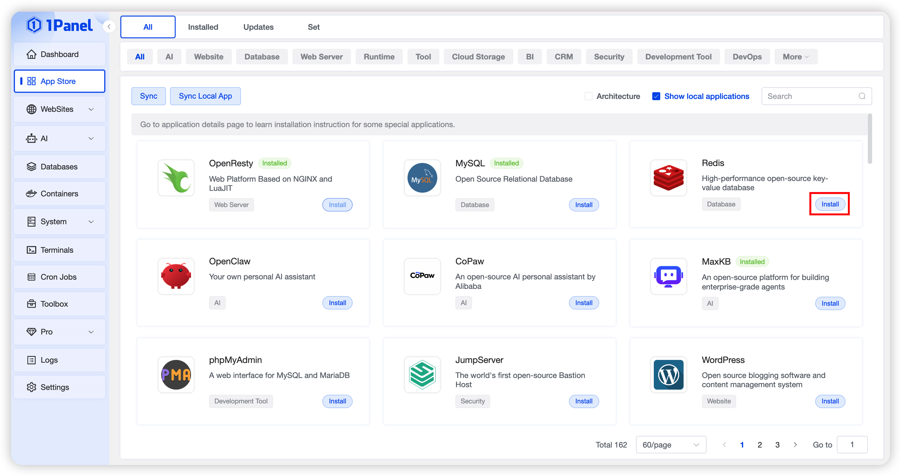
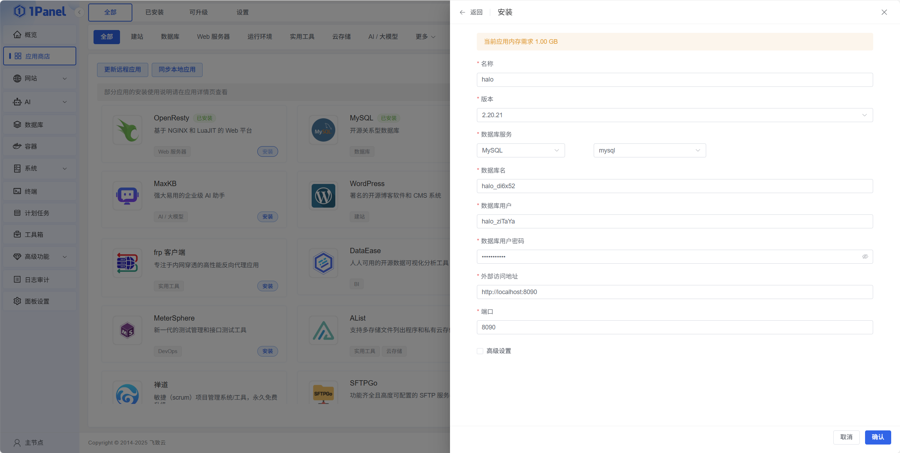
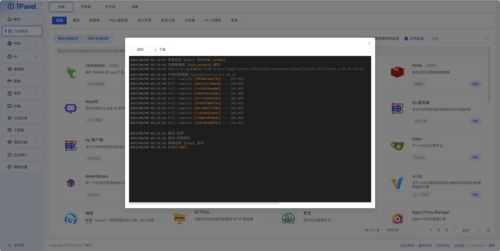
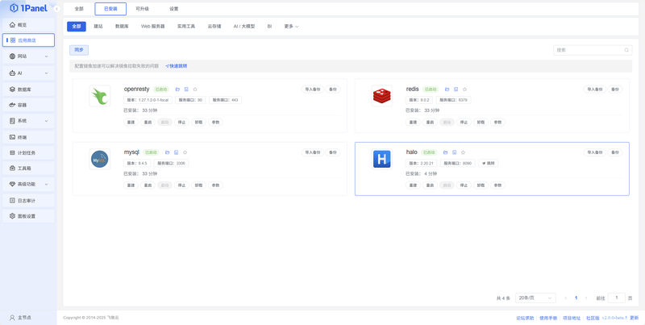

!!! note ""
    Locate and install the target application in the App Store list. You can browse by application category, or quickly search by entering keywords in the search box in the upper right corner.
    > This article uses **Halo** installation as an example.

## 1 Application Installation

!!! note ""
    (1) Click the **Install** button to enter the application details page.

{: .browser-mockup}

!!! note ""
    (2) Fill in parameters such as database and port.

{: .browser-mockup}

!!! note ""
    (3) Configure advanced settings, such as whether to expose external ports, set resource limits, and edit the Compose file. Finally, click the **Confirm** button. The application installation log interface will appear; wait for the installation to complete.

{: .browser-mockup}

{: .browser-mockup}
