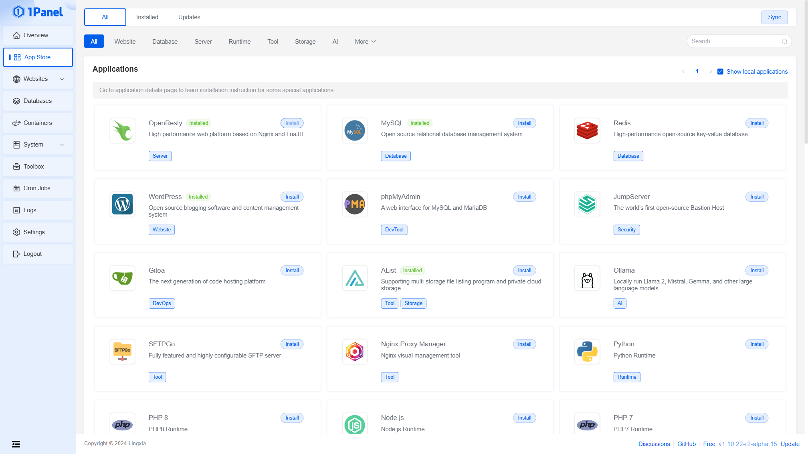
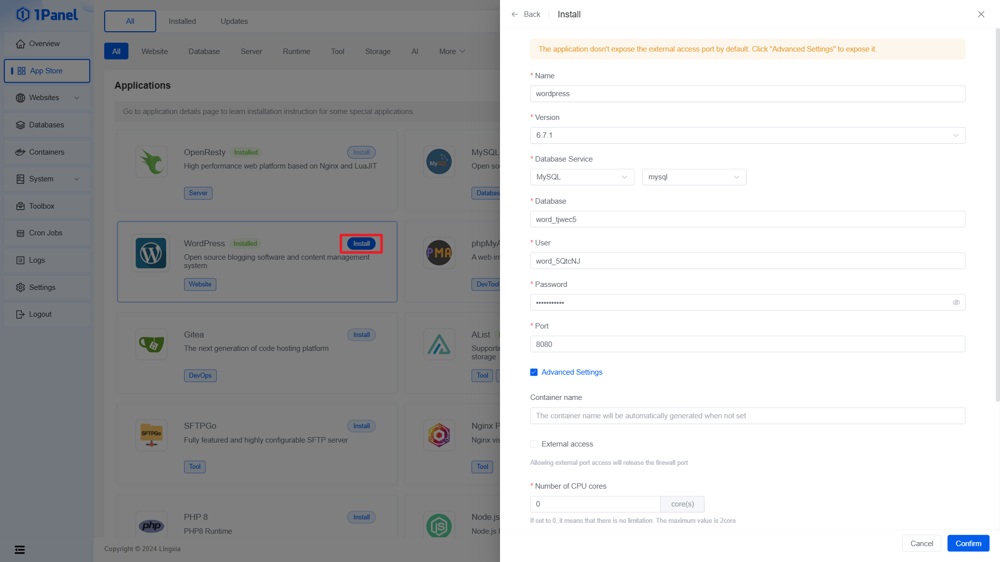
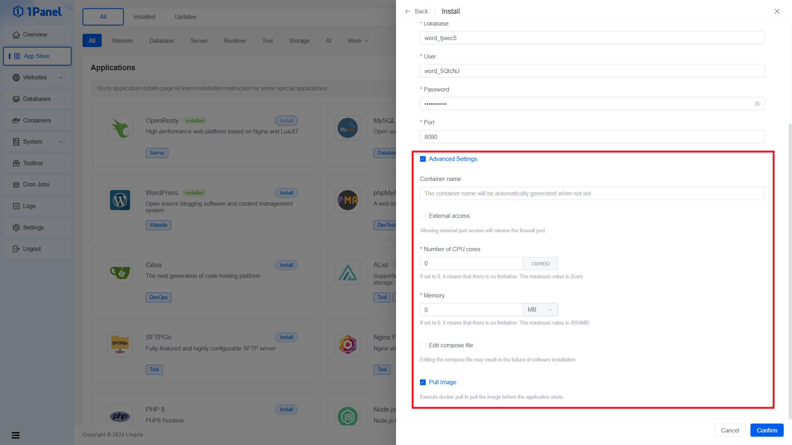

# Install Application

## Browse App list

Find and install the target application in the app store list. You can browse through application categories or directly enter keywords in the search box in the top right corner for quick search.

## Start Installation

Click the `Install` button to enter the application details page.

## Fill in App parameters

Fill in parameters such as database and port.

## Advanced setting

Additionally, advanced setting options are supported, such as whether to expose external ports, resource limits, and editing compose files, etc.

Finally, click the `Confirm` button and wait for the application installation to complete.

