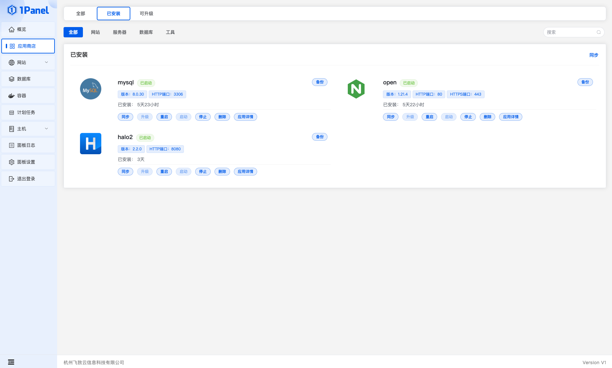
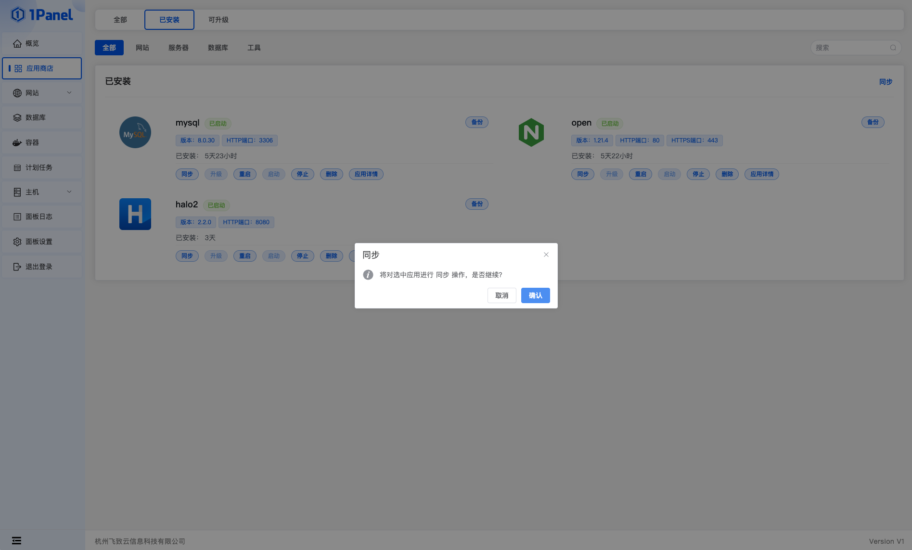
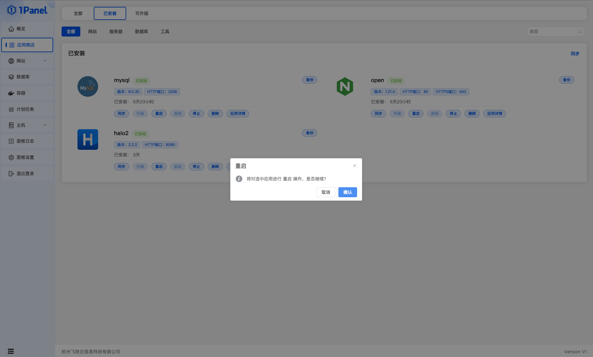
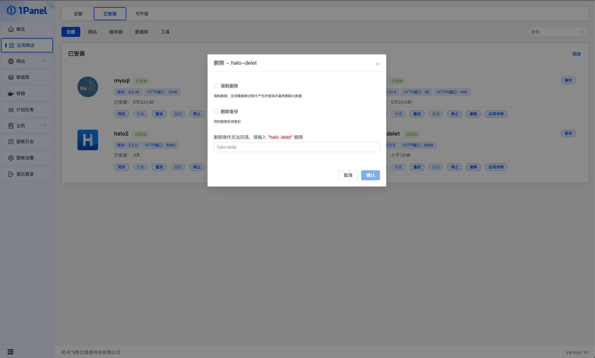
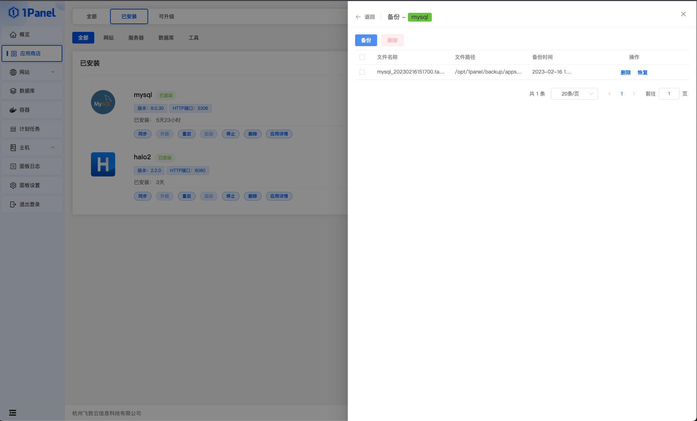
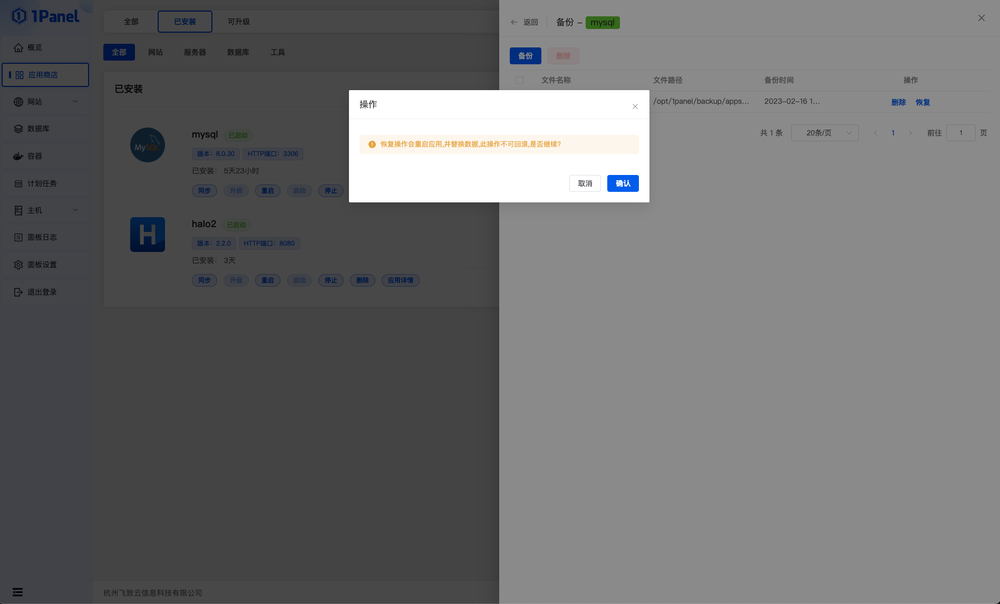
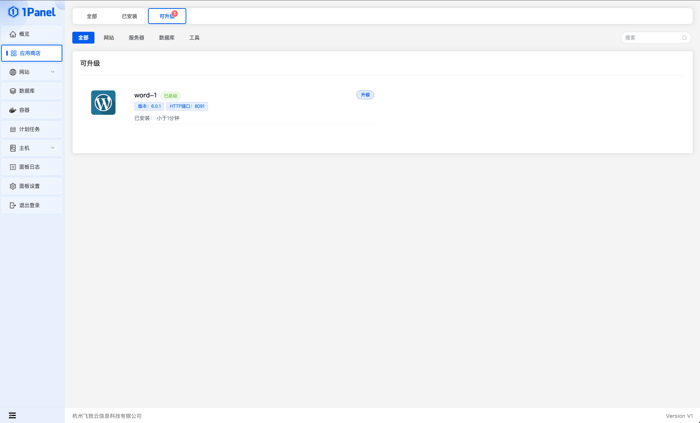
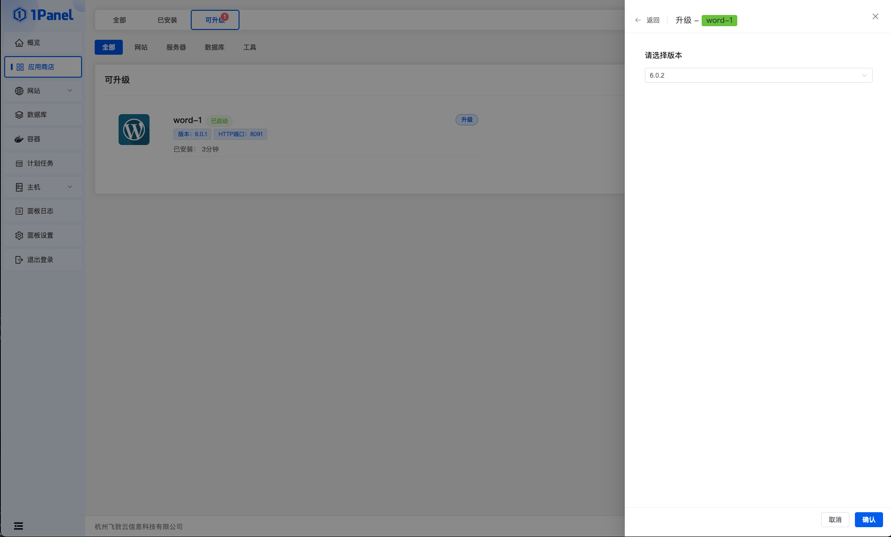

!!! Abstract ""

    在已安装列表，可以对应用进行同步、升级、重启、启动、停止、删除、备份、恢复等操作。

{ width="900px" }

## 1 同步应用

!!! Abstract ""

    点击同步可以同步应用状态。

## 2 启动/停止/重启应用

## 3 应用详情

!!! Abstract ""

    点击应用详情，可以查看应用的相关参数。

## 4 删除应用

!!! Abstract ""

    点击删除，可以删除已安装的应用。
    
    - 强制删除：无视删除过程中的错误，直接删除；
    - 删除备份：删除网站同时删除备份。

## 5 备份/恢复应用

!!! Abstract ""
        
    点击备份，进入备份列表。

!!! Abstract ""

    点击备份，备份应用。点击恢复，以当前备份恢复应用。

## 6 升级应用

!!! Abstract ""

    进入可升级列表，查看可升级的应用。

!!! Abstract ""

    点击升级，选择要升级的版本，点击确认等待升级完成。

