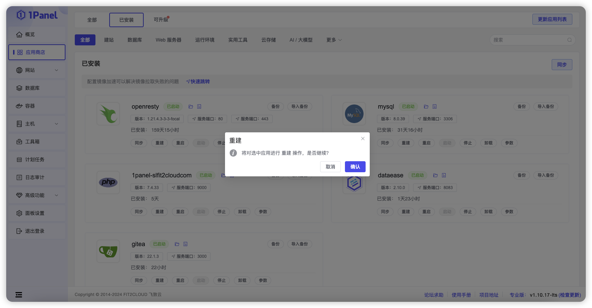
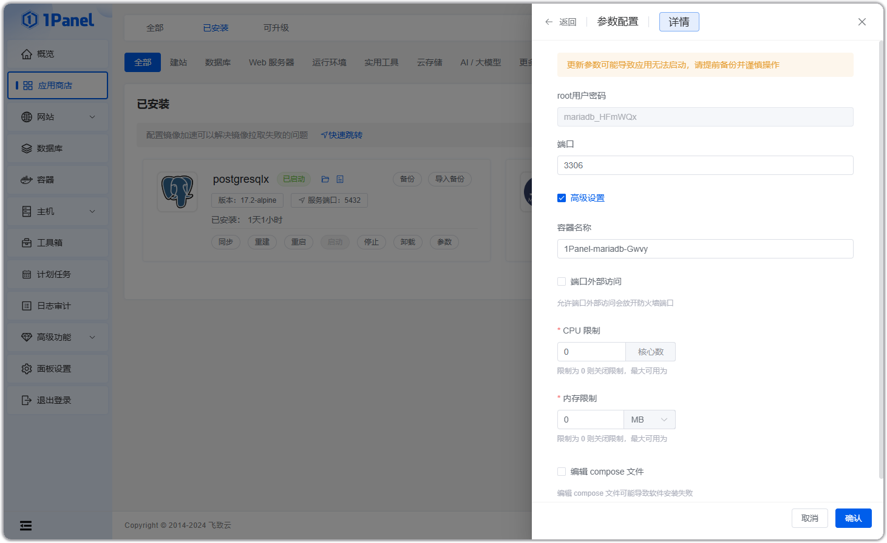

!!! note ""

    进入已安装列表，用户可以对应用进行同步、升级、重启、启动、停止、删除、备份和恢复等操作。

{ width="900px" }

## 1 同步

!!! note ""

    点击【同步】按钮，可自动更新应用状态，确保与当前系统状态保持一致。

## 2 重建

!!! note ""

    点击【重建】按钮，系统会删除现有的应用实例，并基于当前的设置和配置重新安装和启动应用。

## 3 启动 / 停止 / 重启

## 4 卸载

!!! note ""

    点击【卸载】按钮，系统将自动执行卸载过程，删除应用的所有相关资源，包括容器、配置文件等。
    
    - 强制删除：会忽略删除过程中产生的错误并最终删除元数据。
    - 删除备份：删除备份列表中的备份文件。

## 5 应用详情

!!! note ""

    点击【参数】按钮，可以查看应用的相关参数。

!!! note ""

    点击参数页面右上角的【编辑】按钮，可以对部分应用参数及应用高级设置进行修改，具体支持修改的参数与应用定义有关。

## 6 备份 / 恢复

!!! note ""

    点击【备份】按钮，进入备份列表。

!!! note ""

    点击【备份】按钮可立即备份当前应用。若需恢复应用，点击备份列表中的【恢复】按钮，将根据选定的备份恢复应用到相应状态。

## 7 升级

!!! note ""

    进入【可升级】页面，可查看当前支持升级的应用。

!!! note ""

    点击【升级】按钮后，选择目标版本。可选择在升级前备份应用、自动拉取最新镜像、以及自定义修改 compose.yml 文件等。最后点击【确认】按钮，等待升级完成。

