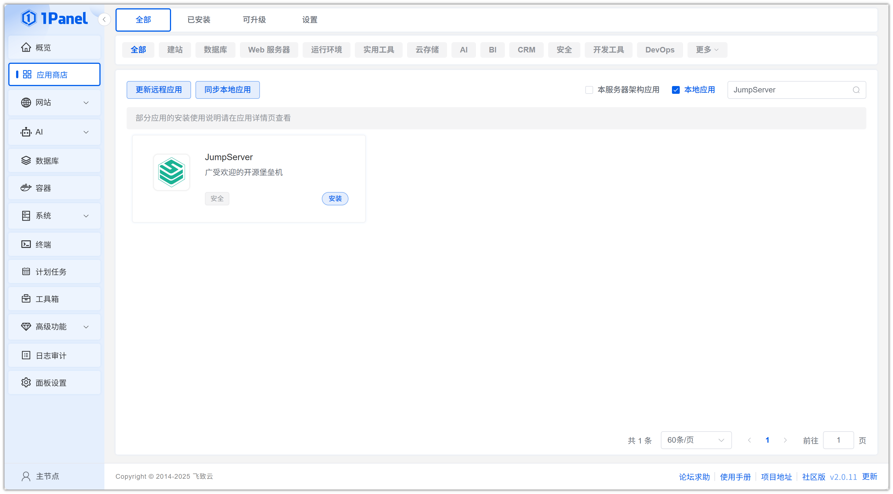
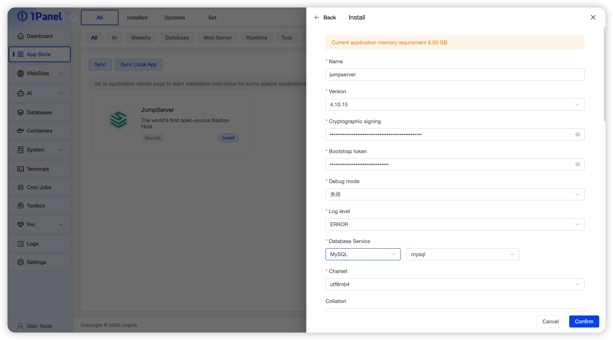
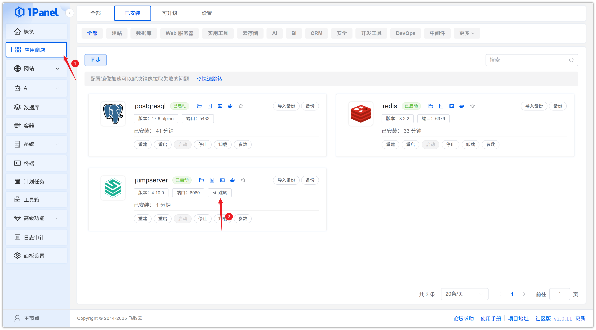
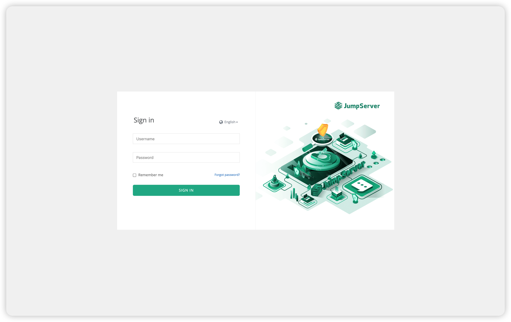

# 使用 1Panel 可视化安装 JumpServer

!!! note ""
     **JumpServer** 是广受欢迎的开源堡垒机，是符合 4A 规范的专业运维安全审计系统。JumpServer 堡垒机帮助企业以更安全的方式管控和登录各种类型的资产。

## 1. 打开应用商店

!!! note ""
    进入 1Panel 控制台后，点击左侧菜单的 **「应用商店」**。

## 2. 搜索 JumpServer 并安装

!!! note ""
    在右上角搜索框输入 **JumpServer**，点击应用卡片进入详情页，选择 **安装**。

## 3. 配置安装参数

!!! note ""
     你可以根据需要配置

    - **名称** (输入框内可自定义应用名称，默认为 jumpserver)
    - **版本** (下拉选择所需的 JumpServer 版本)
    - **加密签名** (设置用于数据加密的签名密钥)
    - **认证令牌** (设置用于 JumpServer 内部组件认证的令牌)
    - **调试模式** (选择是否开启调试模式，默认为关闭)
    - **日志级别** (选择应用的日志输出级别，默认为 ERROR)
    - **数据库服务** (选择用于存储数据的数据库服务，例如 PostgreSQL)
    - **数据库** (为应用创建的数据库名称)
    - **数据库用户** (用于连接数据库的用户名)
    - **数据库密码** (数据库用户的密码)
    - **Redis 服务** (选择用于缓存的 Redis 服务)
    - **Redis 服务密码** (Redis 服务的密码)
    - **使用内置的 Nginx 服务** (选择是否使用 JumpServer 内置的 Nginx)
    - **HTTP 端口** (Web 访问端口，默认为 8080)
    - **SSH 端口** (SSH 服务的访问端口，默认为 2222)
    - **域名** (设置 JumpServer 的访问域名)

    确认设置无误后，点击 **确认** 按钮开始安装。

!!! note ""
     等待安装完成即可

## 4. 访问 JumpServer 服务

!!! note ""
     安装完成后，确认 1Panel 配置默认访问地址，已配置过可忽略

!!! note ""
     返回应用商店，点击 **跳转** 即可访问 JumpServer 服务

!!! note ""
     使用默认用户名: `admin`  密码: `ChangeMe`登录即可

