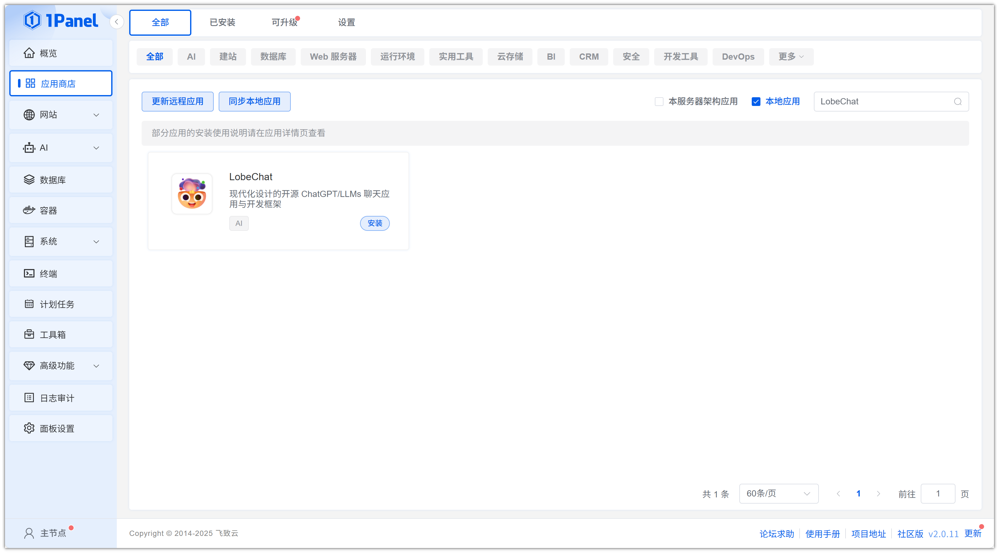
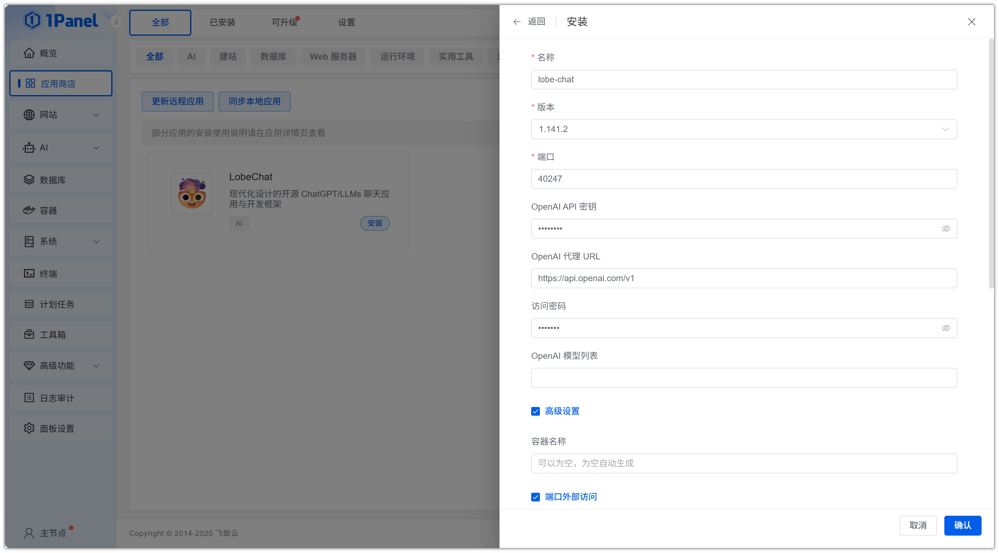
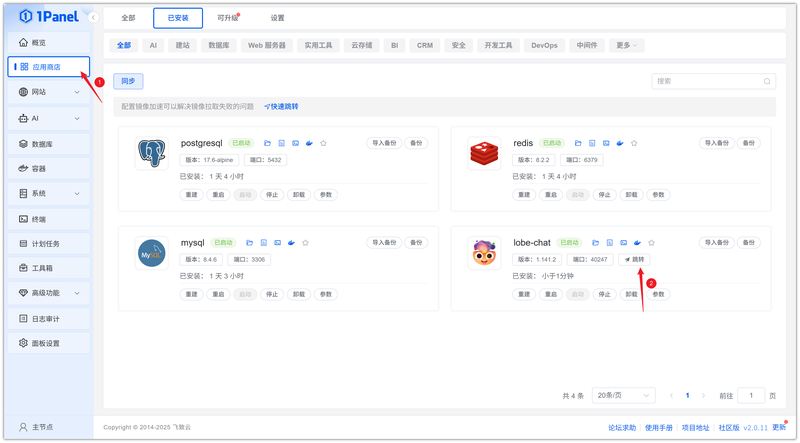
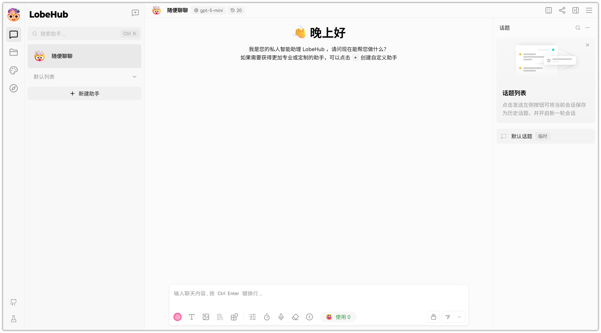

# 使用 1Panel 可视化安装 LobeChat

!!! note ""
     **LobeChat** 是一个现代化设计的开源 ChatGPT/LLMs 聊天应用与开发框架，支持语音合成、多模态、可扩展的（function call）插件系统，一键免费拥有你自己的 ChatGPT/Gemini/Claude/Ollama 应用。

## 1. 打开应用商店

!!! note ""
    进入 1Panel 控制台后，点击左侧菜单的 **「应用商店」**。

## 2. 搜索 LobeChat 并安装

!!! note ""
    在右上角搜索框输入 **LobeChat**，点击应用卡片进入详情页，选择 **安装**。

## 3. 配置安装参数

!!! note ""
     你可以根据需要配置

    - **名称** (输入框内可自定义应用名称，默认为 lobe-chat)
    - **版本** (下拉选择所需的 LobeChat 版本)
    - **端口** (应用的访问端口，默认为 40247)
    - **OpenAI API 密钥** (填入您的 OpenAI API 密钥)
    - **OpenAI 代理 URL** (设置 API 请求的代理地址，默认为官方地址)
    - **访问密码** (设置 LobeChat 页面的访问密码)
    - **OpenAI 模型列表** (配置可用模型，非必填)
    - **端口外部访问** (开启后，将允许从外部网络访问此应用端口)

    确认设置无误后，点击 **确认** 按钮开始安装。

!!! note ""
    等待安装完成即可

## 4. 访问 LobeChat 服务

!!! note ""
     安装完成后，确认 1Panel 配置默认访问地址，已配置过可忽略

!!! note ""
     返回应用商店，点击 **跳转** 即可访问 LobeChat 服务

!!! note ""
     访问即可使用

