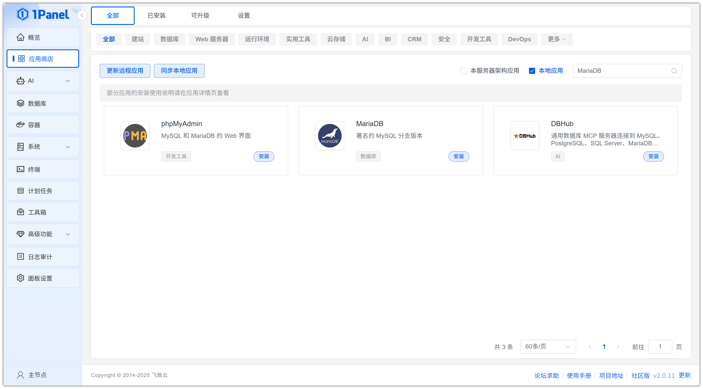
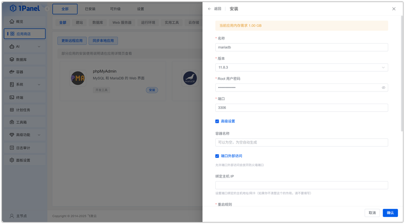
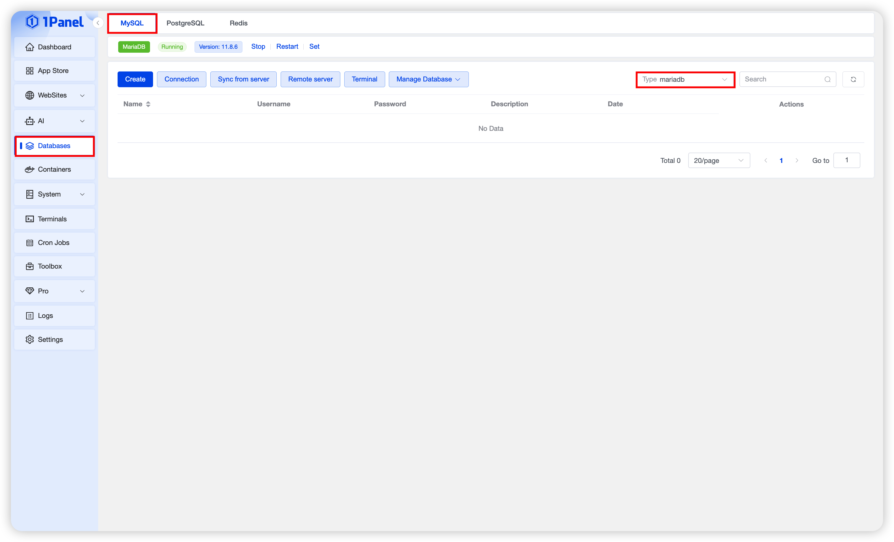
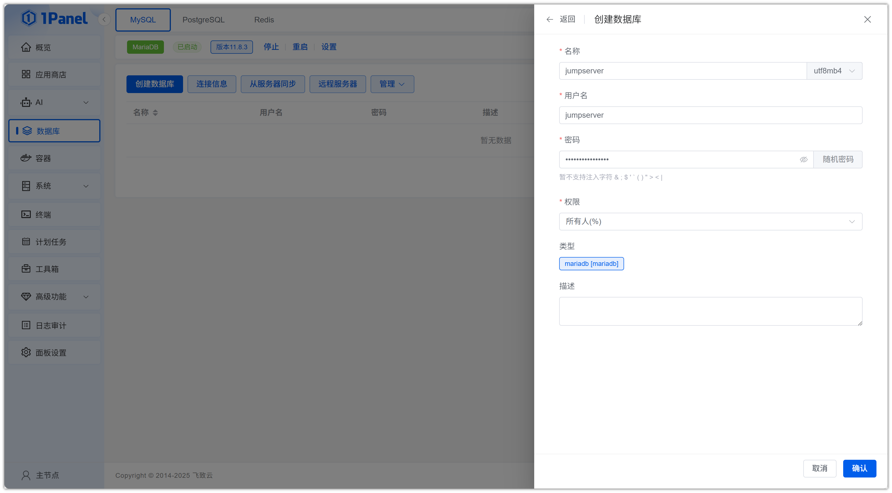
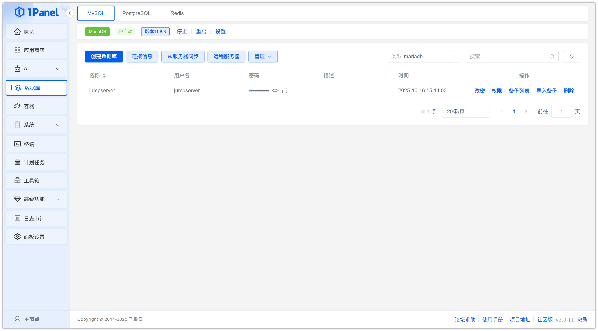
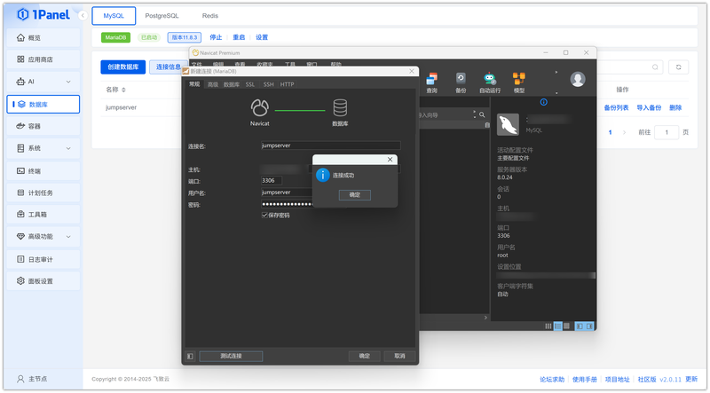

# Install MariaDB Visually Using 1Panel

!!! note ""
    **MariaDB** is a popular open‑source relational database management system (RDBMS). It is a fork of MySQL and offers rich features and high performance, suitable for various application scenarios.

## 1. Open the App Store

!!! note ""
    After entering the 1Panel console, click **App Store** in the left menu.

{: .original}

## 2. Search for MariaDB and Install

!!! note ""
    Enter **MariaDB** in the search box in the upper right corner, click the application card to go to the details page, then select **Install**.

{: .original}

## 3. Configure Installation Parameters

!!! note ""
    You can configure the following as needed:

    - **Name**: Default application name in the input field
    - **Version**: Select the required version
    - **Root Password**: Randomly generated by default
    - **Port**: Default 3306 (can be changed if conflicting with existing services)
    - **Port External Access**: When enabled, allows external network connections to this database port

    After confirming the settings are correct, click the **Confirm** button to start installation.

{: .original}

!!! note ""
    Wait for the installation to complete.

## 4. Create a MariaDB Database

!!! note ""
    After installation, click **Databases** in the left menu.

{: .original}

!!! note ""
    Select **Create Database** and modify the information as needed:

    - **Name**: Database name
    - **Username**: Set according to actual needs
    - **Password**: Randomly generated by default
    - **Privileges**: Optional – All Hosts or Specified IP

    After confirming the configuration is correct, click the **Confirm** button to create.

{: .original}

## 5. Connect to the MariaDB Database

!!! note ""
    Obtain the database configuration information.

{: .original}

!!! note ""
    Connect to the database using a local client tool.

{: .original}
