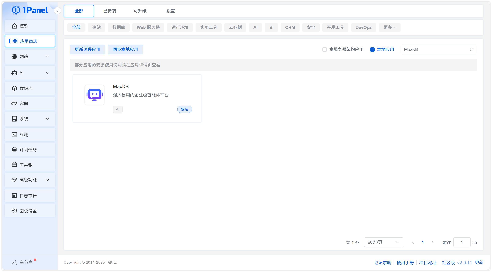
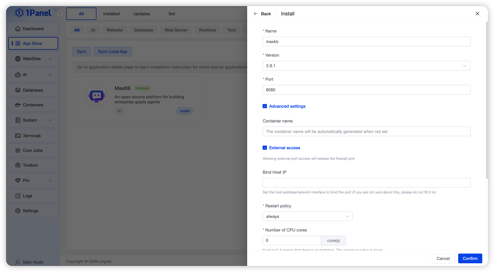
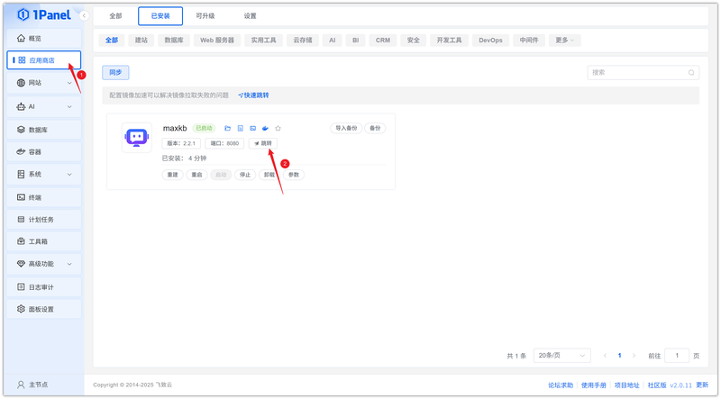

# 使用 1Panel 可视化安装 MaxKB

!!! note ""
     **MaxKB** = Max Knowledge Brain，是一款强大易用的企业级智能体平台，支持 RAG 检索增强生成、工作流编排、MCP 工具调用能力。MaxKB 支持对接各种主流大语言模型，广泛应用于智能客服、企业内部知识库问答、员工助手、学术研究与教育等场景。

## 1. 打开应用商店

!!! note ""
    进入 1Panel 控制台后，点击左侧菜单的 **「应用商店」**。

## 2. 搜索 MaxKB 并安装

!!! note ""
    在右上角搜索框输入 **MaxKB**，点击应用卡片进入详情页，选择 **安装**。

## 3. 配置安装参数

!!! note ""
     你可以根据需要配置

    - **名称** (输入框内可自定义应用名称，默认为 maxkb)
    - **版本** (下拉选择所需的 MaxKB 版本)
    - **端口** (应用的访问端口，默认为 8080)
    - **端口外部访问** (开启后，将允许从外部网络访问此应用端口)

    确认设置无误后，点击 **确认** 按钮开始安装。

!!! note ""
     等待安装完成即可

## 4. 访问 MaxKB 服务

!!! note ""
     安装完成后，确认 1Panel 配置默认访问地址，已配置过可忽略

!!! note ""
     返回应用商店，点击 **跳转** 即可访问 MaxKB 服务

!!! note ""
     使用默认用户名: `admin`  密码: `MaxKB@123..`登录即可

