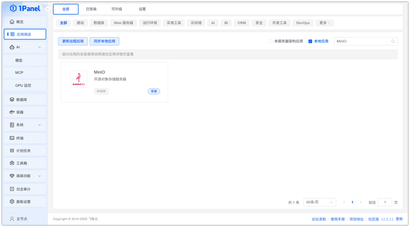
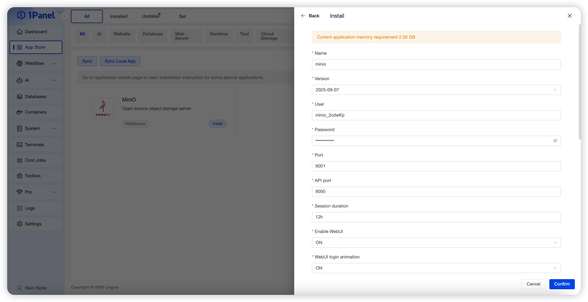
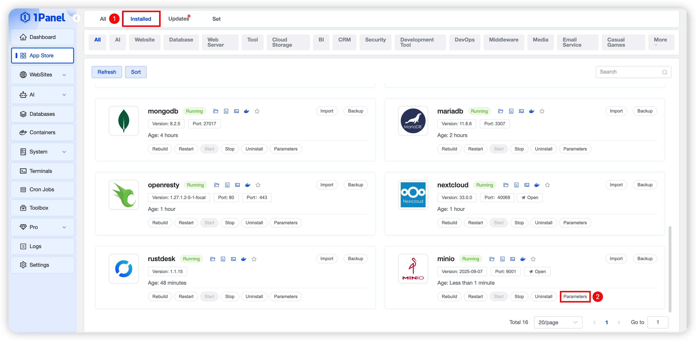
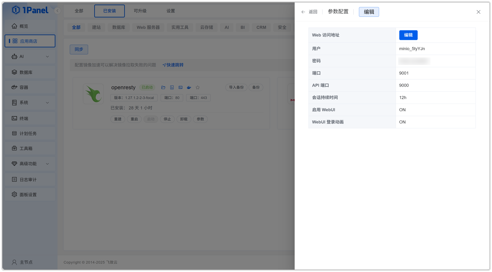
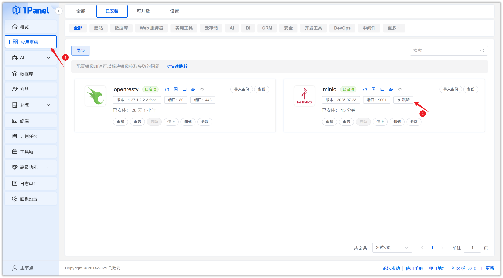
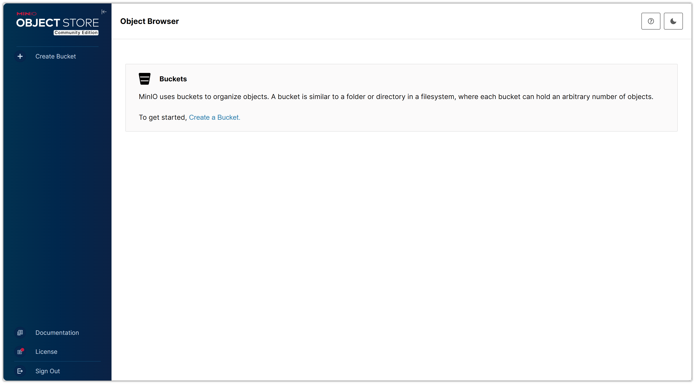

# Install MinIO Visually Using 1Panel

!!! note ""
    **MinIO** is a high-performance object storage system released under the GNU Affero General Public License v3.0. It is API-compatible with the Amazon S3 cloud storage service. MinIO can be used to build high-performance infrastructure for machine learning, analytics, and application data workloads.

## 1. Open the App Store

!!! note ""
    After entering the 1Panel console, click **App Store** in the left menu.

{: .browser-mockup}

## 2. Search for MinIO and Install

!!! note ""
    Enter **MinIO** in the search box in the upper right corner, click the application card to go to the details page, then select **Install**.

{: .browser-mockup}

## 3. Configure Installation Parameters

!!! note ""
    You can configure the following as needed:

    - **Name**: Customize the application name (default: minio)
    - **Version**: Select the desired MinIO version from the dropdown
    - **User**: Username for login (randomly generated by default)
    - **Password**: Set the login password
    - **Port**: Access port for the WebUI (default: 9001)
    - **API Port**: Access port for the S3 API (default: 9000)
    - **Session Duration**: Validity period of the WebUI login session (default: 12h)
    - **Enable WebUI**: Whether to enable the MinIO web management interface
    - **WebUI Login Animation**: Whether to enable animation on the login page
    - **Port External Access**: When enabled, allows external network access to the application ports

    After confirming the settings are correct, click the **Confirm** button to start installation.

{: .browser-mockup}

!!! note ""
    Wait for the installation to complete.

## 4. Access the MinIO Service

!!! note ""
    After installation, obtain the MinIO configuration information. Click **Installed** and select **Parameters**.

{: .browser-mockup}

!!! note ""
    Obtain the configuration details.

{: .browser-mockup}

!!! note ""
    Configure the default access address.

{: .browser-mockup}

!!! note ""
    Return to the App Store and click **Jump** to access the MinIO service.

{: .browser-mockup}

!!! note ""
    Enter the **username and password** obtained above to log in to the **MinIO Web Service**.

{: .browser-mockup}
