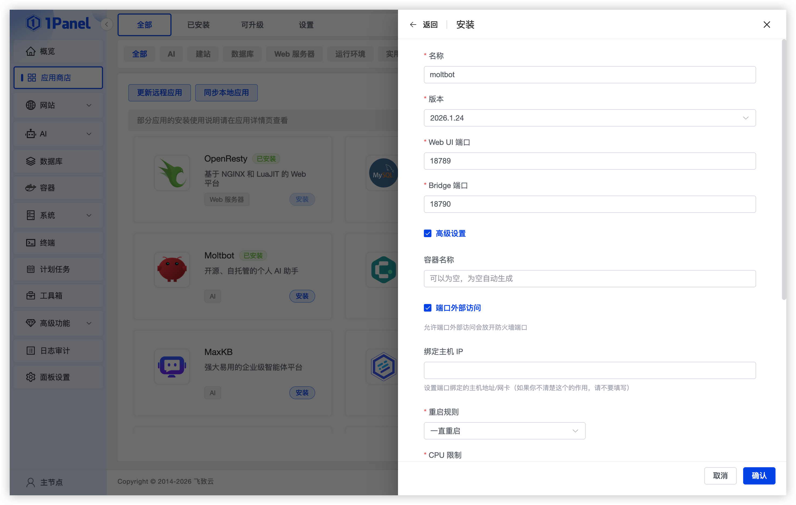
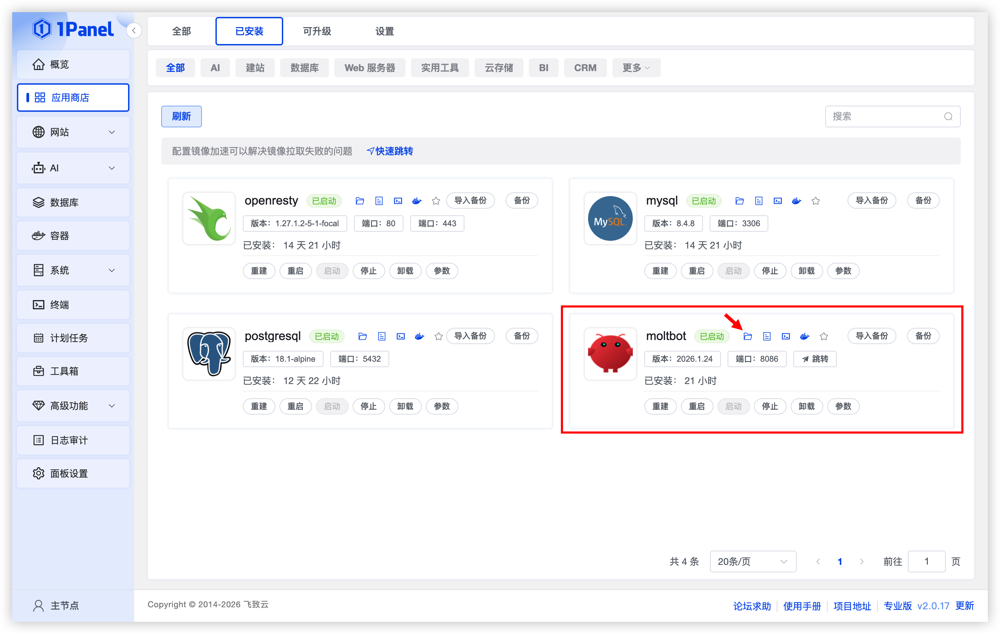
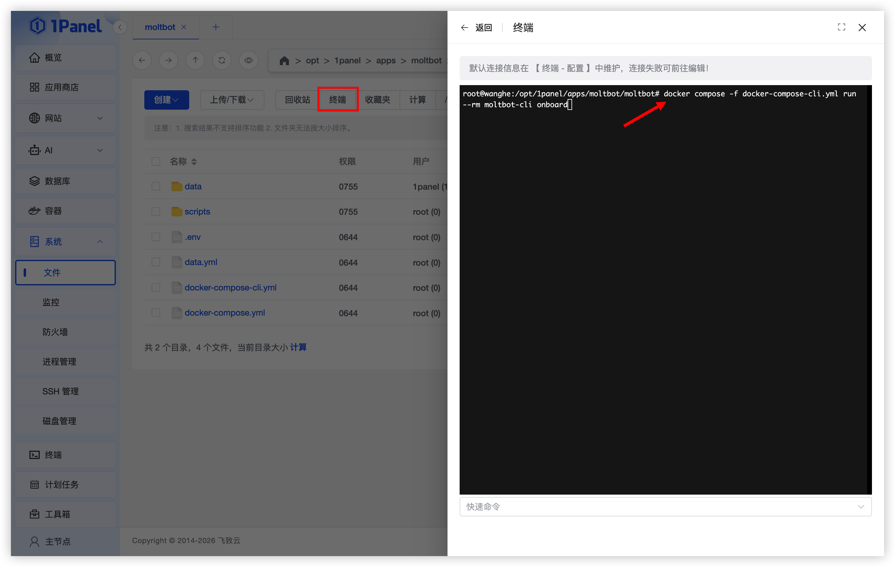
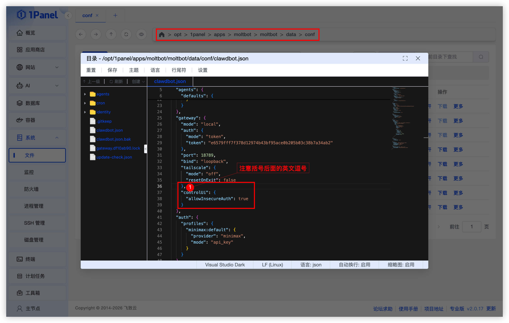
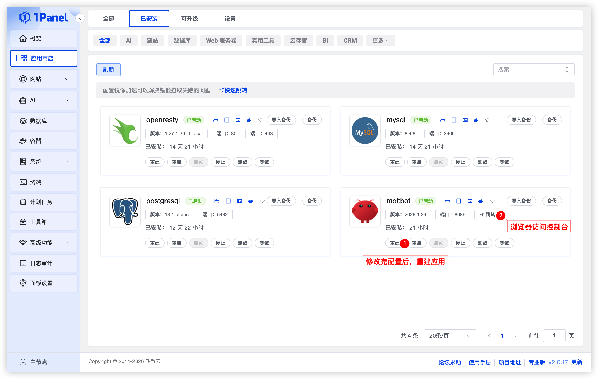
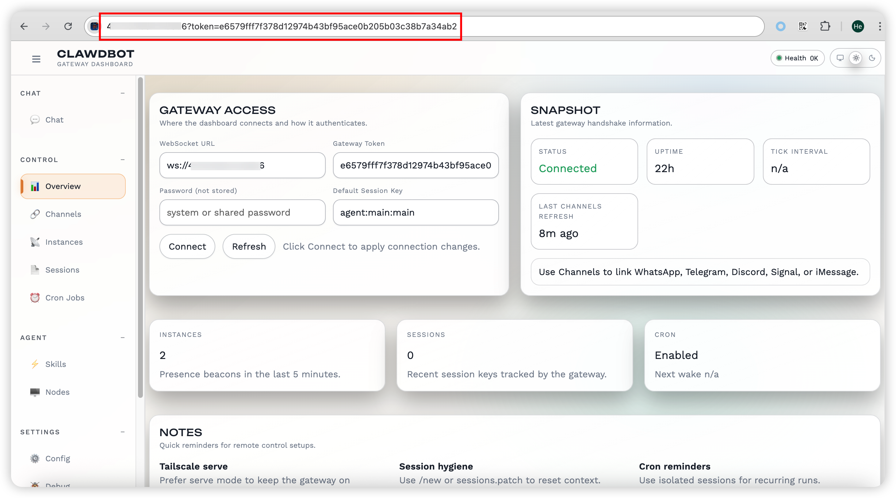

# 使用 1Panel 可视化安装 Moltbot

!!! note ""
     **Moltbot**（原 Clawdbot） 是一款开源、自托管的个人 AI 助手，可以在本地计算机上运行，兼容 MacOS、Windows 及 Linux 等多种系统，支持接入常用聊天工具，除了内置多种 Agent 常用工具外，还可以通过插件和 Skill 扩展更多能力。

## 1. 打开应用商店

!!! note ""
    进入 1Panel 控制台后，点击左侧菜单的 **「应用商店」**。


## 2. 安装 Moltbot

!!! note ""
    点击首页 **Moltbot** 应用卡片进入详情页，选择 **安装**。

!!! note ""
     您可以根据需要配置：

    - **名称** (输入框内可自定义应用名称，默认为 moltbot)
    - **版本** (下拉选择所需的 Moltbot 版本)
    - **WebUI 端口** (默认为 18789)
    - **Bridge 端口** (默认为 18790)
    - **端口外部访问** (开启后，将允许从外部网络访问此应用端口)
    
    确认设置无误后，点击 **确认** 按钮开始安装。



## 3. 初始化 Moltbot

### 3.1. 进入安装目录

!!! note ""
     进入已安装应用页面，找到 **Moltbot 应用**，点击顶部的 **进入安装目录** 按钮。



### 3.2. 初始化 Moltbot

!!! note ""
     点击文件列表顶部的 **终端** 按钮，执行初始化命令：

     ```bash
     docker compose -f docker-compose-cli.yml run --rm moltbot-cli onboard
     ```



### 3.3. 修改配置文件

!!! note ""
     1. 初始化完成后，进入 `data/conf` 目录，编辑 **clawdbot.json** 文件。
     2. 新增 `gateway.controlUi.allowInsecureAuth` 配置：
     ```json
     "gateway": {
          "mode": "local",
          "auth": {
               "mode": "token",
               "token": "e6579fff7f378d12974b43bf95ace0b205b03c38b7a34ab2"
          },
          "port": 18789,
          "bind": "loopback",
          "tailscale": {
               "mode": "off",
               "resetOnExit": false
          },
          "controlUi": {
               "allowInsecureAuth": true
          }
     }
     ```
     3. 复制其中 "gateway.auth.token" 的值，后续访问 Moltbot 应用时需要用到的 Token。



### 3.4. 重建应用并访问

!!! note ""
     返回 **已安装应用页面**，找到 Moltbot 应用，点击 **重建** 按钮来重新运行 Moltbot 应用。



!!! note ""
     等待重建完成后，点击跳转按钮，在新打开的浏览器地址栏中，在 URL 后添加 `?token=你的 Moltbot Token`。


