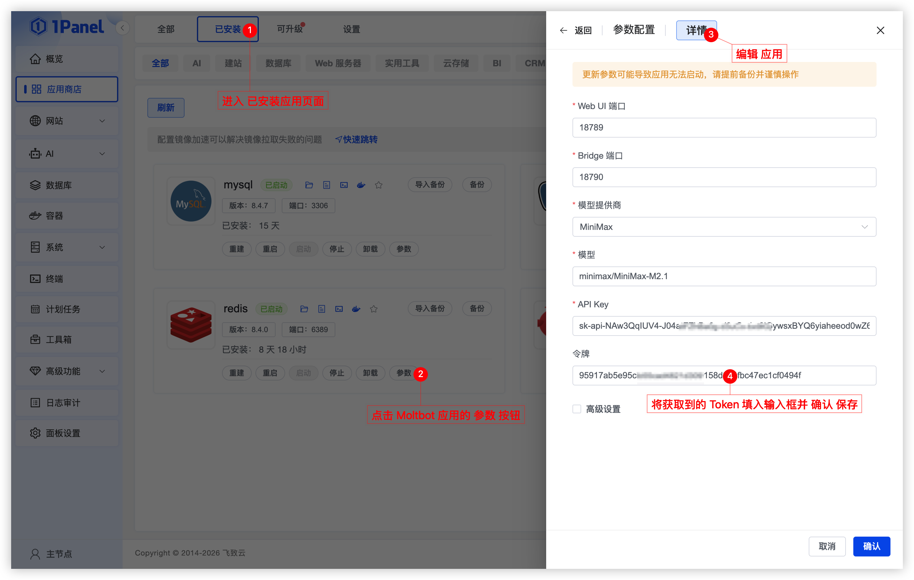
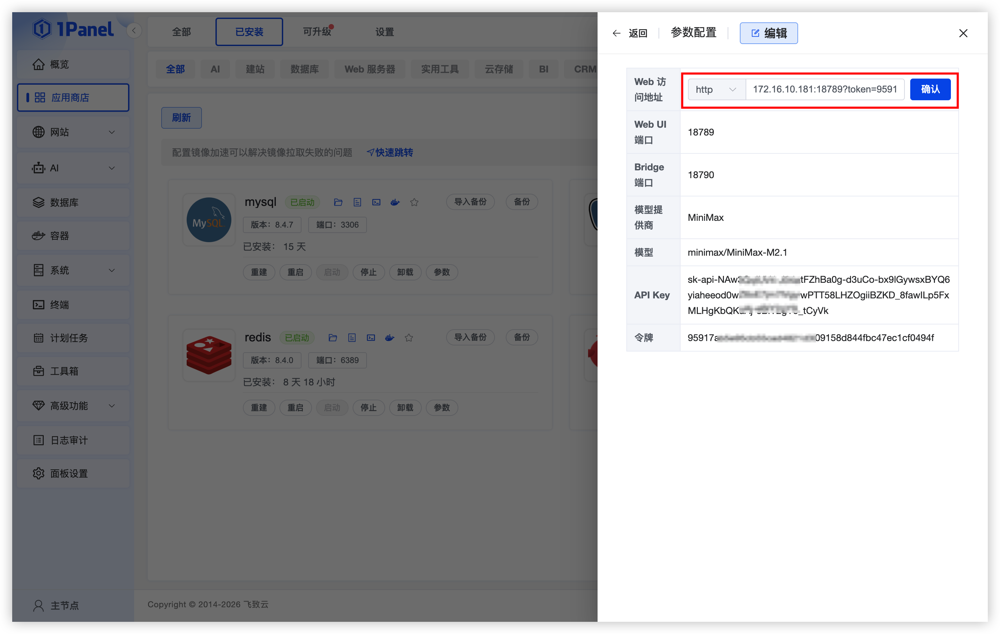

# 使用 1Panel 可视化安装 Moltbot

!!! note ""
     **Moltbot**（原 Clawdbot） 是一款开源、自托管的个人 AI 助手，可以在本地计算机上运行，兼容 MacOS、Windows 及 Linux 等多种系统，支持接入常用聊天工具，除了内置多种 Agent 常用工具外，还可以通过插件和 Skill 扩展更多能力。

## 1. 打开应用商店

!!! note ""
    进入 1Panel 控制台后，点击左侧菜单的 **「应用商店」**。


## 2. 安装 Moltbot

!!! note ""
    点击首页 **Moltbot** 应用卡片进入详情页，选择 **安装**。

!!! note ""
     您可以根据需要配置：

    - **名称** (输入框内可自定义应用名称，默认为 moltbot)
    - **版本** (下拉选择所需的 Moltbot 版本)
    - **WebUI 端口** (默认为 18789)
    - **Bridge 端口** (默认为 18790)
    - **模型提供商** (下拉选择所需的 AI 模型提供商)
    - **模型** (模型提供商代号/模型ID)
    - **API Key** (调用模型提供商接口使用的 API Key，在模型提供商处获取)
    - **Token / 令牌** (默认先不填写 Token。应用安装成功后，通过配置文件获取 Token，然后回到已安装应用页面在参数中填写，方便后续使用。)
    - **端口外部访问** (开启后，将允许从外部网络访问此应用端口)

    确认设置无误后，点击 **确认** 按钮开始安装。

!!! note "常见模型提供商与示例模型"
    
     - DeepSeek: `deepseek/deepseek-chat`
     - Qwen: `qwen/qwen2.5-coder-32b-instruct`
     - MiniMax: `minimax/MiniMax-M2.1`
     - Moonshot (Kimi): `moonshot/kimi-k2.5`
     - ZAI (GLM): `zai/glm-4.7`
     - OpenAI: `openai/gpt-4o-mini`
     - Anthropic: `anthropic/claude-3-7-sonnet`
     - Gemini: `gemini/gemini-1.5-pro`
     - Groq: `groq/llama-3.1-70b-versatile`
     - Mistral: `mistral/large-latest`
     - Cohere: `cohere/command-r-plus`


## 3. 获取 Moltbot Token

!!! note ""
     在 **已安装应用页面**，找到 **Moltbot** 应用点击 **文件夹图标** 进入应用数据目录，在目录下的 `data/conf` 文件夹，点击 **moltbot.json** 文件，复制其中 "gateway.auth.token" 的值，用作访问 Moltbot 应用时的 Token。

     ```json
     "gateway": {
     "mode": "local",
          "token": "c9917c5a066beeb26266d09baed99495e7563b33c771e89a"
     },
     ***
     ```


!!! note "Token / 令牌"
     回到 **已安装应用页面**，点击 `参数` 按钮编辑应用，将该 Token 填入输入框，方便后续使用。



### 4. 访问 Moltbot WebUI

!!! note ""
     - 在 **已安装应用页面**，点击 `参数` 按钮进入编辑页面，选择自定义 **Web 访问地址**，将带有 `?token=你的 Moltbot Token` 的地址填入输入框并保存，方便后续访问应用。
     - 示例：http://172.16.10.181:18789?token=95917ab5e95cb55cad4821d309158d844fbc47ec1cf0494f



!!! note ""
     在 **已安装应用页面** 找到 Moltbot 应用，点击 **跳转** 按钮，选择带有 Token 的自定义访问地址，即可正常访问 Moltbot 应用。


### 5. 配置聊天工具对接（可选）

!!! note ""
     如果你希望通过 Telegram、WhatsApp、Discord、iMessage 等聊天工具与机器人进行对话，可以在 **已安装应用页面** 找到 **Moltbot 应用**，点击顶部的 **进入安装目录** 按钮。点击文件列表顶部的 **终端** 按钮，在终端中执行以下命令配置对应的聊天工具对接。

     ```bash
     docker compose -f docker-compose-cli.yml run --rm moltbot-cli channels add
     ```
