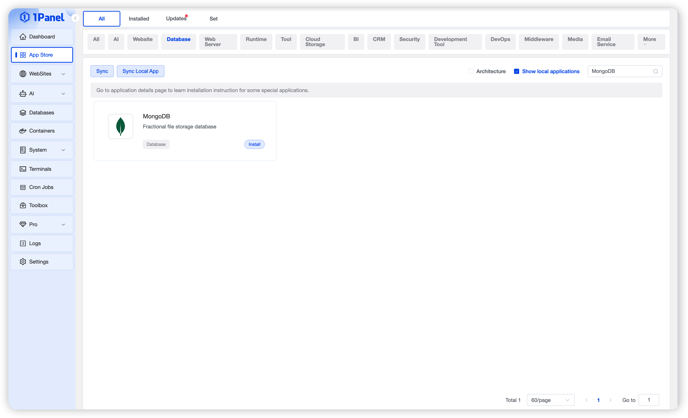
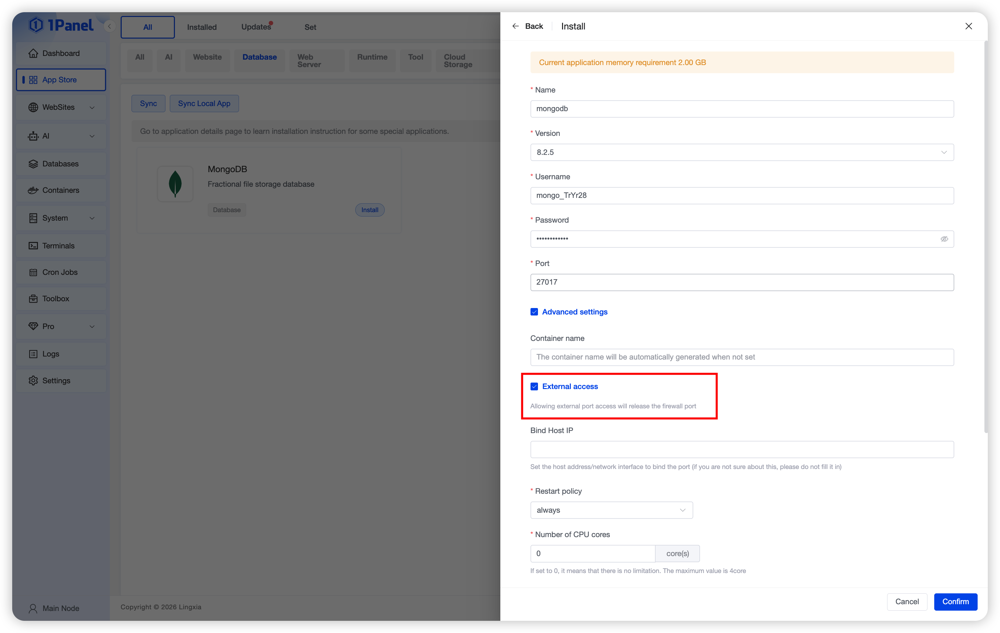
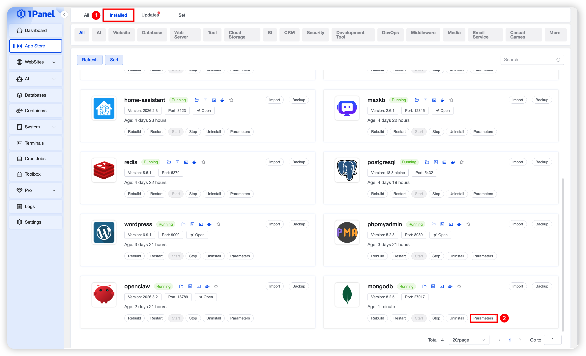
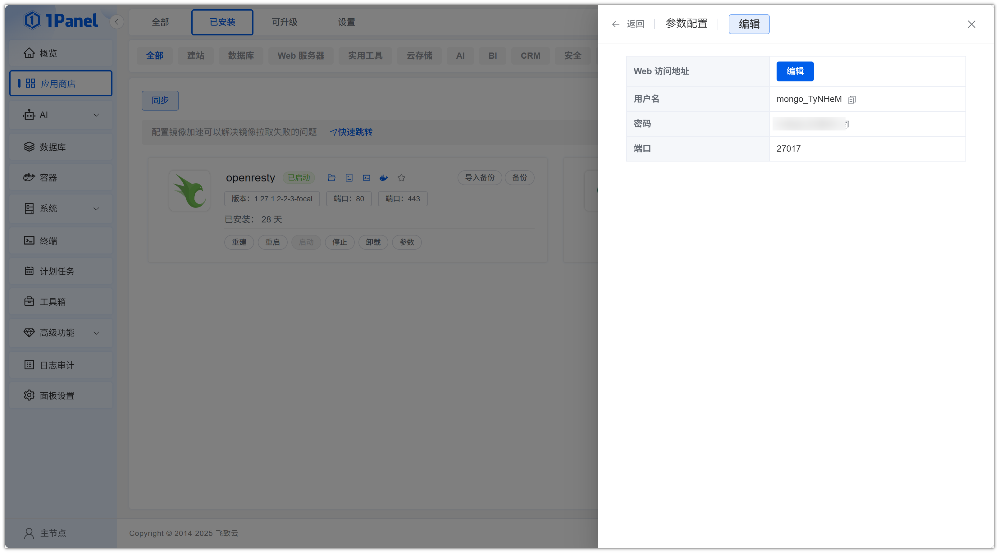
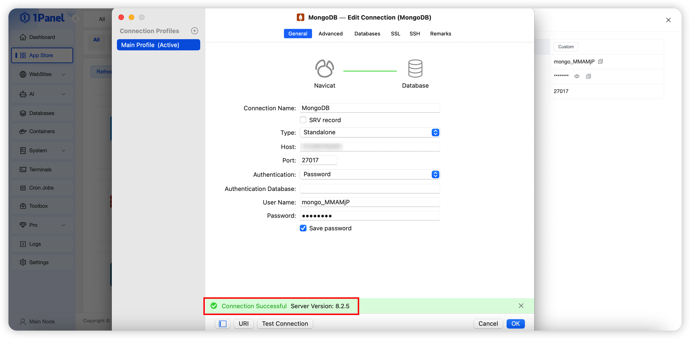

# Install MongoDB Visually Using 1Panel

!!! note ""
    **MongoDB** is a popular NoSQL database management system that offers a range of features making it a powerful tool for handling large-scale data and flexible data models.

## 1. Open the App Store

!!! note ""
    After entering the 1Panel console, click **App Store** in the left menu.

{: .original}

## 2. Search for MongoDB and Install

!!! note ""
    Enter **MongoDB** in the search box in the upper right corner, click the application card to go to the details page, then select **Install**.

{: .original}

## 3. Configure Installation Parameters

!!! note ""
    You can configure the following as needed:

    - **Name**: Default application name in the input field
    - **Version**: Select the required version
    - **Username**: Randomly generated by default
    - **Port**: Default 27017 (can be adjusted if conflicting with existing services)
    - **Port External Access**: When enabled, allows external network connections to this database port

    After confirming the settings are correct, click the **Confirm** button to start installation.

{: .original}

!!! note ""
    Wait for the installation to complete.

## 4. Connect to the MongoDB Database

!!! note ""
    After installation, obtain the MongoDB configuration information. Click **Installed** and select **Parameters**.

{: .original}

!!! note ""
    Obtain the configuration details.

{: .original}

!!! note ""
    Connect to MongoDB using a local client tool.

{: .original}
