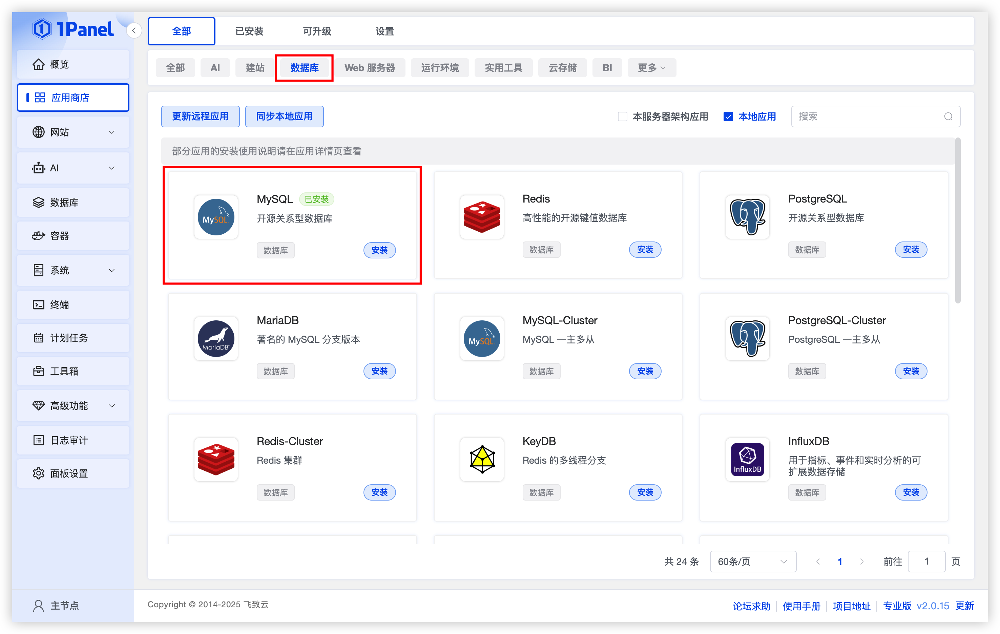
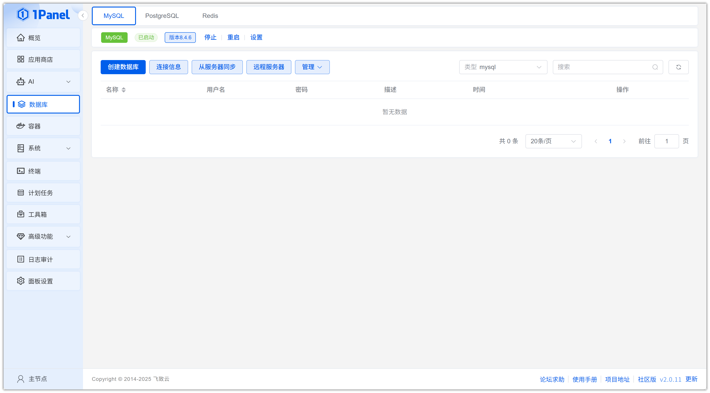
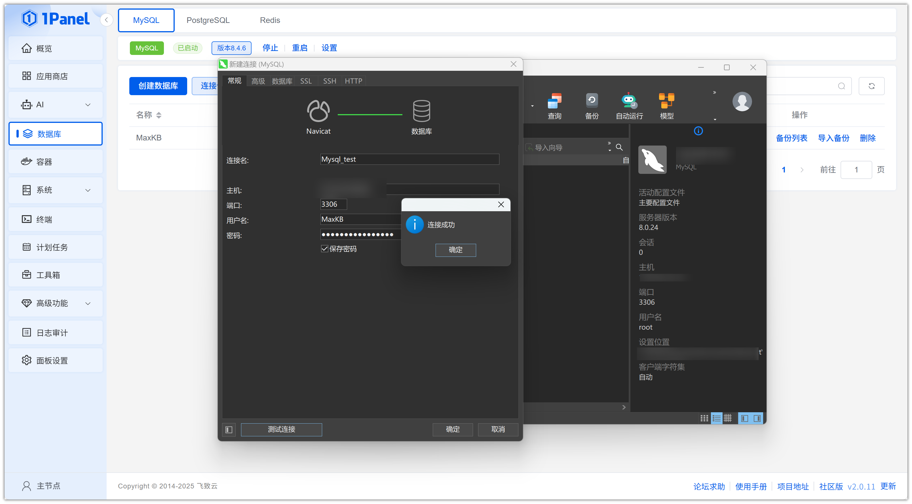

# 使用 1Panel 可视化安装 MySQL

!!! note ""
    **MySQL** 是一个流行的开源关系型数据库管理系统（RDBMS），它提供了丰富的功能，适用于各种应用场景。

## 1. 打开应用商店

!!! note ""
    进入 1Panel 控制台后，点击左侧菜单的 **「应用商店」**。

## 2. 搜索 MySQL 并安装

!!! note ""
    在右上角搜索框输入 **MySQL**，点击应用卡片进入详情页，选择 **安装**。

## 3. 配置安装参数

!!! note ""
     你可以根据需要配置

    - **名称**（输入框默认应用名称）
    - **版本**（选择所需版本）
    - **Root 密码**（默认随机生成）
    - **端口**（默认 3306，如果与现有服务冲突可调整）
    - **端口外部访问** （开启后，允许从外部网络连接到此数据库端口）
    
    确认设置无误后，点击 **确认** 按钮开始安装。

!!! note ""
     等待安装完成即可
## 4. 创建 MySQL 数据库

!!! note ""
    安装完成后，点击左侧菜单的 **「数据库」**。

!!! note ""
    选择 **创建数据库**
    根据需要修改相关信息

    - **名称**（数据库名称）
    - **用户名**（根据实际需求设置）
    - **密码**（默认随机生成）
    - **权限**（可选所有人或指定IP）
    确认配置无误后，点击 **确认** 按钮开始创建。

## 5. 连接 MySQL 数据库

!!! note ""
    获取数据库配置信息

!!! note ""
    使用本地工具连接数据库

