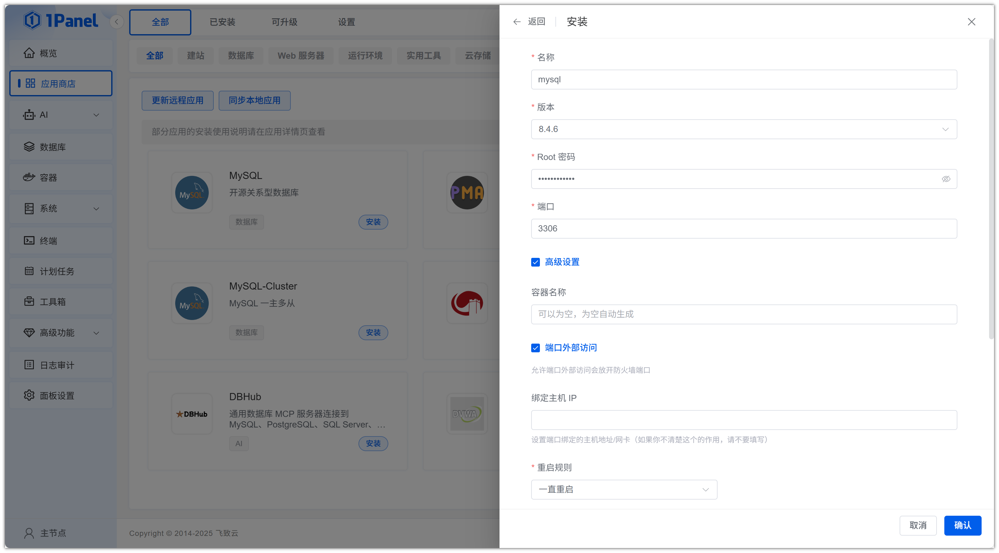
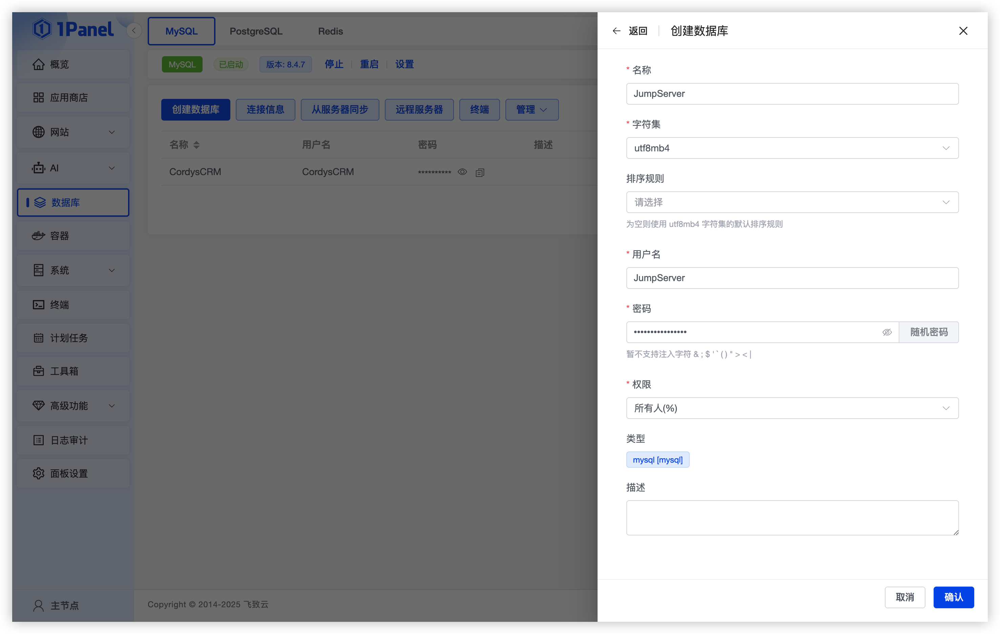
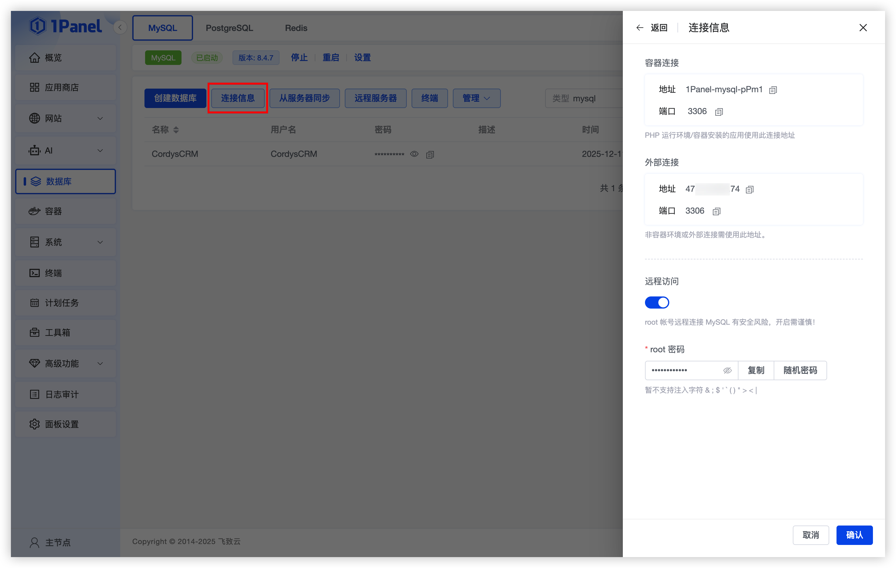
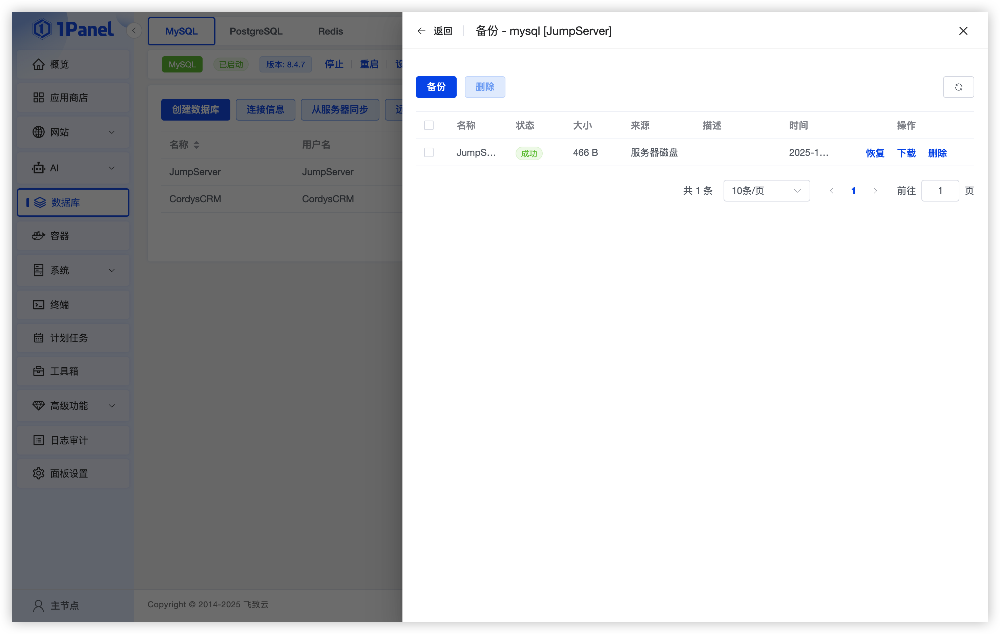
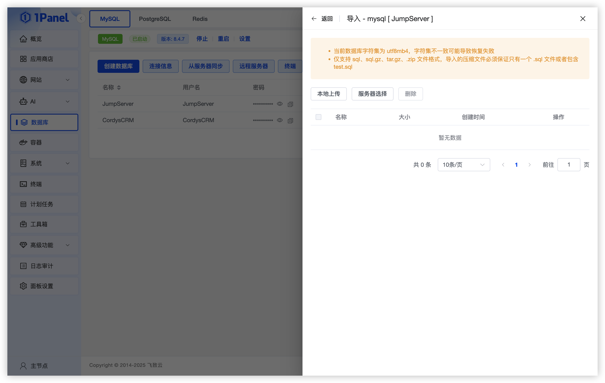
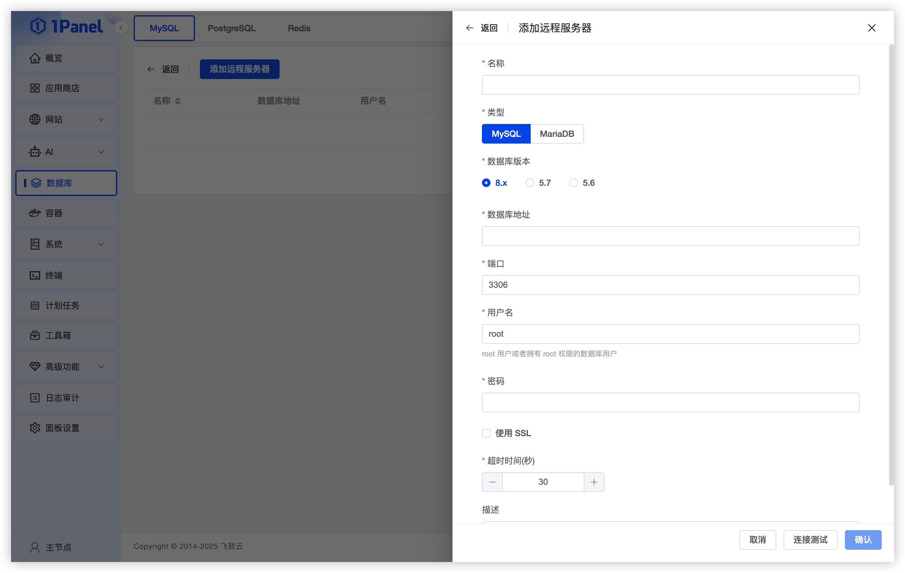
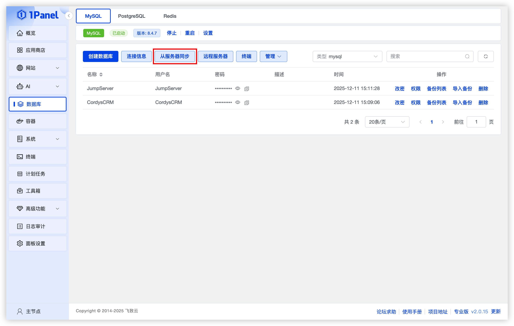
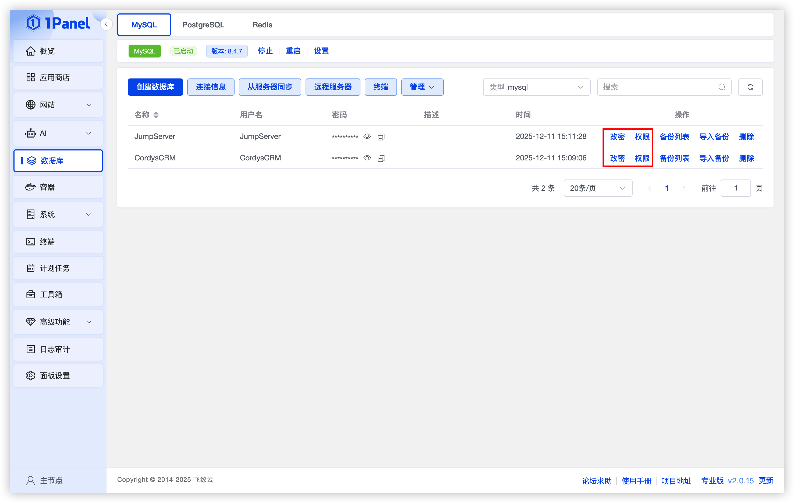
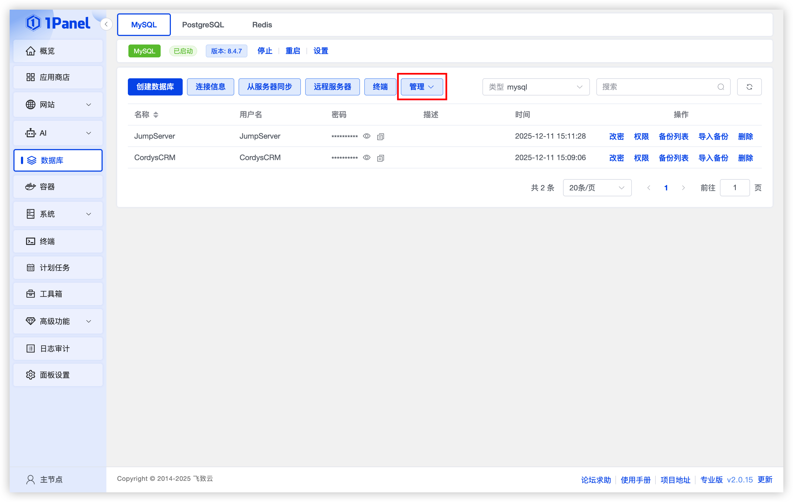
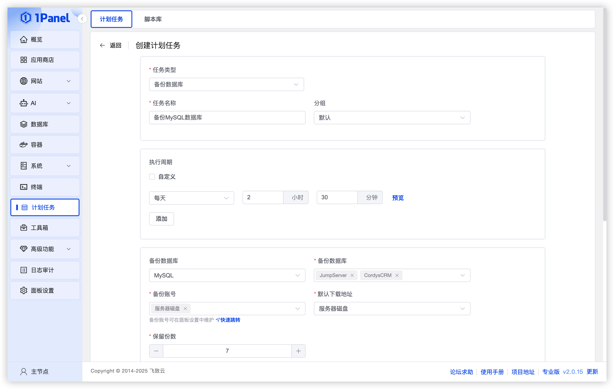

# 使用 1Panel 可视化安装 MySQL

!!! note ""
    **MySQL** 是一个流行的开源关系型数据库管理系统（RDBMS），适用于各种应用场景。1Panel 提供了可视化安装与管理能力，让部署与维护更加轻松。

## 1. 打开应用商店

!!! note ""
    进入 1Panel 控制台后，点击左侧菜单的 **「应用商店」**。

## 2. 搜索 MySQL 并安装

!!! note ""
    在应用商店中（首页或数据库分类下），找到并点击 **MySQL** 应用卡片进入详情页，然后选择 **安装**。

## 3. 配置安装参数

!!! note ""
    您可以根据需要配置：

    - **名称**（默认应用名称）
    - **版本**（选择需要的版本）
    - **Root 密码**（默认随机生成）
    - **端口**（默认 3306，可按需修改）
    - **端口外部访问**（开启后支持从外部访问数据库）

    确认设置无误后，点击 **确认** 开始安装。

## 4. 创建 MySQL 数据库

!!! note ""
    安装完成后，进入左侧菜单的 **「数据库」** 页面，点击 **创建数据库**，并根据实际需求填写相关信息：

    - **名称**（数据库名称）
    - **字符集**（默认 utf8mb4）
    - **排序规则**（默认为空，将自动使用所选字符集的默认排序规则）
    - **用户名**（默认与数据库名称相同）
    - **密码**（默认随机生成）
    - **权限**（所有人或指定 IP）

    设置完成后点击 **确认** 创建数据库。

## 5. 连接 MySQL 数据库

!!! note ""
    点击数据库后可查看连接信息，用于客户端或程序进行访问。

## 6. 查看与管理备份

!!! note ""
    - 支持查看备份列表，点击备份后可对数据库执行备份。  
    - 备份时可设置 **压缩密码**，备份文件支持 **恢复**、**下载** 等操作。

## 7. 导入数据库备份

!!! note ""
    支持 **导入备份**，可选择 **本地上传文件** 或 **服务器已有的备份文件** 进行导入。

## 8. 添加远程数据库

!!! note ""
    - 支持将 **远程 MySQL 数据库添加到面板** 中进行管理
    - 添加的远程数据库同样支持 **备份与恢复** 操作
    - 在安装应用时，也可以选择已添加的远程数据库进行使用

## 9. 从服务器同步数据库

!!! note ""
    支持 **从远程服务器同步数据库** 到本地，实现跨服务器的数据同步。

## 10. 修改用户密码与权限

!!! note ""
    可对数据库用户执行 **修改密码**、**修改权限** 等维护操作。

## 11. 使用 phpMyAdmin / Adminer 可视化管理

!!! note ""
    可通过 **phpMyAdmin** 或 **Adminer** 对数据库进行更完整的可视化管理。

## 12. 使用计划任务定时备份数据库

!!! note ""
    在 **计划任务** 中选择 **备份数据库** 类型，可配置定时自动备份目标数据库。

