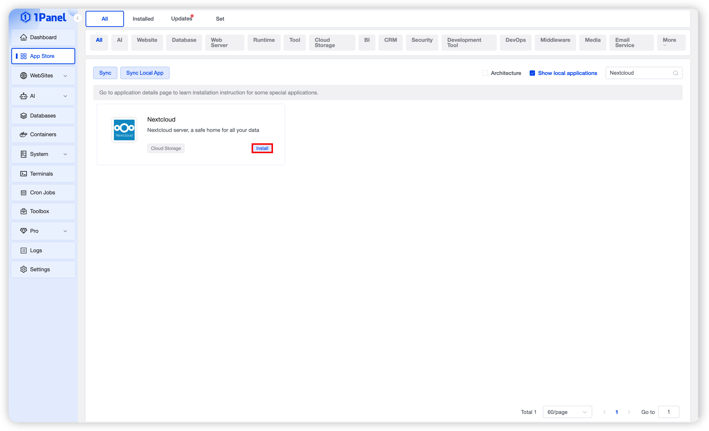
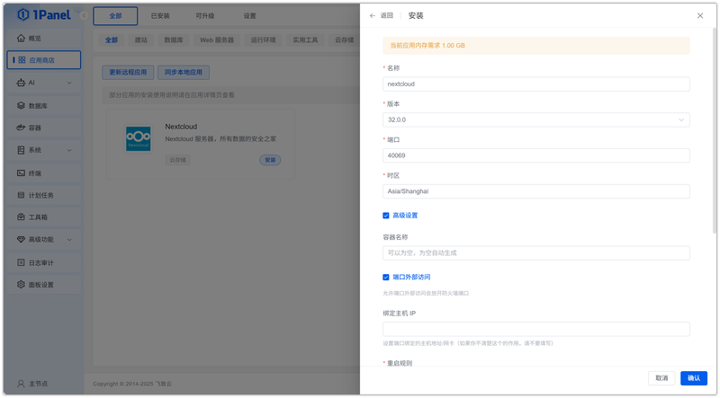
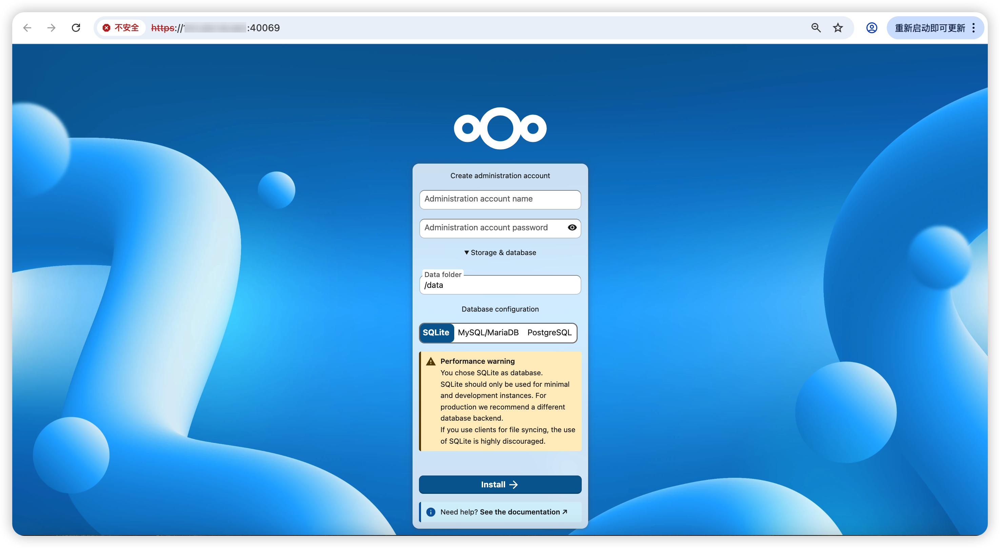
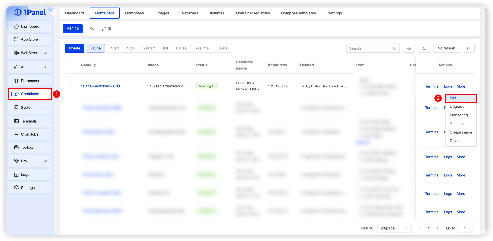
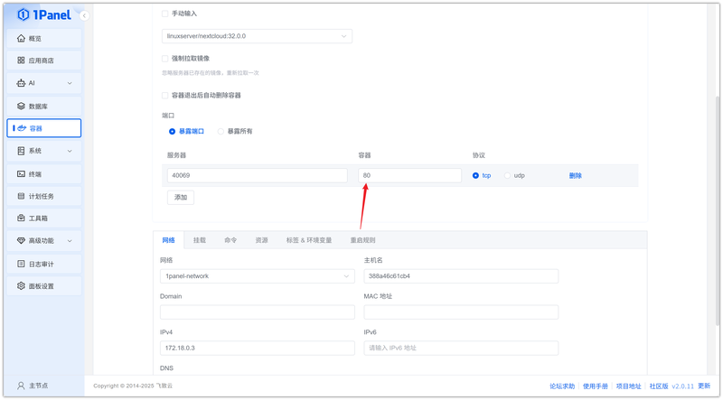

# Install Nextcloud Visually Using 1Panel

!!! note ""
    **Nextcloud** is an open-source self-hosted cloud storage and collaboration platform that offers a range of features to help you manage and share files, calendars, contacts, tasks, and more, while protecting your data privacy.

## 1. Open the App Store

!!! note ""
    After entering the 1Panel console, click **App Store** in the left menu.

{: .original}

## 2. Search for Nextcloud and Install

!!! note ""
    Enter **Nextcloud** in the search box in the upper right corner, click the application card to go to the details page, then select **Install**.

{: .original}

## 3. Configure Installation Parameters

!!! note ""
    You can configure the following as needed:

    - **Name**: Customize the application name (default: nextcloud)
    - **Version**: Select the desired Nextcloud version from the dropdown
    - **Port**: Access port for the application (default: 40069)
    - **Timezone**: Set the container runtime timezone (default: Asia/Shanghai)
    - **Port External Access**: When enabled, allows external network access to the application port

    After confirming the settings are correct, click the **Confirm** button to start installation.

{: .original}

!!! note ""
    Wait for the installation to complete.

## 4. Access the Nextcloud Service

!!! note ""
    The default port is 443, so for the first access, you need to use the format `https://IP:Port` in the browser address bar.

{: .original}

!!! note ""
    You can click **Edit** on the **Containers** page to modify the port configuration.

{: .original}

!!! note ""
    Change it to port 80 to access via HTTP directly.

{: .original}
