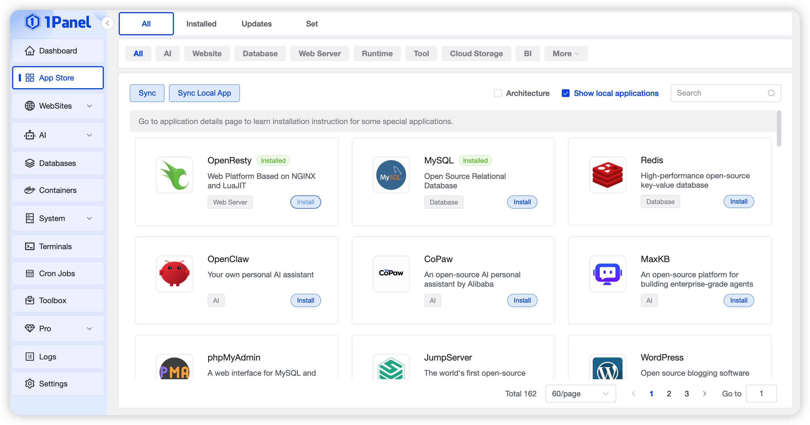
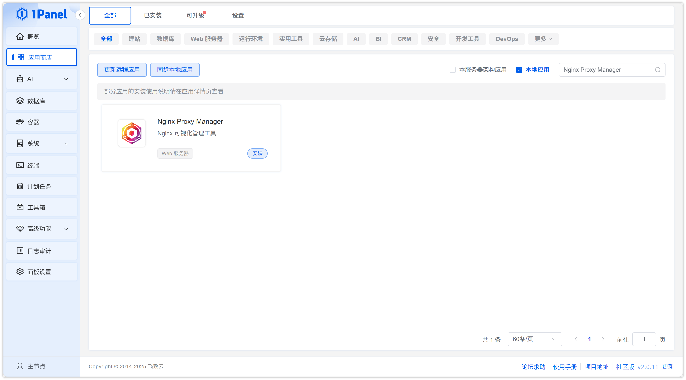
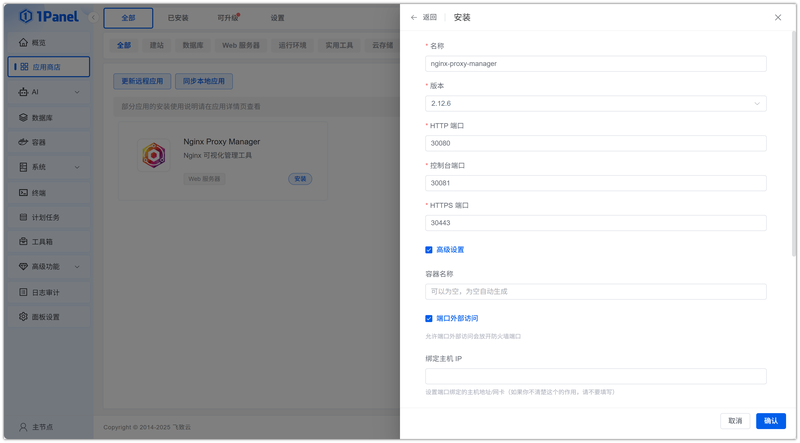
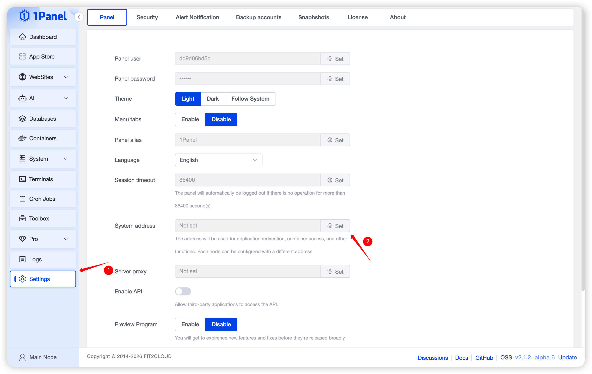
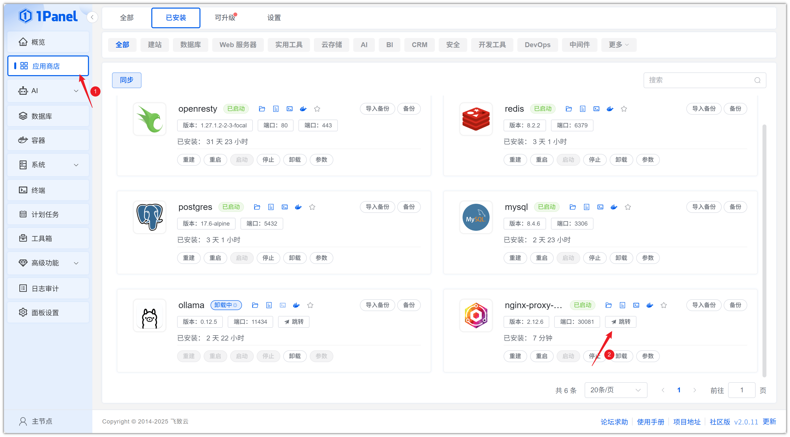
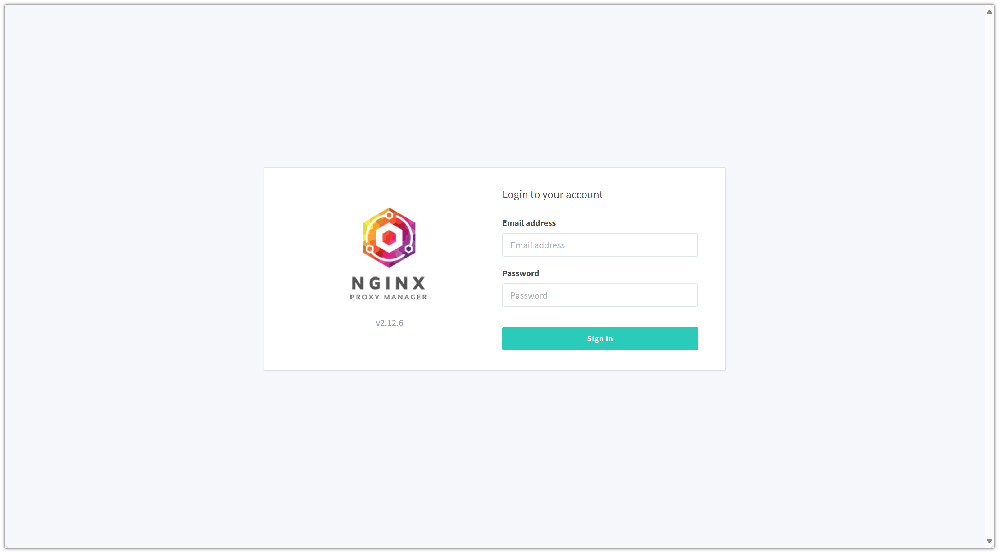

# 使用 1Panel 可视化安装 Nginx Proxy Manager

!!! note ""
     **Nginx Proxy Manager** 是一个功能强大的反向代理和Web服务器管理工具，它使您能够轻松地管理多个网站和应用程序的代理设置。

## 1. 打开应用商店

!!! note ""
    进入 1Panel 控制台后，点击左侧菜单的 **「应用商店」**。

## 2. 搜索 Nginx Proxy Manager 并安装

!!! note ""
    在右上角搜索框输入 **Nginx Proxy Manager**，点击应用卡片进入详情页，选择 **安装**。

## 3. 配置安装参数

!!! note ""
     你可以根据需要配置

    - **名称** (输入框内可自定义应用名称，默认为 nginx-proxy-manager)
    - **版本** (下拉选择所需的 Nginx Proxy Manager 版本)
    - **HTTP 端口** (HTTP 服务的访问端口，默认为 30080)
    - **控制台端口** (WebUI 管理界面的访问端口，默认为 30081)
    - **HTTPS 端口** (HTTPS 服务的访问端口，默认为 30443)
    - **端口外部访问** (开启后，将允许从外部网络访问此应用端口)
    
    确认设置无误后，点击 **确认** 按钮开始安装。

!!! note ""
     等待安装完成即可

## 4. 配置访问 Nginx Proxy Manager 服务

!!! note ""
     安装完成后，确认 1Panel 配置默认访问地址，已配置过可忽略

!!! note ""
     返回应用商店，点击 **跳转** 即可访问 Nginx Proxy Manager 服务

!!! note ""
     使用默认的用户名: `admin@example.com`  密码:`changeme` 登录即可

