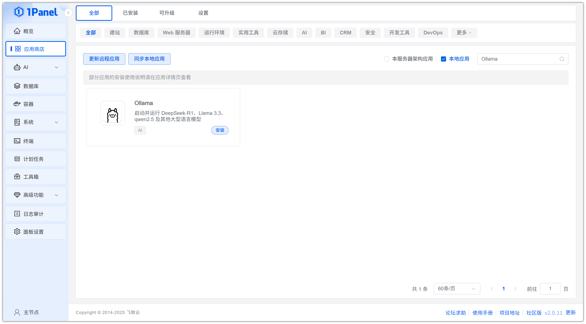
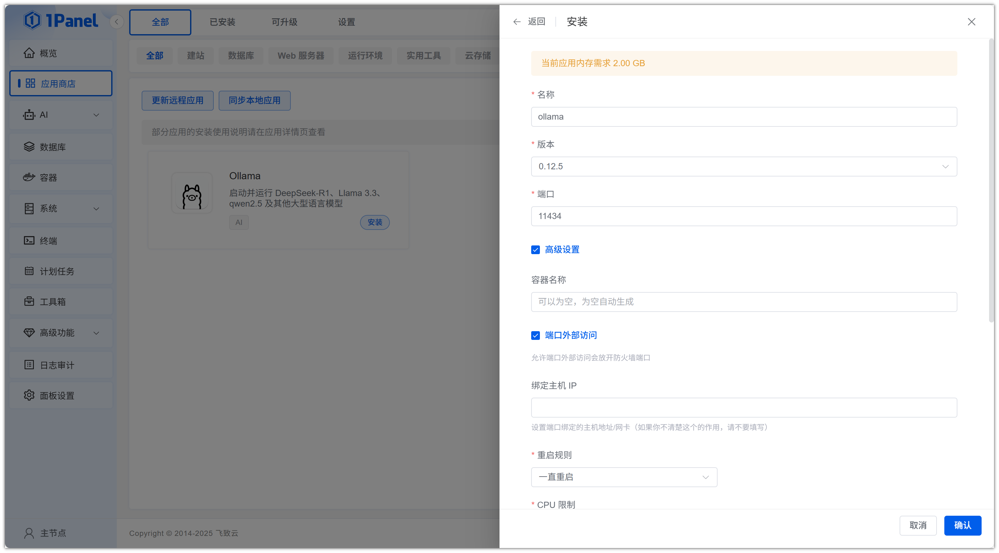
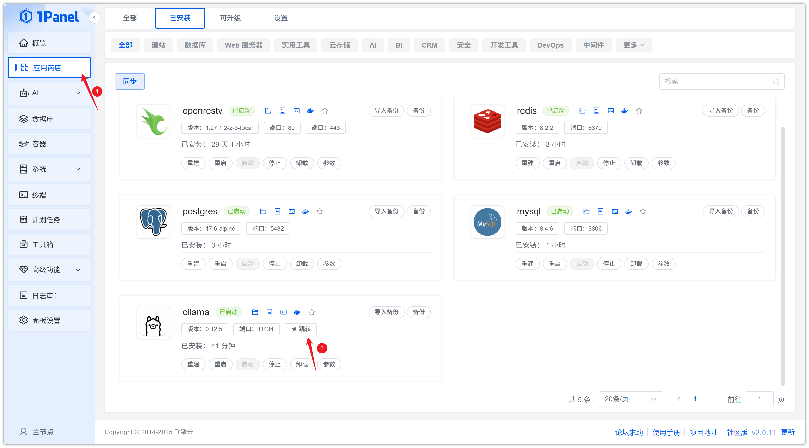
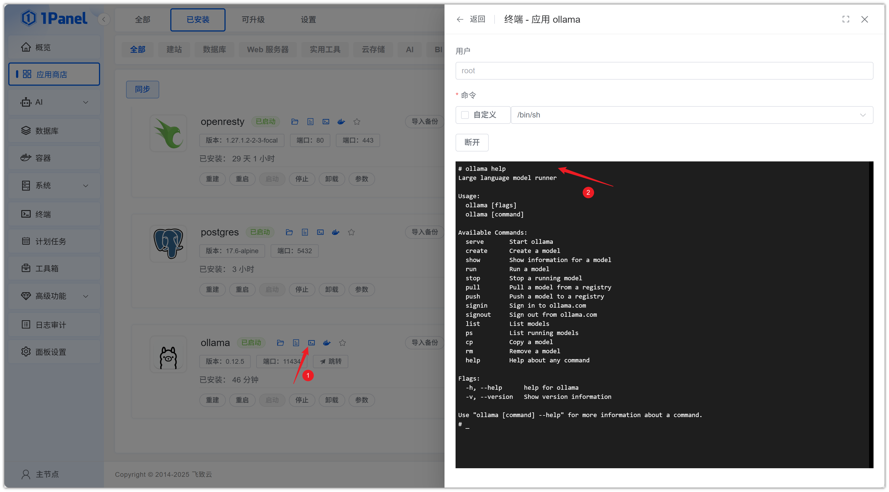

# Install Ollama Visually Using 1Panel

!!! note ""
    **Ollama** is an open-source large language model service that provides an OpenAI-like API interface and chat interface. It allows you to easily deploy the latest GPT models and use them via APIs. It supports hot-reloading model files, enabling you to switch between different models without restarting the service.

## 1. Open the App Store

!!! note ""
    After entering the 1Panel console, click **App Store** in the left menu.

{: .browser-mockup}

## 2. Search for Ollama and Install

!!! note ""
    Enter **Ollama** in the search box in the upper right corner, click the application card to go to the details page, then select **Install**.

{: .browser-mockup}

## 3. Configure Installation Parameters

!!! note ""
    You can configure the following as needed:

    - **Name**: Customize the application name (default: ollama)
    - **Version**: Select the desired Ollama version from the dropdown
    - **Port**: Access port for the application (default: 11434)
    - **Port External Access**: When enabled, allows external network access to the application port

    After confirming the settings are correct, click the **Confirm** button to start installation.

{: .browser-mockup}

!!! note ""
    Wait for the installation to complete.

## 4. Access the Ollama Service

!!! note ""
    Configure the default access address. Skip this step if already configured.

{: .browser-mockup}

!!! note ""
    Return to the App Store and click **Jump** to access the Ollama service.

{: .browser-mockup}

!!! note ""
    If you see `Ollama is running` on the page, the deployment is successful.

{: .browser-mockup}

!!! note ""
    Click **Terminal** to connect to Ollama and control it using commands.

{: .browser-mockup}
