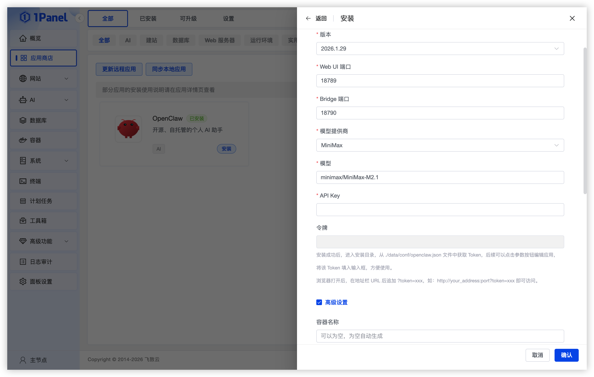
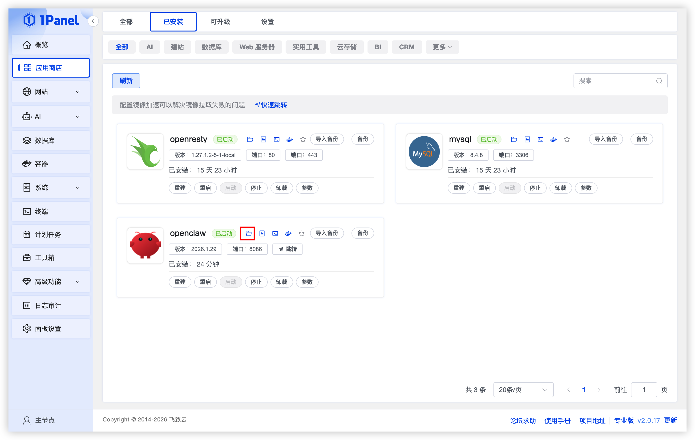
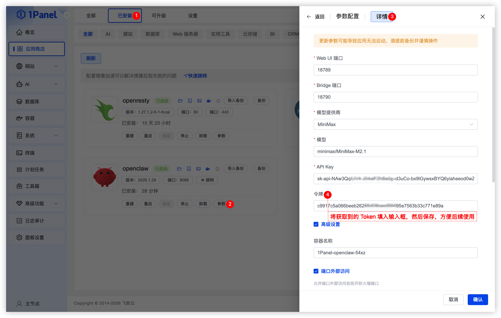
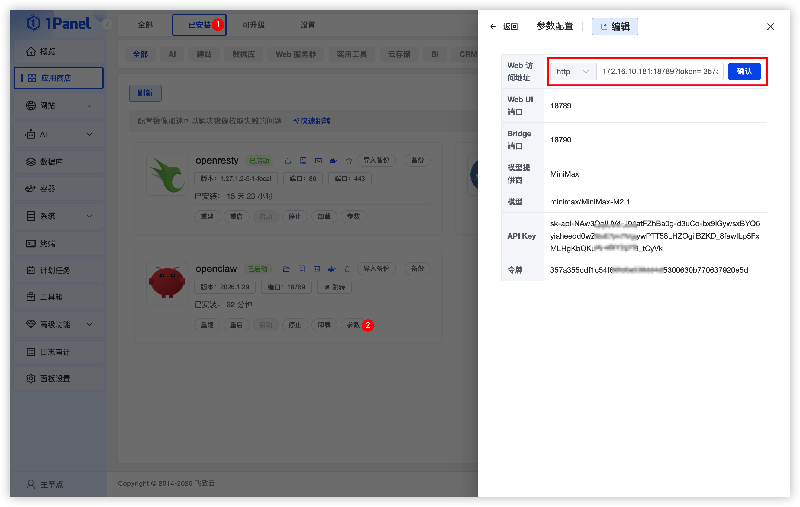

# Install OpenClaw Visually Using 1Panel

!!! note ""
    **OpenClaw** is a *personal AI assistant* that runs on your own devices. It can converse with you across various communication channels you already use, including: WhatsApp, Telegram, Slack, Discord, Google Chat, Signal, iMessage, Microsoft Teams, WebChat, and also supports extended channels such as BlueBubbles, Matrix, Zalo, and Zalo Personal.

    If you want a single-person personal assistant that feels like a local helper, is fast, and always online – this is it.

    **Scan to join the discussion group**

## 1. Open the App Store

!!! note ""
    After entering the 1Panel console, click **App Store** in the left menu.


{: .original}

## 2. Install OpenClaw

!!! note ""
    Enter **OpenClaw** in the search box in the upper right corner, click the application card to go to the details page, then select **Install**.

!!! note ""
    You can configure the following as needed:

    - **Name**: Customize the application name (default: openclaw)
    - **Version**: Select the desired OpenClaw version from the dropdown
    - **WebUI Port**: Defaults to 18789
    - **Bridge Port**: Defaults to 18790
    - **Model Provider**: Select the AI model provider from the dropdown
    - **Model**: Model provider code/Model ID
    - **API Key**: API Key for calling the model provider's interface (obtained from the model provider)
    - **Token**: Leave the Token blank by default. After the application is installed successfully, obtain the Token from the configuration file, then return to the Installed Applications page to fill it in the parameters for future use.
    - **Port External Access**: When enabled, allows external network access to the application ports

    After confirming the settings are correct, click the **Confirm** button to start installation.

!!! note "Common Model Providers and Example Models"
    - MiniMax: `minimax/MiniMax-M2.1`
    - DeepSeek: `deepseek/deepseek-chat`
    - Qwen: `qwen/qwen2.5-coder-32b-instruct`
    - Moonshot (Kimi): `moonshot/kimi-k2.5`
    - ZAI (GLM): `zai/glm-4.7`
    - OpenAI: `openai/gpt-4o-mini`
    - Anthropic: `anthropic/claude-3-7-sonnet`
    - Gemini: `gemini/gemini-1.5-pro`
    - Groq: `groq/llama-3.1-70b-versatile`
    - Mistral: `mistral/large-latest`
    - Cohere: `cohere/command-r-plus`


{: .original}

## 3. Obtain OpenClaw Token

!!! note ""
    On the **Installed Applications page**, find the **OpenClaw** application and click the **folder icon** to enter the application data directory. In the `data/conf` folder under this directory, click the `openclaw.json` file and copy the value of "gateway.auth.token" to use as the Token for accessing the OpenClaw application.

    ```json
    "gateway": {
    "mode": "local",
         "token": "c9917c5a066beeb26266d09baed99495e7563b33c771e89a"
    },
    ***
    ```


{: .original}

!!! note "Token"
    Return to the **Installed Applications page**, click the `Parameters` button to edit the application, and fill in the Token in the input box for future use.


{: .original}

## 4. Access OpenClaw WebUI

!!! note ""
    - On the **Installed Applications page**, click the `Parameters` button to enter the edit page, select a custom **Web Access Address**, fill in the address with `?token=Your OpenClaw Token` and save for easy access to the application later.
    - Example: http://172.16.10.181:18789?token=95917ab5e95cb55cad4821d309158d844fbc47ec1cf0494f


{: .original}

!!! note ""
    On the **Installed Applications page**, find the OpenClaw application, click the **Jump** button, and select the custom access address with Token to access the OpenClaw application normally.

## 5. Configure Chat Tool Integration (Optional)

!!! note ""
    If you want to chat with the robot through chat tools such as Telegram, WhatsApp, Discord, iMessage, etc., find the **OpenClaw application** on the **Installed Applications page** and click the **Enter Installation Directory** button at the top. Click the **Terminal** button at the top of the file list, and execute the following command in the terminal to configure the corresponding chat tool integration.

    ```bash
    docker compose -f docker-compose-cli.yml run --rm openclaw-cli channels add
    ```
{: .original}
