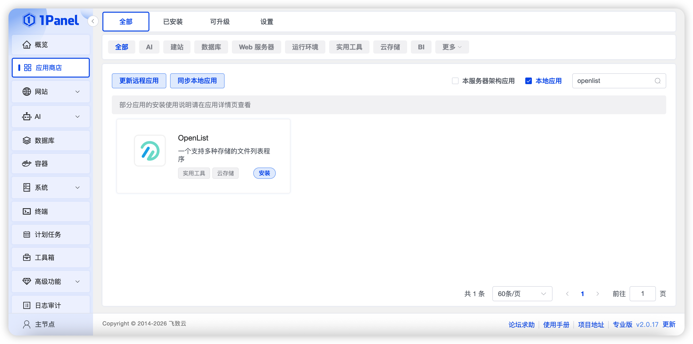
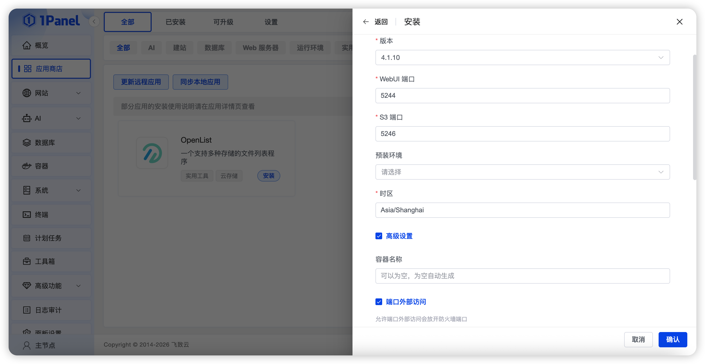
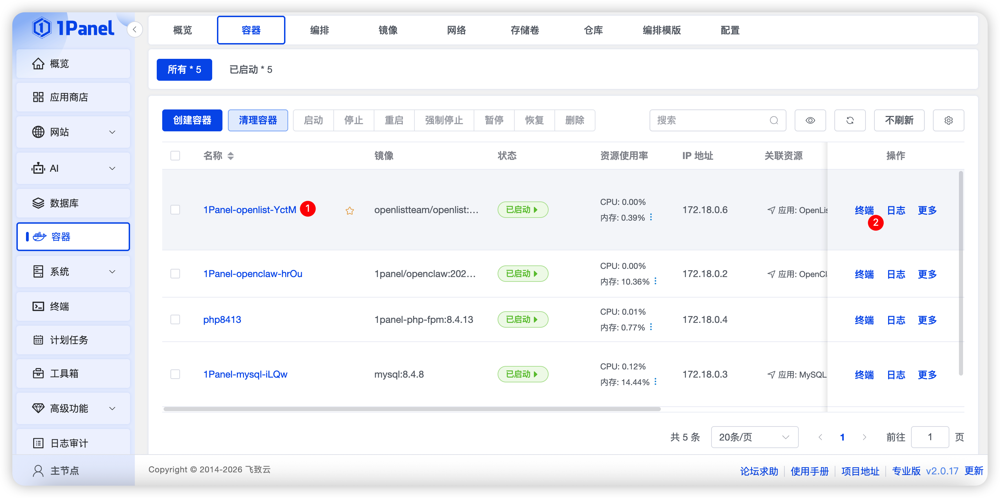
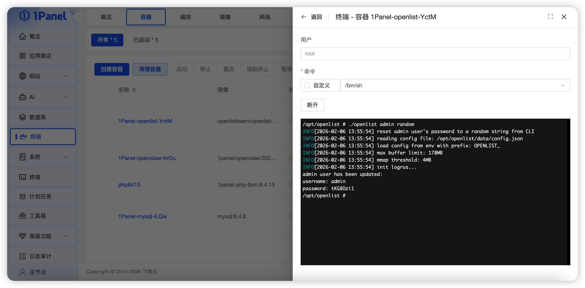
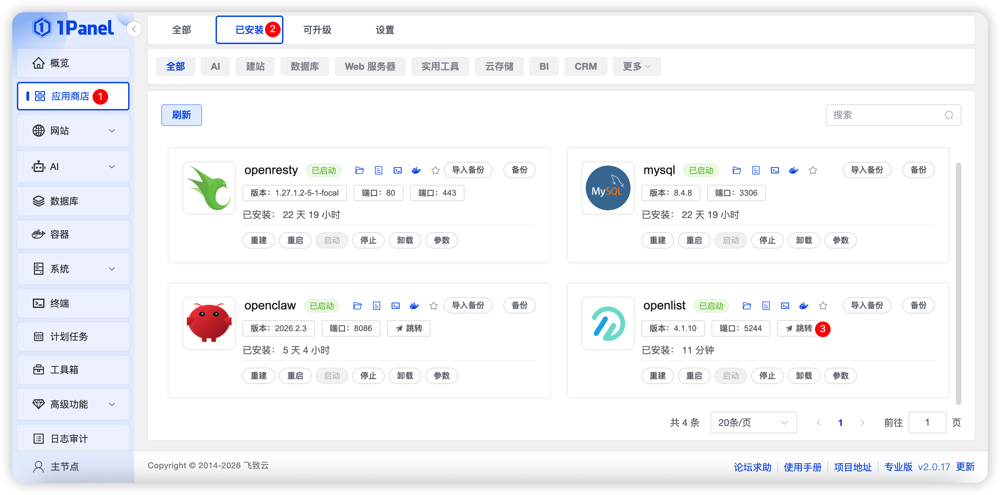
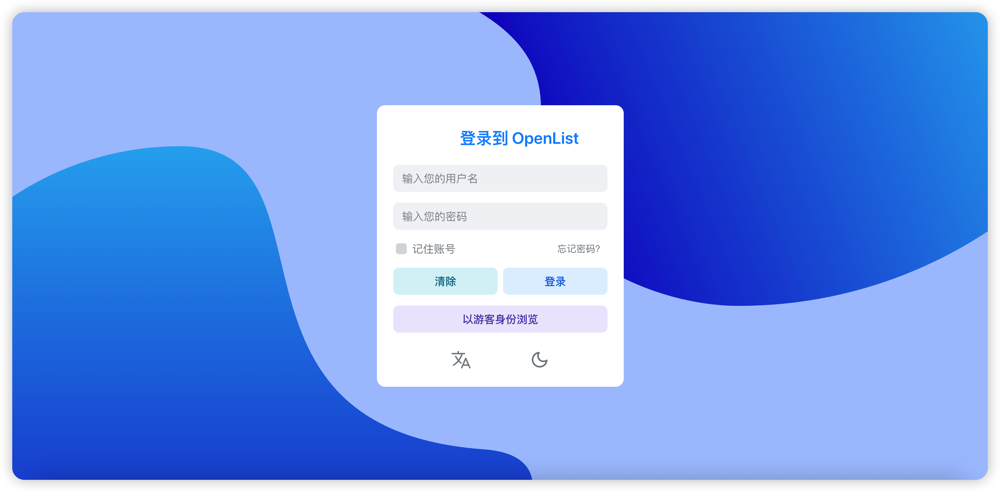

# 使用 1Panel 可视化安装 OpenList

!!! note ""
     **OpenList** 是一个支持多种存储，支持网页浏览和 WebDAV 的文件列表程序，由 gin 和 Solidjs 驱动。

## 1. 打开应用商店

!!! note ""
    进入 1Panel 控制台后，点击左侧菜单的 **「应用商店」**。

## 2. 搜索 OpenList 并安装

!!! note ""
    在右上角搜索框输入 **OpenList**，点击应用卡片进入详情页，选择 **安装**。

## 3. 配置安装参数

!!! note ""
     你可以根据需要配置

    - **名称** (输入框内可自定义应用名称，默认为 openlist)
    - **版本** (下拉选择所需的 OpenList 版本)
    - **WebUI 端口** (应用的访问端口，默认为 5244)
    - **S3 端口** (S3 服务的访问端口，默认为 5246)
    - **预装环境** (可选 `缩略图(预装：ffmpeg)` / `离线下载(预装：aria2)` / `以上所有(预装：ffmpeg & aria2)`)
    - **时区** (默认为 `Asia/Shanghai`)
    - **端口外部访问** (开启后，将允许从外部网络访问此应用端口)

    确认设置无误后，点击 **确认** 按钮开始安装。

!!! note ""
     等待安装完成即可

## 4. 默认账户密码

!!! note ""
     点击左侧菜单的 **容器**，找到 OpenList 容器，点击 **终端**

!!! note ""
     连接终端，生成密码，可选两种方式

    - **生成随机密码**: `./openlist admin random`
    - **手动设置密码**: `./openlist admin set NEW_PASSWORD`

## 5. 访问 OpenList 服务

!!! note ""
     安装完成后，确认 1Panel 配置默认访问地址，已配置过可忽略

!!! note ""
     返回应用商店，点击 **跳转** 即可访问 OpenList 服务

!!! note ""
     输入生成的密码即可

