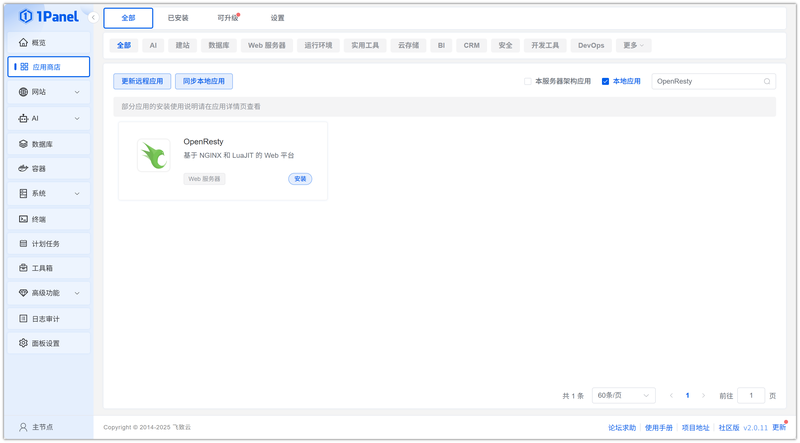
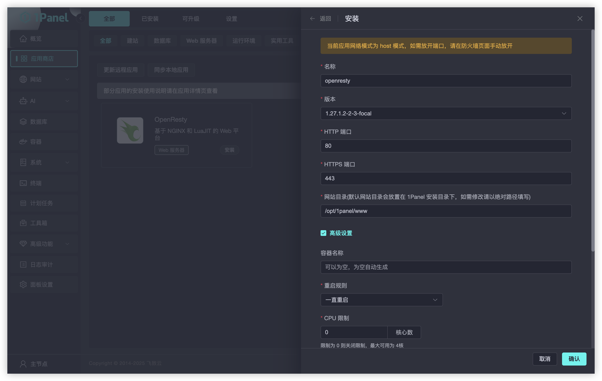
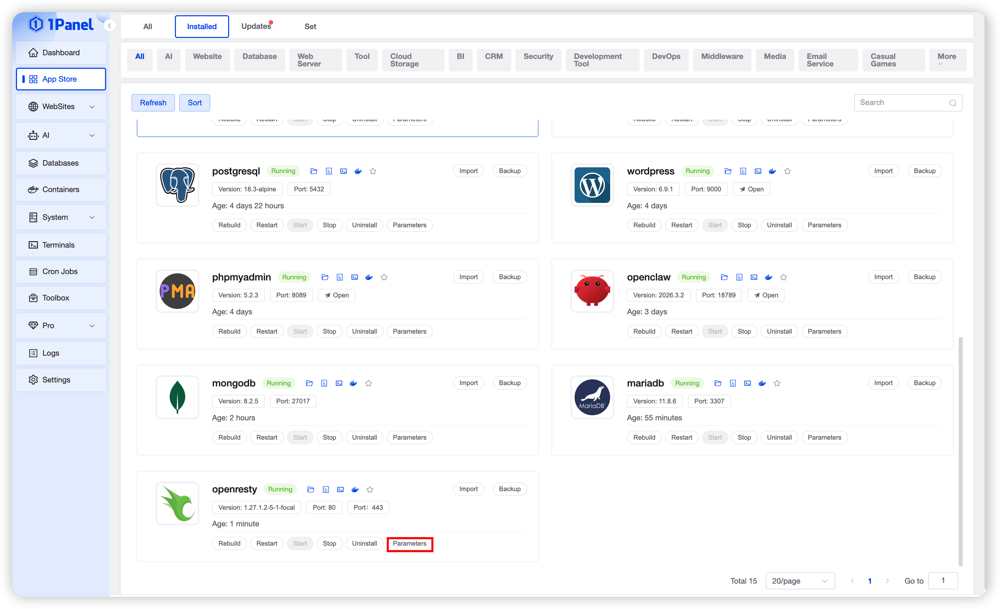
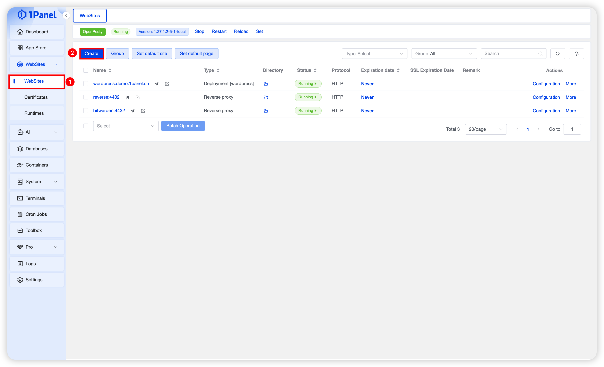

# 使用 1Panel 可视化安装 OpenResty

!!! note ""
    **OpenResty** 是一个基于 Nginx 的高性能 Web 应用服务器，它将 Nginx 与 Lua 编程语言集成在一起，提供了强大的功能和灵活性。

## 1. 打开应用商店

!!! note ""
    进入 1Panel 控制台后，点击左侧菜单的 **「应用商店」**。

## 2. 搜索 OpenResty 并安装

!!! note ""
    在右上角搜索框输入 **OpenResty**，点击应用卡片进入详情页，选择 **安装**。

## 3. 配置安装参数

!!! note ""
    你可以根据需要选择：

    - **名称**（输入框默认应用名称）
    - **版本**（建议使用最新稳定版）
    - **HTTP 端口**（默认 80，如果与现有服务冲突可调整）
    - **HTTPS 端口**（默认 443，如果与现有服务冲突可调整）
    - **网站目录**（默认网站目录会放置在 1Panel 安装目录下，如需修改请以绝对路径填写）
    
    确认设置无误后，点击 **确定** 按钮开始安装。

## 4. 查看运行状态

!!! note ""
    进入 **已安装** 页面，即可查看 OpenResty 的运行状态。你可以对应用执行以下操作：

    - **重建**：重新创建应用  
    - **重启**：重启正在运行的应用
    - **启动 / 停止**：启动或停止应用
    - **卸载**：移除应用及其数据
    - **查看参数**：查看应用启动配置
    - **查看日志**：查看应用实时日志
    - **进入容器终端**：在容器内执行命令
    - **备份 / 恢复**：对应用数据进行备份和恢复

## 5. 使用 OpenResty

!!! note ""
    进入 1Panel 左侧的 **网站** 菜单，即可创建新网站并使用 OpenResty 服务。

