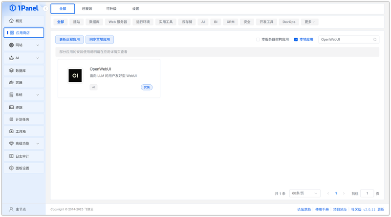
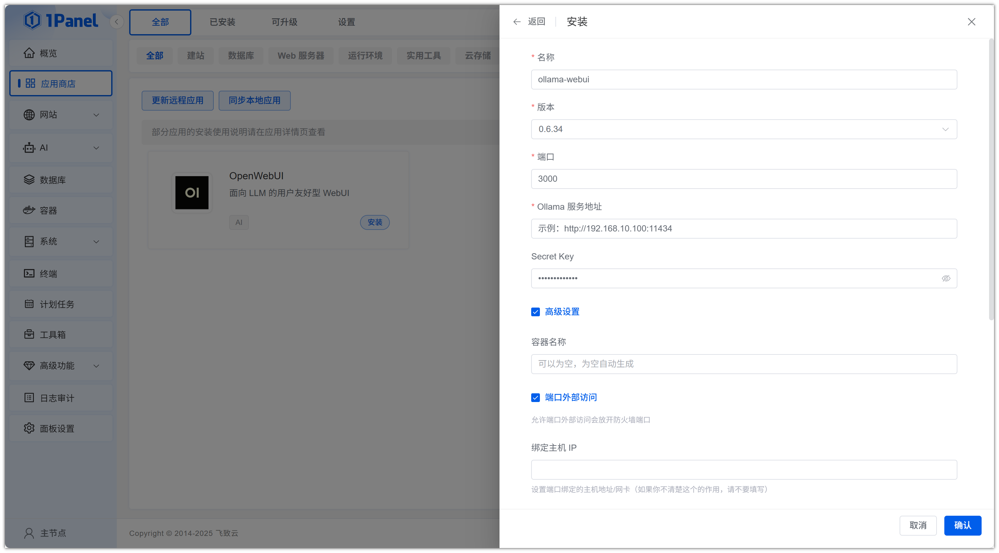
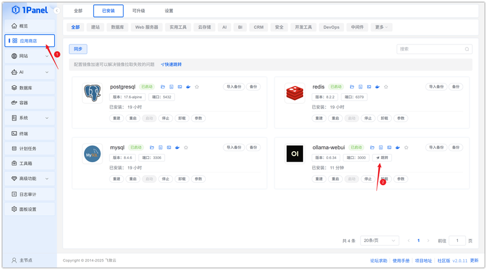
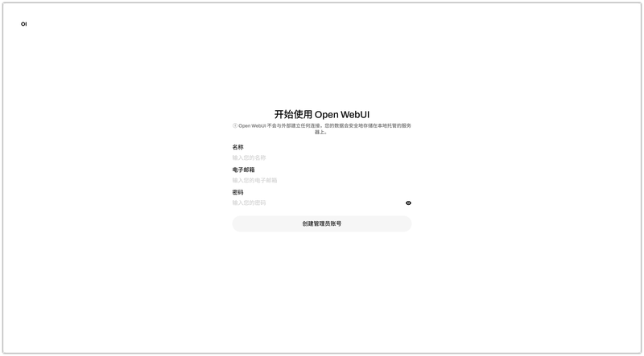

# Install Open WebUI Visually Using 1Panel

!!! note ""
    **Open WebUI** is a user-friendly WebUI for LLMs, supporting LLM backends including Ollama and OpenAI-compatible APIs.

## 1. Open the App Store

!!! note ""
    After entering the 1Panel console, click **App Store** in the left menu.

{: .original}

## 2. Search for Open WebUI and Install

!!! note ""
    Enter **Open WebUI** in the search box in the upper right corner, click the application card to go to the details page, then select **Install**.

{: .original}

## 3. Configure Installation Parameters

!!! note ""
    You can configure the following as needed:

    - **Name**: Customize the application name (default: ollama-webui)
    - **Version**: Select the desired OpenWebUI version from the dropdown
    - **Port**: Access port for the application (default: 3000)
    - **Ollama Endpoint**: Enter the internal address of your installed Ollama service
    - **Secret Key**: Set the security key for OpenWebUI
    - **Port External Access**: When enabled, allows external network access to the application port

    After confirming the settings are correct, click the **Confirm** button to start installation.

{: .original}

!!! note ""
    Wait for the installation to complete.

## 4. Access the Open WebUI Service

!!! note ""
    After installation, confirm the default access address in 1Panel. Skip this step if already configured.

{: .original}

!!! note ""
    Return to the App Store and click **Jump** to access the Open WebUI service.

{: .original}

!!! note ""
    Access the service and create an administrator account.

{: .original}
