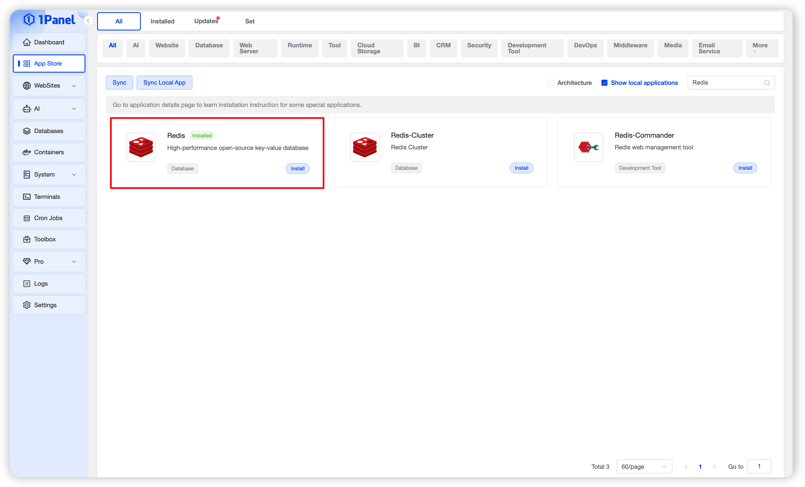
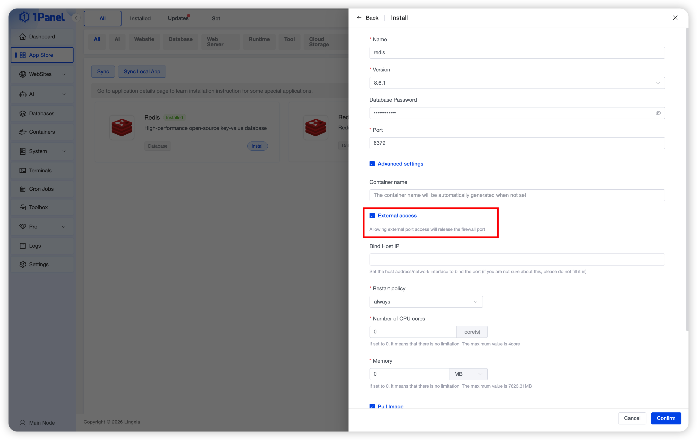
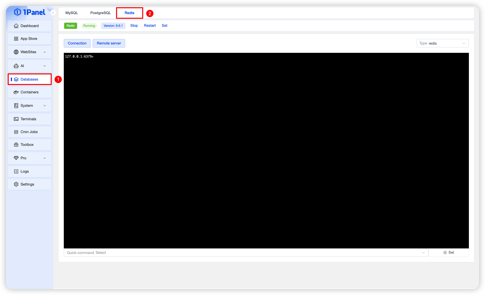
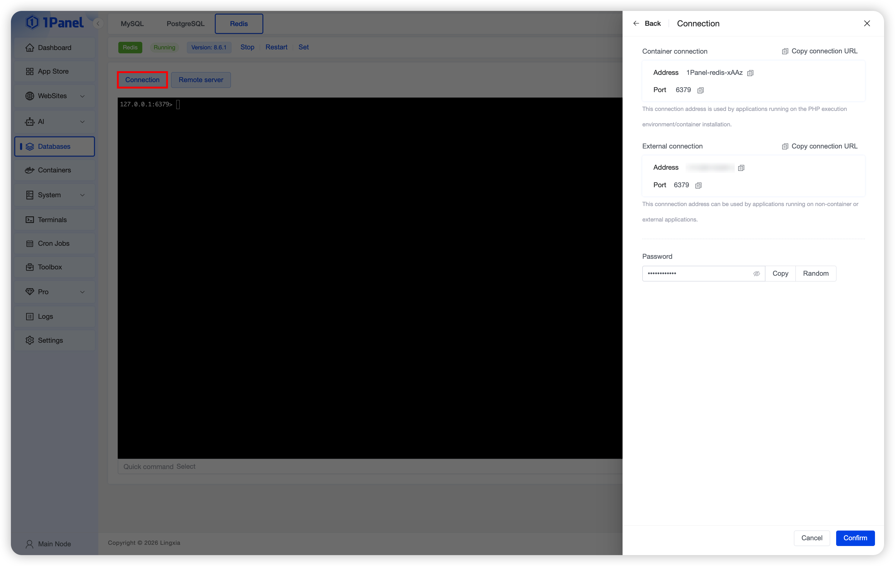
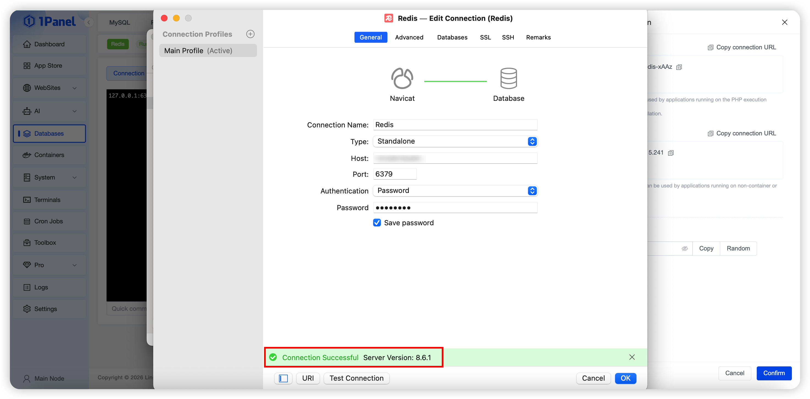

# Install Redis Visually Using 1Panel

!!! note ""
    **Redis** is an open-source in-memory database commonly used as a caching system or key-value storage database.

## 1. Open the App Store

!!! note ""
    After entering the 1Panel console, click **App Store** in the left menu.

{: .browser-mockup}

## 2. Search for Redis and Install

!!! note ""
    Enter **Redis** in the search box in the upper right corner, select the first result, click the application card to go to the details page, then select **Install**.

{: .browser-mockup}

## 3. Configure Installation Parameters

!!! note ""
    You can configure the following as needed:

    - **Name**: Default application name in the input field
    - **Version**: Select the required version
    - **Root Password**: Randomly generated by default
    - **Port**: Default 6379 (can be adjusted if conflicting with existing services)
    - **Port External Access**: When enabled, allows external network connections to this database port

    After confirming the settings are correct, click the **Confirm** button to start installation.

{: .browser-mockup}

!!! note ""
    Wait for the installation to complete.

## 4. Connect to the Redis Database

!!! note ""
    Click **Databases** in the left menu, select Redis, and you can enter commands directly.

{: .browser-mockup}

!!! note ""
    Connect using a client tool. Click **Connection Information** to get the connection configuration.

{: .browser-mockup}

!!! note ""
    Connect to Redis using a local client tool.
   

{: .browser-mockup}
