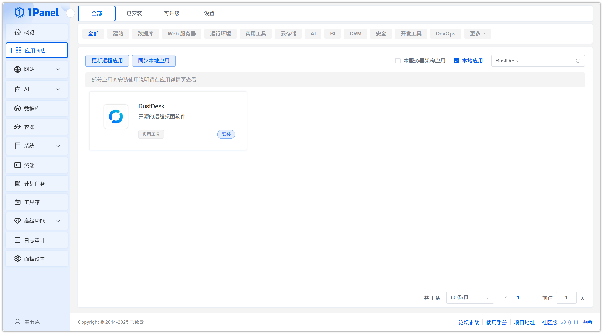
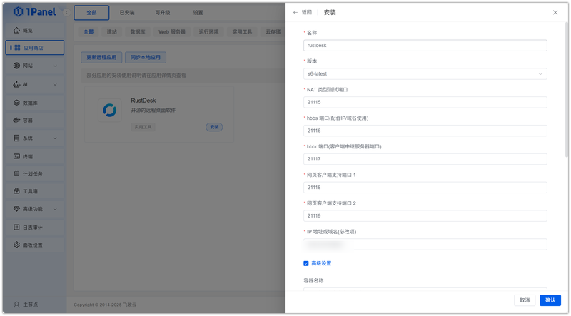
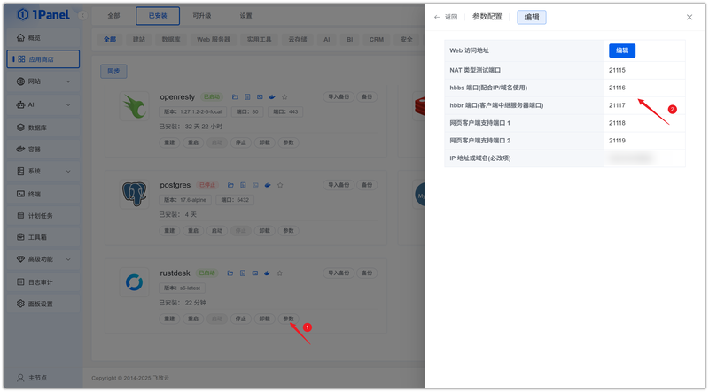
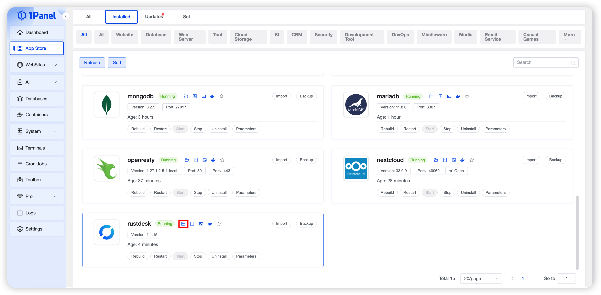
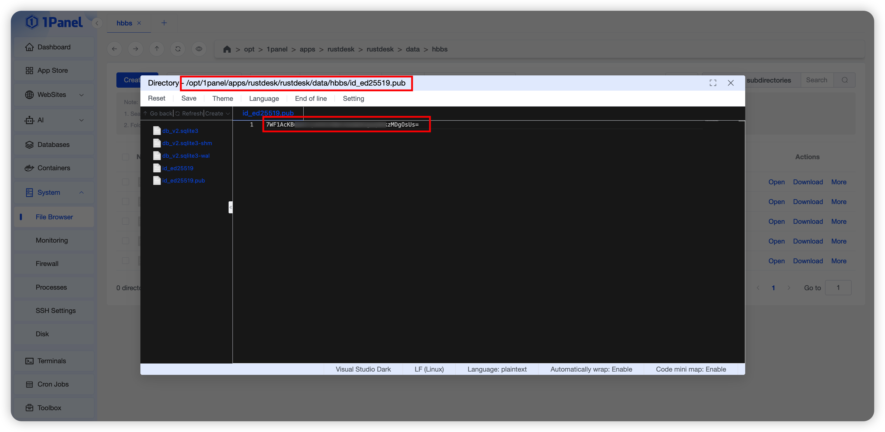
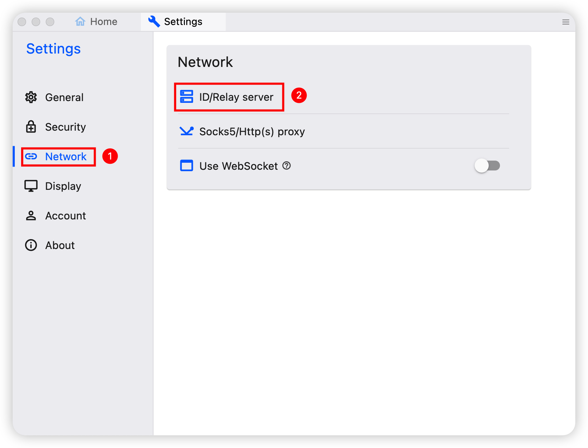
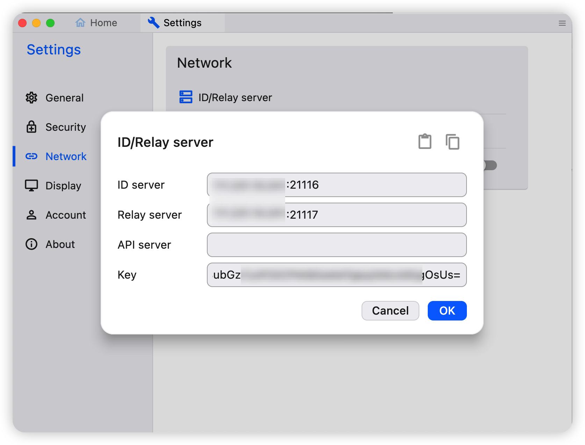
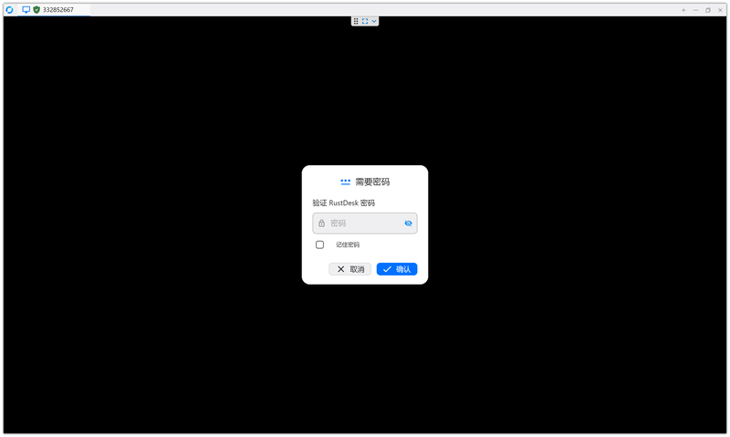

# 使用 1Panel 可视化安装 RustDesk

!!! note ""
     **RustDesk** 是一款开源的远程支持和远程桌面工具，它旨在为用户提供便捷的远程协助和远程访问功能。

## 1. 打开应用商店

!!! note ""
    进入 1Panel 控制台后，点击左侧菜单的 **「应用商店」**。

## 2. 搜索 RustDesk 并安装

!!! note ""
    在右上角搜索框输入 **RustDesk**，点击应用卡片进入详情页，选择 **安装**。

## 3. 配置安装参数

!!! note ""
     你可以根据需要配置

    - **名称** (输入框内可自定义应用名称，默认为 rustdesk)
    - **版本** (下拉选择所需的 RustDesk 版本)
    - **NAT 类型测试端口** (默认为 21115)
    - **hbbs 端口(配合中继服务器使用)** (默认为 21116)
    - **hbbr 端口(客户-客户端中继服务器端口)** (默认为 21117)
    - **网页客户端端口 1** (默认为 21118)
    - **网页客户端端口 2** (默认为 21119)
    - **IP 地址或域名(必填)** (填写服务器的公网 IP 地址或域名)
    - **端口外部访问** (开启后，将允许从外部网络访问此应用端口)
    
    确认设置无误后，点击 **确认** 按钮开始安装。

!!! note ""
     等待安装完成即可

## 4. 配置 RustDesk 并使用

!!! note ""
     点击参数获取配置信息

!!! note ""
     进入安装目录

!!! note ""
     根据找到对应的 pub 文件，获取key

!!! note ""
     下载客户端https://github.com/rustdesk/rustdesk/releases，下载后，打开客户端，进入设置选择中继服务器

!!! note ""
     填入对应的信息

!!! note ""
     在另外一台主机的客户端，也填入相同的信息，输入连接信息远程连接即可

