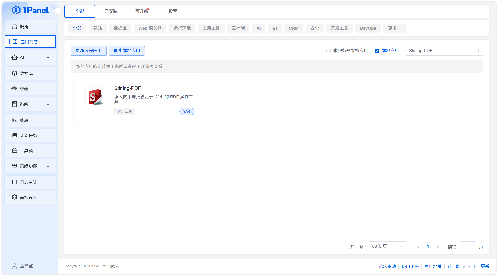
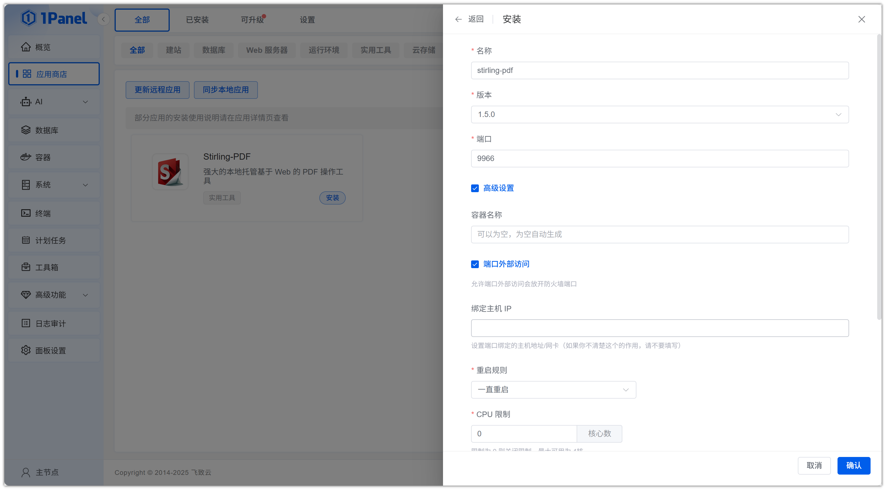
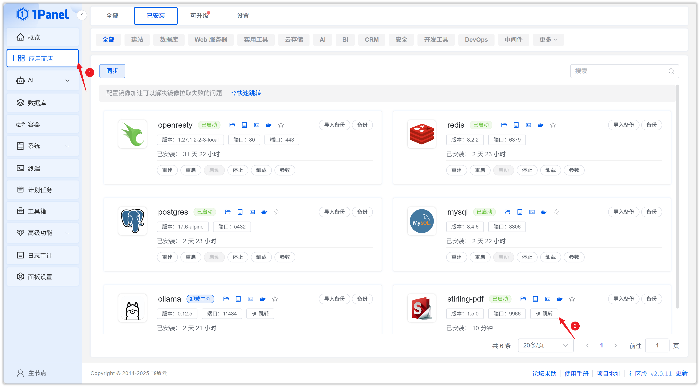
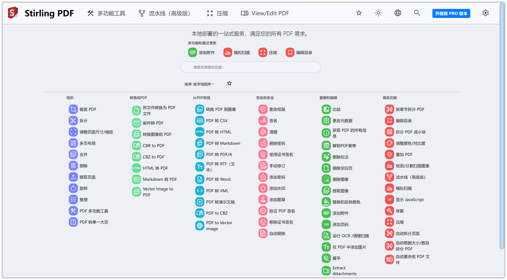

# 使用 1Panel 可视化安装 Stirling-PDF

!!! note ""
     **Stirling-PDF** 是一个强大的本地托管基于 Web 的 PDF 操作工具，允许您对 PDF 文件执行各种操作，例如拆分合并、转换、重新组织、添加图像、旋转、压缩等。

## 1. 打开应用商店

!!! note ""
    进入 1Panel 控制台后，点击左侧菜单的 **「应用商店」**。

## 2. 搜索 Stirling-PDF 并安装

!!! note ""
    在右上角搜索框输入 **Stirling-PDF**，点击应用卡片进入详情页，选择 **安装**。

## 3. 配置安装参数

!!! note ""
     你可以根据需要配置

    - **名称** (输入框内可自定义应用名称，默认为 stirling-pdf)
    - **版本** (下拉选择所需的 Stirling-PDF 版本)
    - **端口** (应用的访问端口，默认为 8080)
    - **端口外部访问** (开启后，将允许从外部网络访问此应用端口)
    
    确认设置无误后，点击 **确认** 按钮开始安装。

!!! note ""
     等待安装完成即可

## 4. 配置访问 Stirling-PDF 服务

!!! note ""
     安装完成后，确认 1Panel 配置默认访问地址，已配置过可忽略

!!! note ""
     返回应用商店，点击 **跳转** 即可访问 Stirling-PDF 服务

!!! note ""
     选择对应的功能即可

