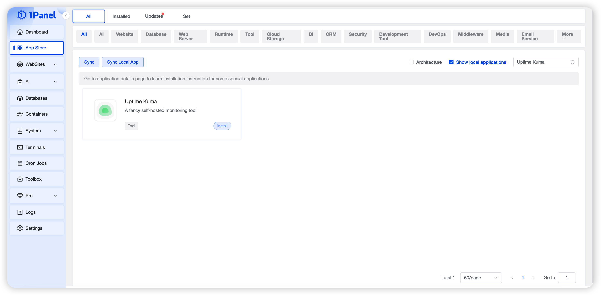
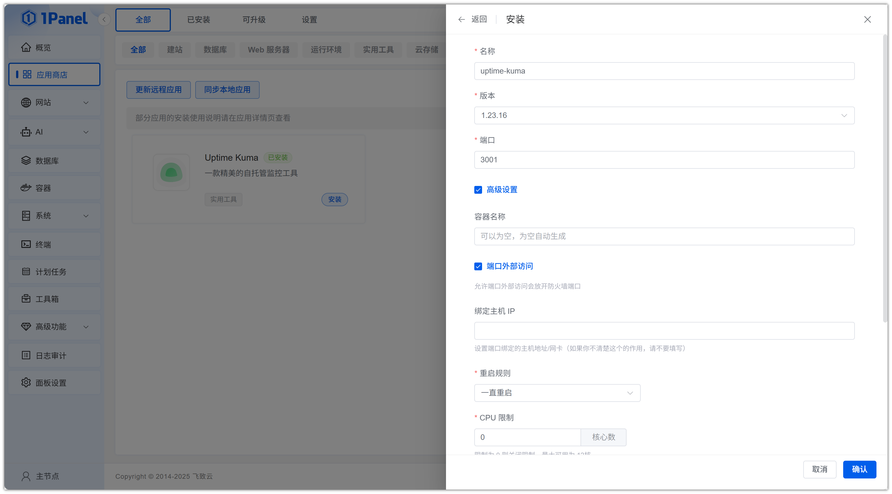
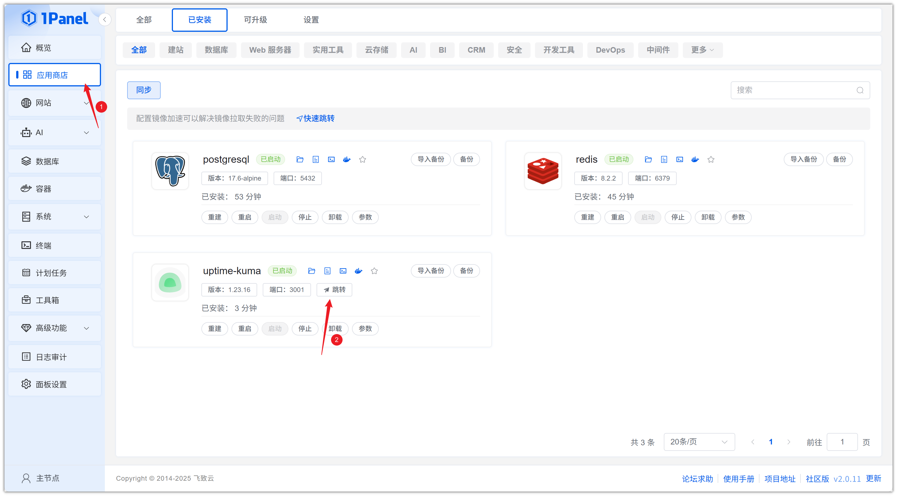
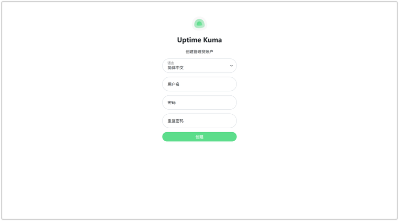

# Install Uptime Kuma Visually Using 1Panel

!!! note ""
    **Uptime Kuma** is an open-source server monitoring and status checking tool that helps you track the availability, performance, and health of your servers.

## 1. Open the App Store

!!! note ""
    After entering the 1Panel console, click **App Store** in the left menu.

{: .original}

## 2. Search for Uptime Kuma and Install

!!! note ""
    Enter **Uptime Kuma** in the search box in the upper right corner, click the application card to go to the details page, then select **Install**.

{: .original}

## 3. Configure Installation Parameters

!!! note ""
    You can configure the following as needed:

    - **Name**: Customize the application name (default: uptime-kuma)
    - **Version**: Select the desired Uptime Kuma version from the dropdown
    - **Port**: Access port for the application (default: 3001)
    - **Port External Access**: When enabled, allows external network access to the application port

    After confirming the settings are correct, click the **Confirm** button to start installation.

{: .original}

!!! note ""
    Wait for the installation to complete.

## 4. Access the Uptime Kuma Service

!!! note ""
    After installation, confirm the default access address in 1Panel. Skip this step if already configured.

{: .original}

!!! note ""
    Return to the App Store and click **Jump** to access the Uptime Kuma service.

{: .original}

!!! note ""
    Create an administrator account to start using it.

{: .original}
