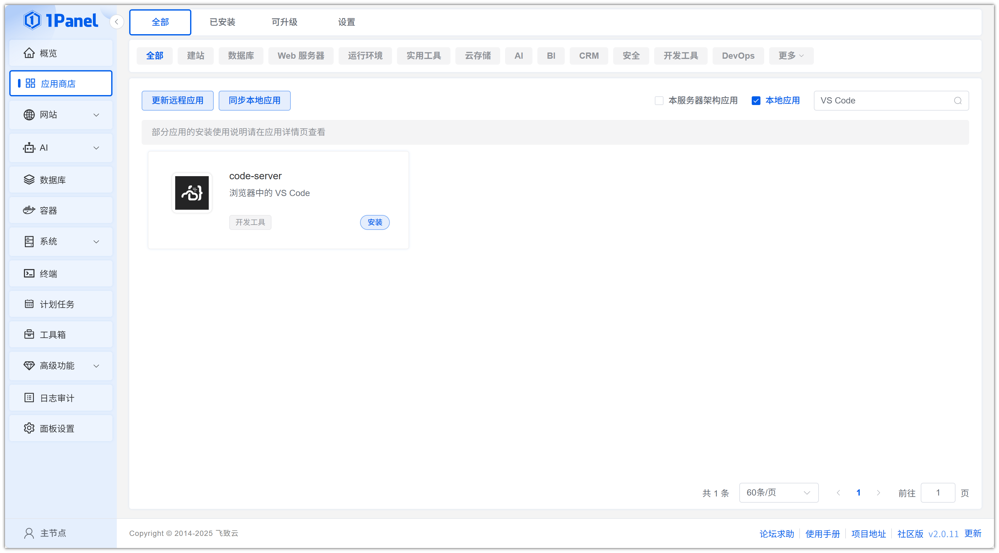
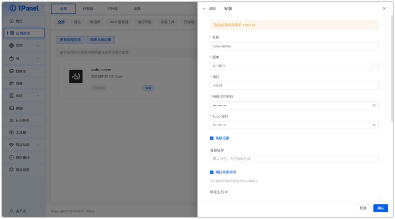
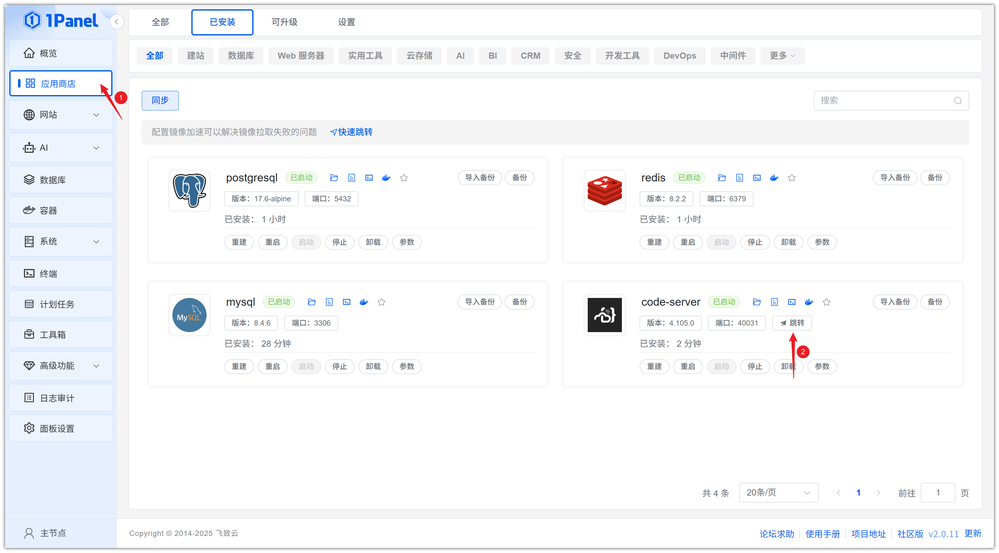
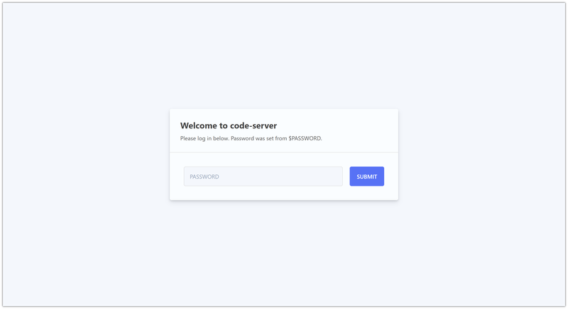

# Install VS Code (code-server) Visually Using 1Panel

!!! note ""
    **code-server** is a powerful open-source tool that brings Visual Studio Code (VS Code) to a web-based online environment. It allows you to remotely access and use VS Code features through a web browser without installing the VS Code application locally.

## 1. Open the App Store

!!! note ""
    After entering the 1Panel console, click **App Store** in the left menu.

{: .original}

## 2. Search for VS Code and Install

!!! note ""
    Enter **VS Code** in the search box in the upper right corner, click the application card to go to the details page, then select **Install**.

{: .original}

## 3. Configure Installation Parameters

!!! note ""
    You can configure the following as needed:

    - **Name**: Customize the application name (default: code-server)
    - **Version**: Select the desired code-server version from the dropdown
    - **Port**: Access port for the application (default: 40031)
    - **Web Access Password**: Set the login password for code-server
    - **Sudo Password**: Set the password for the `sudo` command inside the application
    - **Port External Access**: When enabled, allows external network access to the application port

    After confirming the settings are correct, click the **Confirm** button to start installation.

{: .original}

!!! note ""
    Wait for the installation to complete.

## 4. Access the VS Code Service

!!! note ""
    After installation, confirm the default access address in 1Panel. Skip this step if already configured.

{: .original}

!!! note ""
    Return to the App Store and click **Jump** to access the VS Code service.

{: .original}

!!! note ""
    Enter the access password you set during installation.

{: .original}
