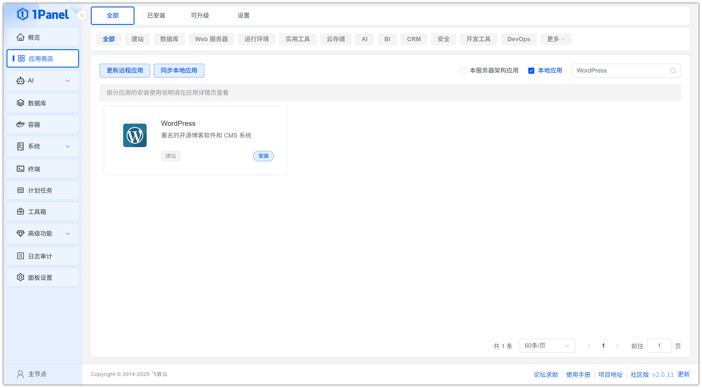
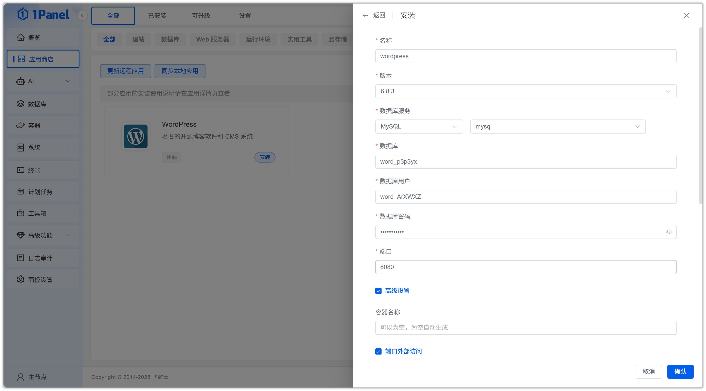
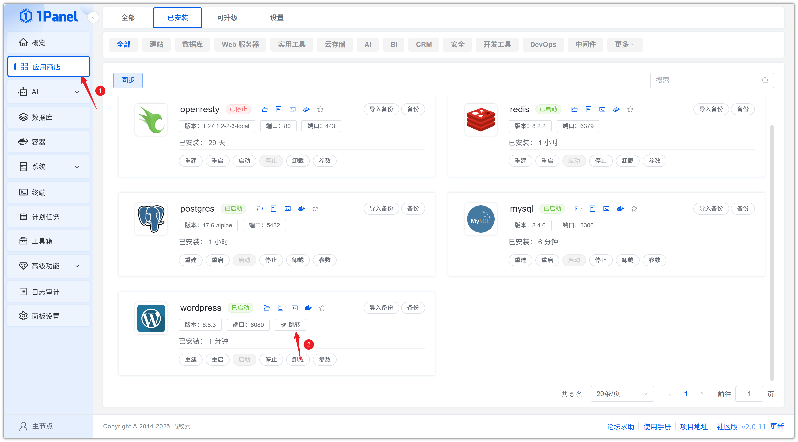
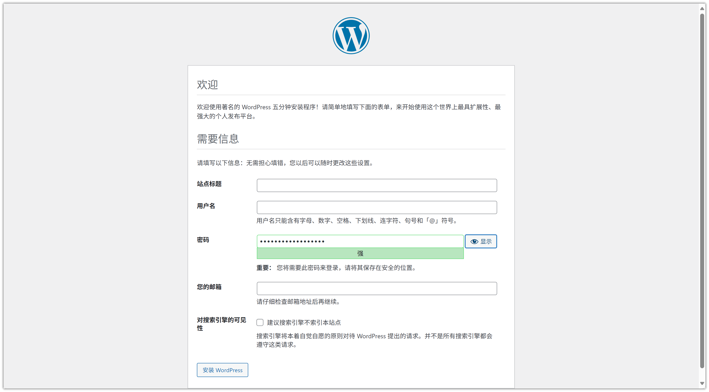
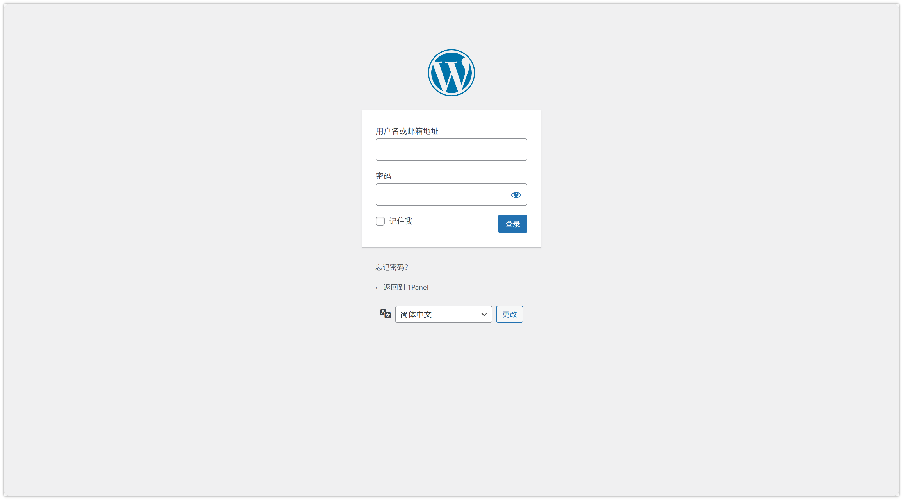

# 使用 1Panel 可视化安装 WordPress

!!! note ""
     **WordPress** 是一款广泛使用的开源内容管理系统（CMS），用于创建和管理网站和博客。

## 1. 打开应用商店

!!! note ""
    进入 1Panel 控制台后，点击左侧菜单的 **「应用商店」**。

## 2. 搜索 WordPress 并安装

!!! note ""
    在右上角搜索框输入 **WordPress**，点击应用卡片进入详情页，选择 **安装**。

## 3. 配置安装参数

!!! note ""
     你可以根据需要配置，这里需要配置数据库服务

    - **名称** (输入框内可自定义应用名称，默认为 wordpress)
    - **版本** (下拉选择所需的 WordPress 版本)
    - **数据库服务** (选择用于存储数据的 MySQL 服务)
    - **数据库名** (为应用创建的数据库名称)
    - **数据库用户** (用于连接数据库的用户名)
    - **数据库密码** (数据库用户的密码)
    - **端口** (应用的访问端口，默认为 8080)
    - **端口外部访问** (开启后，将允许从外部网络访问此应用端口)
    
    确认设置无误后，点击 **确认** 按钮开始安装。

!!! note ""
     等待安装完成即可

## 4. 访问 WordPress 服务

!!! note ""
     配置默认访问地址，已配置则忽略此步骤

!!! note ""
     返回应用商店，点击 **跳转** 即可访问 WordPress 服务

!!! note ""
     设置配置信息，完成初始化

!!! note ""
     输入用户名密码登录，即可使用

