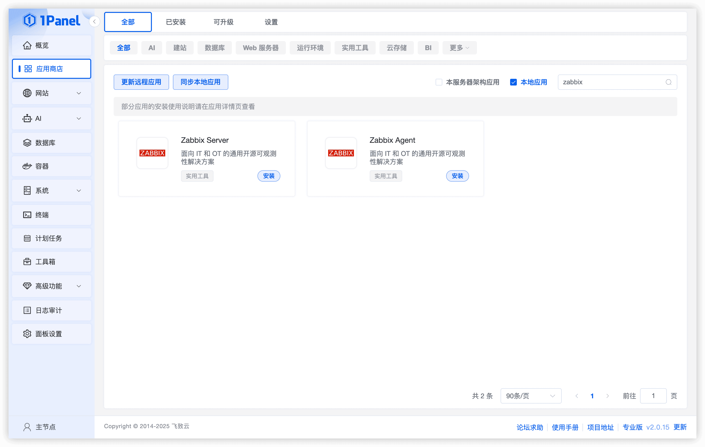
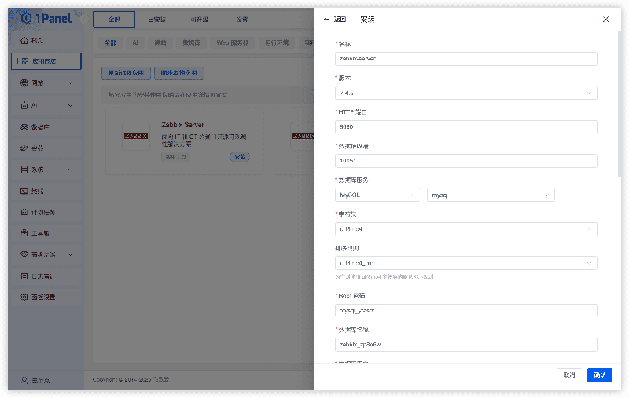
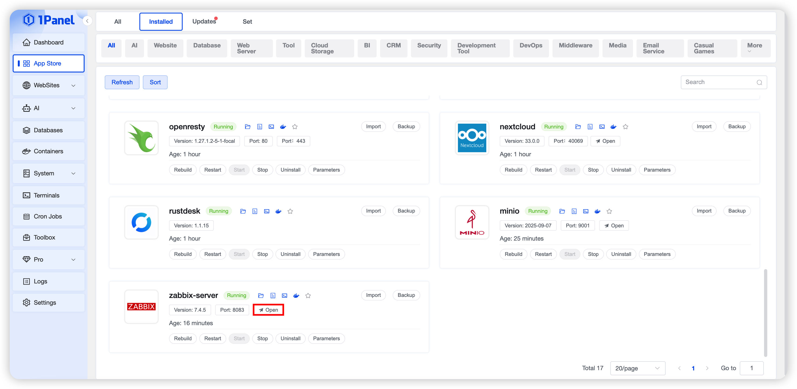
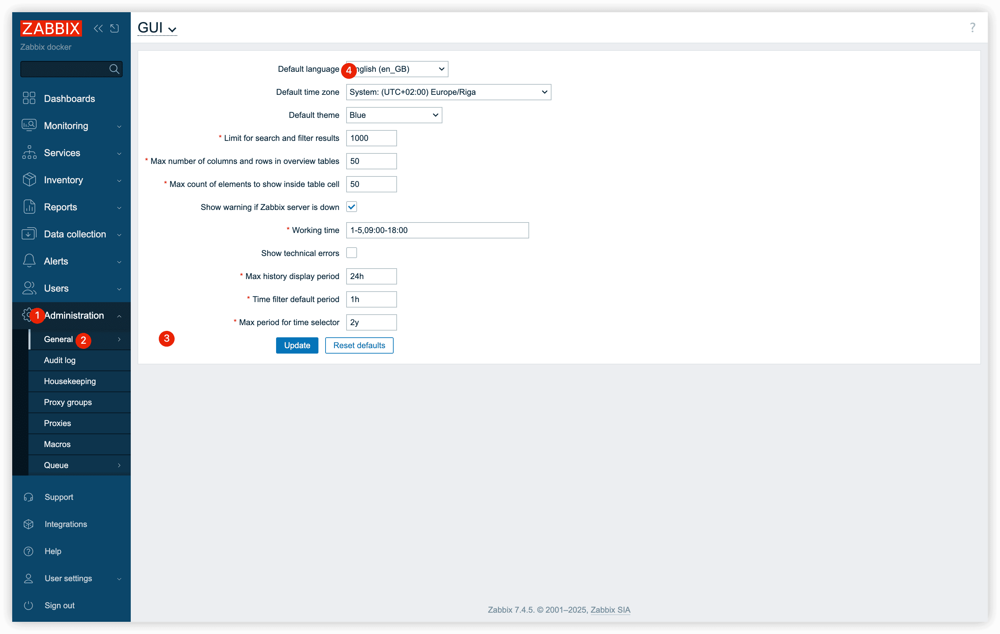
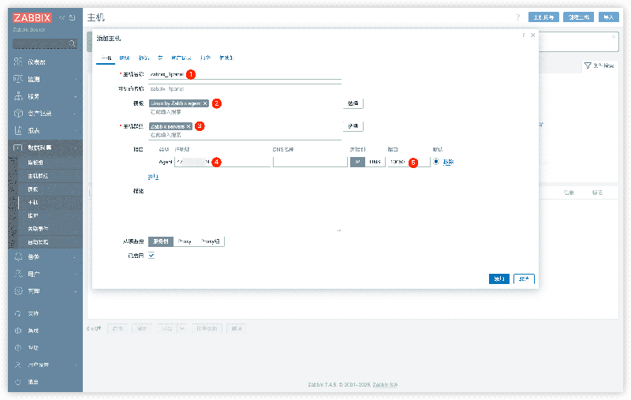
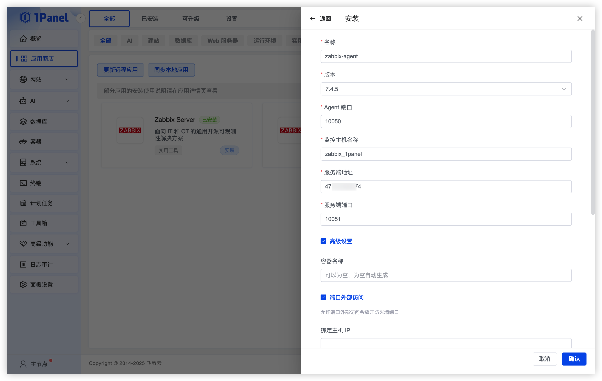
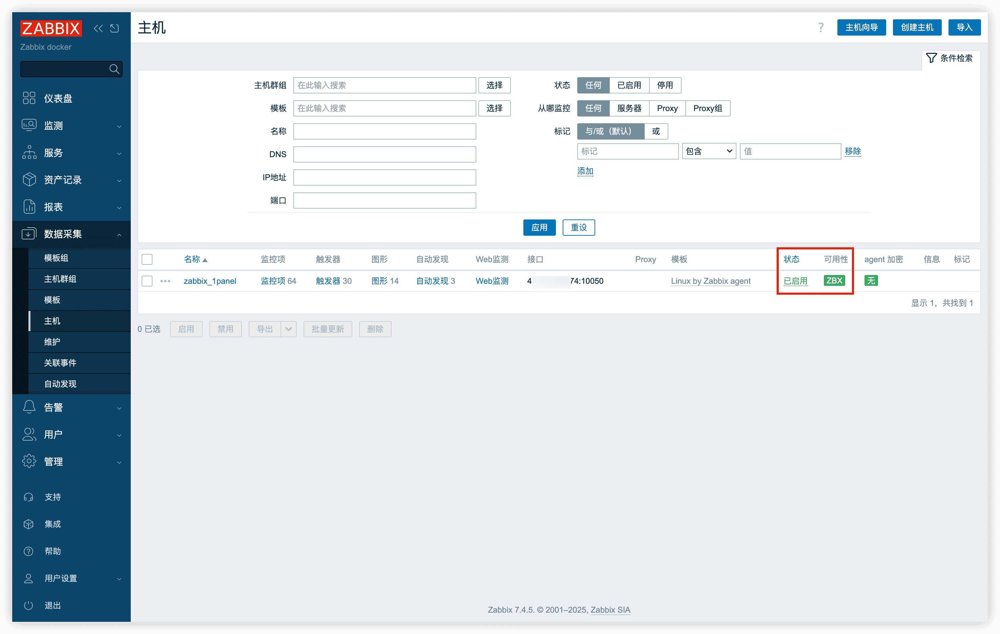

# Install Zabbix Visually Using 1Panel

!!! note ""
    **Zabbix** is an enterprise-class open-source distributed monitoring solution for monitoring the performance and availability of network devices, servers, services, and other IT resources.

## 1. Install Zabbix Server

### 1.1 Open the App Store

!!! note ""
    After logging into the 1Panel console, click **App Store** in the left menu.

{: .original}

### 1.2 Search and Install

!!! note ""
    Enter **Zabbix** in the search box in the upper right corner, click the **Zabbix Server** application card to go to the details page, then select **Install**.

{: .original}

### 1.3 Configure Installation Parameters

!!! note ""
    Configure the following parameters according to your actual needs:

    - **Name**: Customizable (default: `zabbix-server`)
    - **Version**: Select the Zabbix version to install
    - **HTTP Port**: Port for accessing Zabbix (default: 8080)
    - **Data Listening Port**: For receiving monitoring data (default: 10051)
    - **Database Service**: Select the database service for data storage (MySQL supported)
    - **Character Set**: Database character set (default: utf8mb4)
    - **Collation**: It is recommended to choose a case-sensitive collation such as **utf8mb4_bin**
    - **Root Password**: Defaults to the Root password set during MySQL installation
    - **Database**: Database name created for Zabbix
    - **Database User**: Username for connecting to the database
    - **Database Password**: Password for the database user

    After configuration, click **Confirm** to start installation.

{: .original}

### 1.4 Access Zabbix Server

!!! note ""
    - Go to the **Installed** page in the App Store and click **Jump** to access Zabbix Server
    - Default login credentials:
        - Username: `Admin`
        - Password: `zabbix`

{: .original}

!!! note ""
    On first login, you can switch to the Chinese interface by following these steps:

    Go to **Administration** > **General** > **GUI**, select **Chinese (zh_CN)** in **Default language**, then click **Update** to save.

{: .original}

### 1.5 Add a Monitored Host

!!! note ""
    - In the Zabbix Server interface, go to **Data collection** > **Hosts**
    - The default **Zabbix Server** host in the list can be deleted if not needed
    - Click **Create host** in the upper right corner and fill in the host information:
        - **Host name**: Must match the **Monitored host name** set in the Agent
        - **Templates**: Select **Templates Operating systems** > **Linux by Zabbix agent**
        - **Host groups**: Recommended to select **Linux servers**, **Zabbix servers**
        - **Interfaces**: Select **Agent**, enter the correct **IP address** and **port**

    Click **Add** to save the configuration.

{: .original}

## 2. Install Zabbix Agent

### 2.1 Search and Install

!!! note ""
    Return to the App Store list, enter **Zabbix** in the upper right corner, click the **Zabbix Agent** application card to go to the details page, then select **Install**.

{: .original}

### 2.2 Configure Installation Parameters

!!! note ""
    Configure the following parameters according to your actual needs:

    - **Name**: Customizable (default: `zabbix-agent`)
    - **Version**: Select the Agent version to install
    - **Agent Port**: Port used by the Agent to report data (default: 10050)
    - **Monitored host name**: Must match the host name configured on the server
    - **Server Address**: IP/domain of Zabbix Server
    - **Server Port**: Port of Zabbix Server (default: 10051)

    After configuration, click **Confirm** to start installation.

{: .original}

### 2.3 Check Agent Host Status

!!! note ""
    Go to **Data collection** > **Hosts**. If the **Availability** column shows green, the Agent has successfully connected to the Server.

{: .original}
