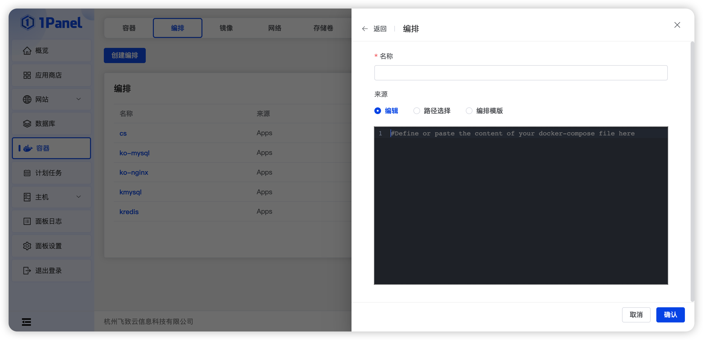
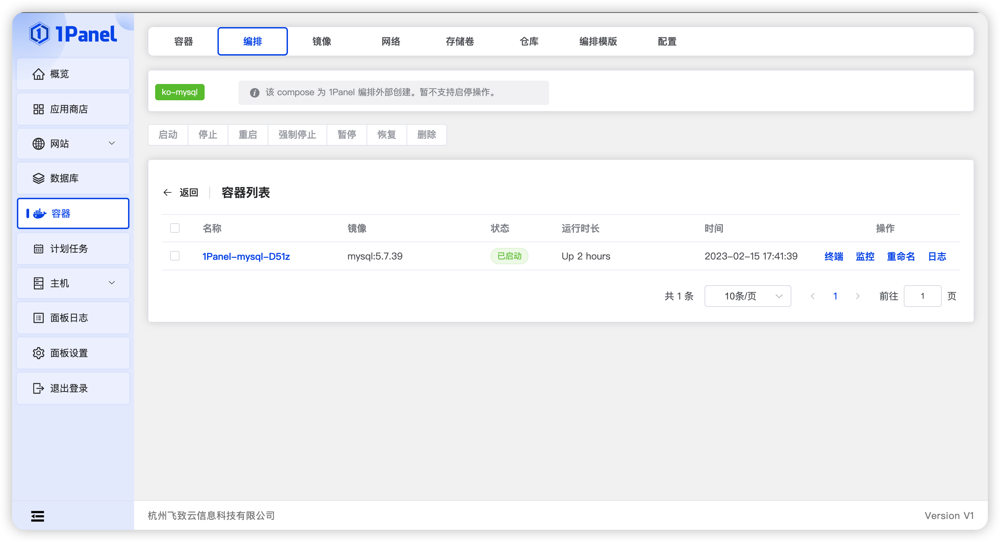

## 1 创建编排

!!! Abstract ""
    提供三种方法可以从 1Panel 部署新 Compose

    - 编辑： 使用 Web 编辑器定义服务。
    - 路径选择： 选择 1Panel 服务中已存在的 docker-compose.yml。 
    - 编排模版： 选择已存在的编排模版。

    [我想了解更多容器编排相关的知识](https://docs.docker.com/compose)

## 2 编辑编排

!!! Abstract ""
    Compose 按照来源可以区分为三种：

    - Apps: 来源于应用商店应用部署；
    - 1Panel: 来源于系统编排创建；
    - Local: 服务器直接创建。

    **编辑仅适用于 1Panel 部署的 Compose**

## 3 编排详情

!!! Abstract ""
    点击编排列表名称，进入编排详情界面，详情界面实现该 Compose 对应的容器列表，仅当该 Compose 为 1Panel 创建时，支持对 Compose 进行启停操作。

