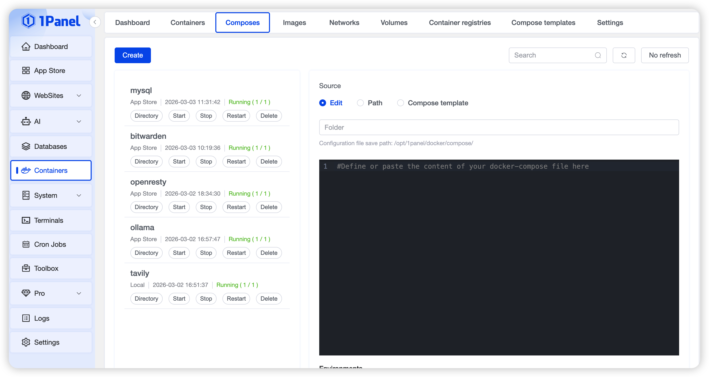
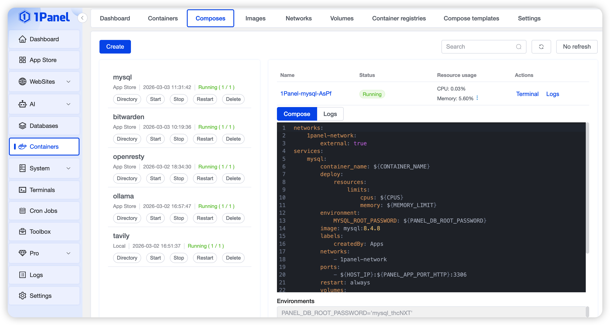

## 1 Create Orchestration

!!! note ""
    Three methods are available to deploy a new Compose from 1Panel:

    - Edit: Use the web editor to define services
    - Path Selection: Select an existing docker-compose.yml file in the 1Panel service
    - Orchestration Template: Choose from existing orchestration templates

    [Learn more about container orchestration](https://docs.docker.com/compose)

{: .original}

## 2 Edit Orchestration

!!! note ""
    Composes can be categorized by their source into three types:

    - Apps: Deployed from applications in the App Store
    - 1Panel: Created through system orchestration
    - Local: Directly created on the server

    **Editing is only available for Composes deployed via 1Panel**

## 3 Orchestration Details

!!! note ""
    Click the name in the orchestration list to enter the orchestration details page. This page displays the container list corresponding to the Compose. Starting/stopping operations for the Compose are only supported when the Compose is created by 1Panel.

{: .original}
