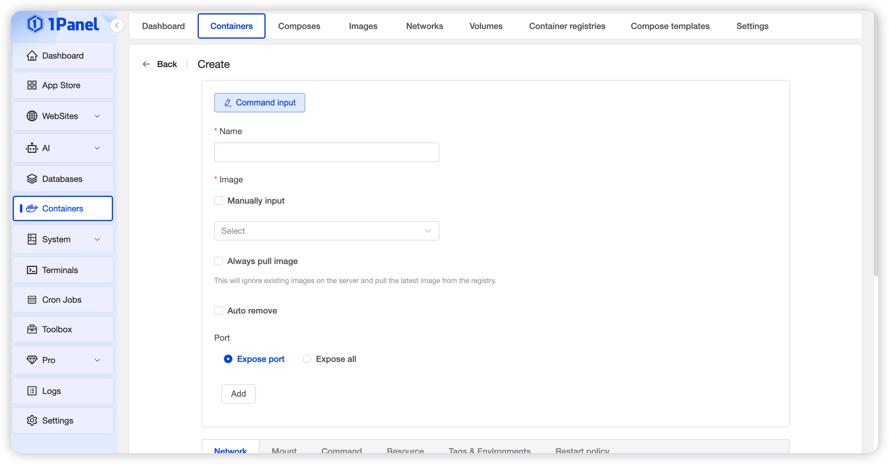
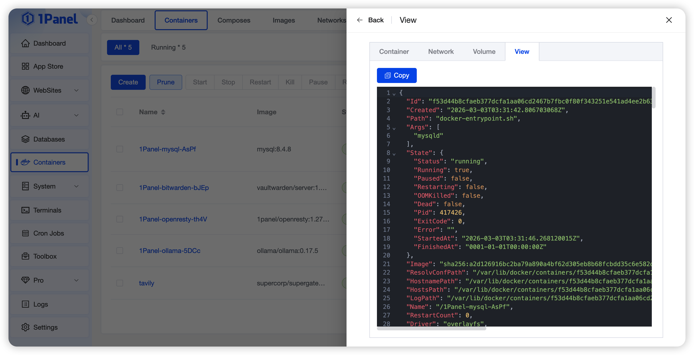
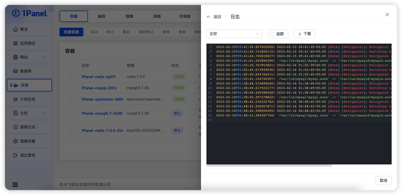
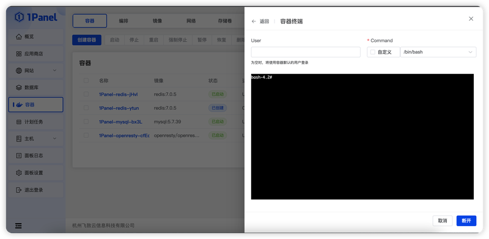
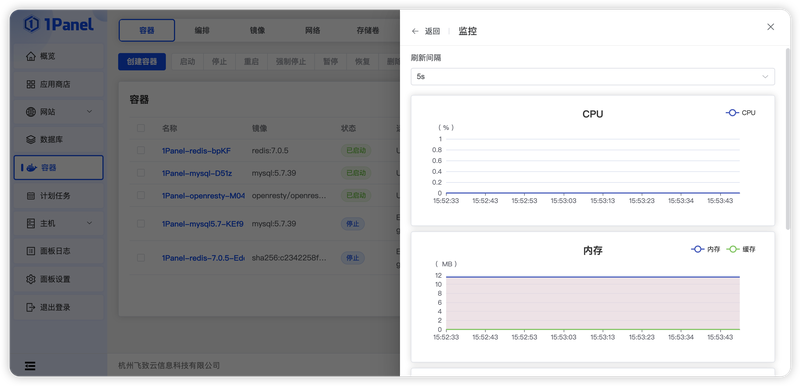

## 1 Add Container

!!! note ""
    - Select **Containers** from the menu, then click **Create Container**
    - Configure container settings as needed
    - Images must be pulled manually from the Images menu

{: .original}

## 2 Inspect Container

!!! note ""
    Click the target container name, and all information about the container will be displayed in the right drawer.

{: .original}

## 3 View Container Logs

!!! note ""
    - Supports viewing logs from the last day, last 4 hours, last 1 hour, and last 10 minutes
    - **Follow**: Refresh container logs in real time
    - **Download**: Download container logs

{: .original}

## 4 Access Container Console

!!! note ""
    - Select the command and user to grant access, then click **Connect**

    **Note**: For Alpine Linux containers, select the `/bin/ash` command. If you need to define a command other than the provided ones, switch the **Custom** option to on.

{: .original}

## 5 View Container Statistics

!!! note ""
    Supported information includes:
    - Memory usage
    - CPU usage
    - Disk I/O usage
    - Network usage

    **Refresh interval can be changed**.

{: .original}
