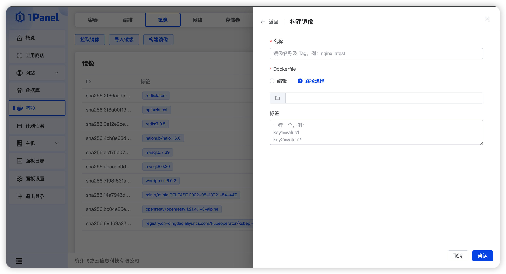

## 1 拉取镜像

!!! Abstract ""

    - 支持从已添加的镜像仓库中拉取，等价于 docker pull 操作。
    - 拉取镜像将耗费一段时间，如果关闭抽屉后还想查看拉取日志，则可以去【主机 - 文件】中，下载或查看 [安装目录]/1panel/tmp/docker_logs/image_pull_[时间戳].log。

## 2 导入镜像

!!! Abstract ""
    
    - 选择 1Panel 服务器上已导出的镜像文件，等价于 docker load 操作。

## 3 构建镜像

!!! Abstract ""

    - 直接构建镜像，等价于 docker build 操作。
    - 构建镜像将耗费一段时间，如果关闭抽屉后还想查看构建日志，则可以去【主机 - 文件】中，下载或查看 [安装目录]/1panel/tmp/docker_logs/image_build_[时间戳].log。
    

!!! Abstract ""

    - 编辑： 使用 Web 编辑器编辑 Dockerfile。
    - 路径选择： 选择 1Panel 服务中已存在的 Dockerfile。

## 4 Tag 镜像

!!! Abstract ""
    
    - Tag 镜像，等价于 docker tag 操作。

## 5 推送镜像

!!! Abstract ""
    
    - 将镜像推送到镜像仓库，推送过程中，后台将自动修改对应的镜像 Tag，等价于 docker tag + docker push 操作。

## 6 导出镜像

!!! Abstract ""
    
    - 将镜像导出为 .tar 文件，等价于 docker save，当需要进行复制或者移动镜像时，可直接在系统执行导入导出操作。

