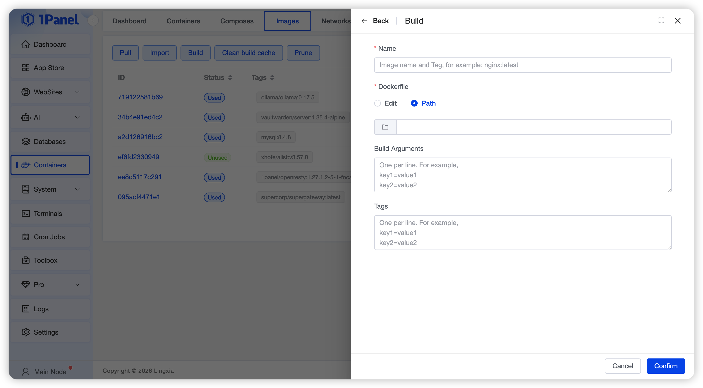

## 1 Pull Image

!!! note ""
    - Supports pulling from added image repositories, equivalent to the `docker pull` command
    - Pulling an image may take some time. If you close the drawer and still want to view the pull logs, you can go to [Host - Files] to download or view the log file at [Installation Directory]/1panel/tmp/docker_logs/image_pull_[timestamp].log

## 2 Import Image

!!! note ""
    - Select an exported image file on the 1Panel server, equivalent to the `docker load` command

## 3 Build Image

!!! note ""
    - Build an image directly, equivalent to the `docker build` command
    - Building an image may take some time. If you close the drawer and still want to view the build logs, you can go to [Host - Files] to download or view the log file at [Installation Directory]/1panel/tmp/docker_logs/image_build_[timestamp].log
    

{: .original}

!!! note ""
    - Edit: Use the web editor to modify the Dockerfile
    - Path Selection: Select an existing Dockerfile in the 1Panel service

## 4 Tag Image

!!! note ""
    - Tag an image, equivalent to the `docker tag` command

## 5 Push Image

!!! note ""
    - Push the image to an image repository. During the push process, the background will automatically modify the corresponding image tag, equivalent to the combination of `docker tag + docker push` commands

## 6 Export Image

!!! note ""
    - Export the image as a .tar file, equivalent to the `docker save` command. When you need to copy or move the image, you can directly perform import and export operations in the system
