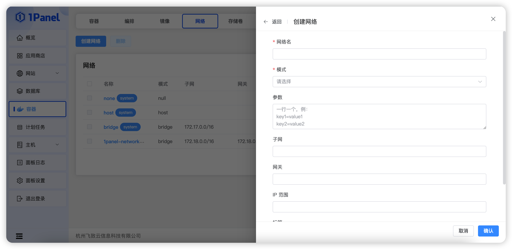

## 1 添加网络

!!! Abstract ""
    1Panel 允许在环境中添加、删除网络，其中 none、host、bridge、1panel-network 四个网络为系统自带网络，无法删除。

    [我想了解更多容器网络相关的知识](https://docs.docker.com/network)

!!! Abstract ""

    **模式：Docker中的网络驱动（network driver）是可插拔的，1Panel 提供几种网络驱动以提供核心的网络功能，包括：**
        
    - bridge: docker 默认的 network driver。如果不显示指定driver类型，docker默认会使用 bridge 模式的 network。通常，当应用程序运行在独立的容器中，并且要相互通信，可以使用 bridge 模式。Bridge 模式下容器与 docker host 的网络是相互隔离的。
    - ipvlan: IPvlan 驱动程序让用户完全控制 IPv4 和 IPv6 寻址。VLAN 驱动程序建立在此基础上，为操作员提供对二层 VLAN 标记的完全控制，甚至对底层网络集成感兴趣的用户提供 IPvlan L3 路由。
    - macvlan:macvlan network 能够给容器分配一个 MAC 地址，使的此容器就像一个此网络上的物理设备。Docker Daemon可以通过MAC地址给容器路由消息。对于一些遗留的应用需要直接连接到物理网络而不是通过 docker host 的网络栈转发时， macvlan 驱动是最好的选择。
    - overlay: Overlay network能够连通不同的 docker daemon，能够使 swarm service 之间能够相互通信. Overlay network 也能够使 swarm service 与独立的容器连通, 能够使位于不同 Docker daemon 上的独立的容器连通。Overlay 模式省去了容器之间操作系统层级的路由工作。
