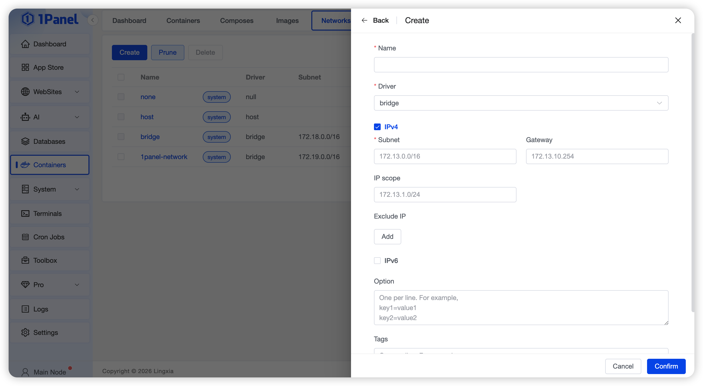

!!! note ""
    1Panel allows you to add and remove networks in the environment. The four networks **none, host, bridge, and 1panel-network** are built-in system networks and cannot be deleted.

    [Learn more about container networks](https://docs.docker.com/network)

{: .original}

!!! note ""
    **Mode: Network drivers in Docker are pluggable. 1Panel provides several network drivers to deliver core networking functionality, including:**

    - bridge: The default Docker network driver. If no driver type is explicitly specified, Docker uses a bridge network by default. It is typically used for standalone containers that need to communicate with each other. Containers in bridge mode are isolated from the Docker host network.
    - ipvlan: The IPvlan driver gives users full control over IPv4 and IPv6 addressing. The VLAN driver builds on this to provide complete control over Layer 2 VLAN tagging, and even IPvlan L3 routing for users interested in underlay network integration.
    - macvlan: Macvlan networks allow you to assign a MAC address to a container, making it appear as a physical device on the network. The Docker Daemon routes traffic to containers by their MAC address. This driver is the best choice for legacy applications that need to connect directly to the physical network instead of routing through the Docker host’s network stack.
    - overlay: Overlay networks connect multiple Docker Daemons and enable Swarm services to communicate with each other. They also allow Swarm services to communicate with standalone containers, and standalone containers across different Docker Daemons to communicate. Overlay mode eliminates OS-level routing between containers.
