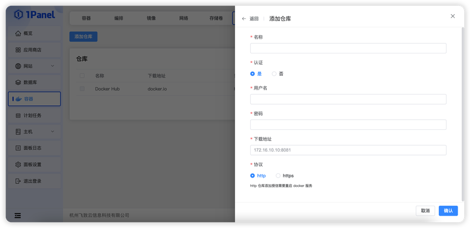

# 镜像仓库

!!! note ""
    镜像仓库用于保存 Docker Registry 连接信息，供镜像拉取和推送使用。入口为 **容器 -> 仓库**，社区版、专业版和企业版均可使用。

## 1 创建仓库

点击 **创建**，填写名称、协议、下载地址，以及是否认证、用户名和密码。启用认证后，1Panel 会使用所填凭证执行 Docker 登录。

使用 HTTP 仓库时，1Panel 会按确认提示把地址加入 Docker 不安全仓库配置，并需要重启 Docker 服务。重启会影响当前节点上正在进行的镜像操作，并可能短暂影响容器管理。

## 2 管理仓库

!!! note ""
    列表支持检查连接、编辑和删除。编辑或删除 1Panel 中的仓库记录不会删除仓库服务端已有镜像；凭证变更后应重新检查连接。

!!! warning "仓库安全"
    优先使用 HTTPS 仓库并为账号分配最小权限。HTTP 传输和长期保存的高权限凭证会增加镜像与认证信息泄露风险。
