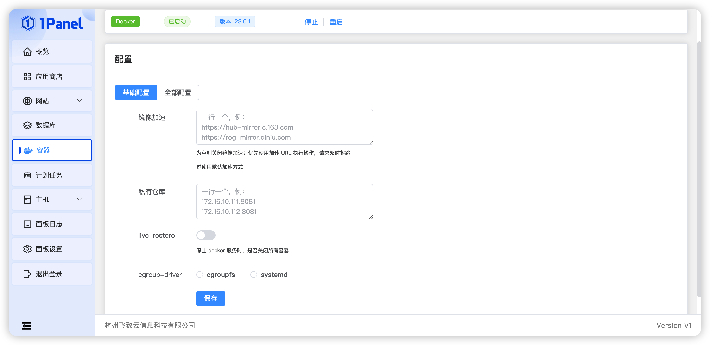
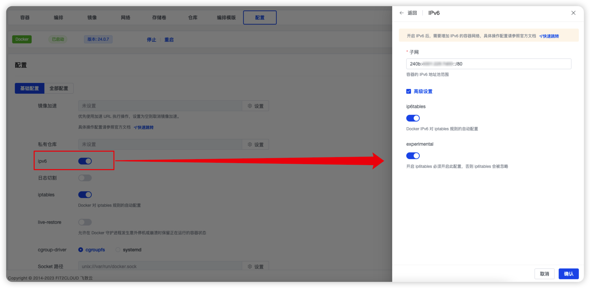
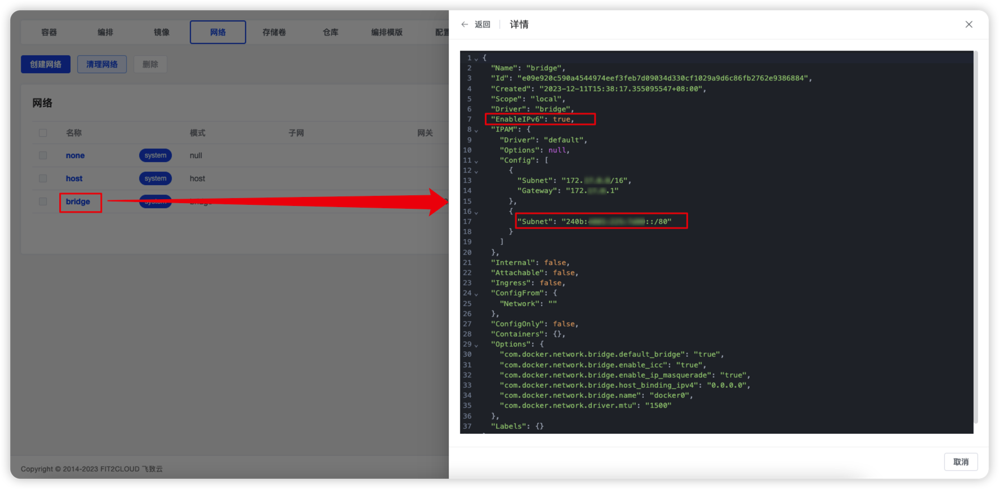
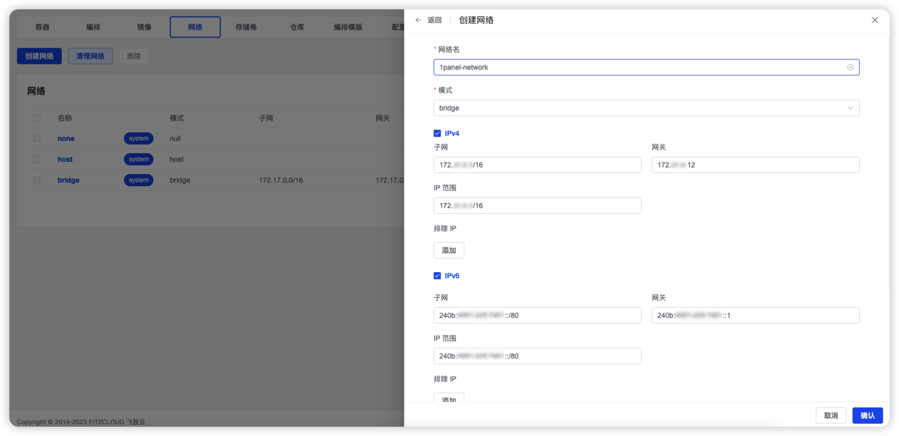

## 1 配置

!!! Abstract ""
    
    - 支持查看 Docker 运行状态，并执行重启服务等操作。
    - 配置文件默认为：/etc/docker/daemon.json。



!!! Abstract ""

    - 镜像加速：国内访问 Docker Hub 有时会遇到困难，此时可以配置镜像加速器。
        - 配置加速地址：
            ```properties
            https://docker.1panel.live
            ```
        - 另外还推荐使用自己的镜像加速地址：
            - [DaoCloud 加速器](https://www.daocloud.io/mirror#accelerator-doc)：https://<你的ID>.m.daocloud.io
            - [阿里云加速器](https://cr.console.aliyun.com/#/accelerator)：https://<你的ID>.mirror.aliyuncs.com
    - 私有仓库：搭建的私有镜像仓库，如 harber、nexus、docker-registry 等。
    - iptables：该设置将关闭 Docker 对 iptables 规则的自动配置，这可能会导致容器无法与外部网络通信。
    - live-restore：停止 Docker 服务是，是否停止所有容器。
    - cgroup-driver：默认情况下使用的 Cgroup Driver 为 cgroupfs。

## 2 使用 IPv6

!!! Abstract ""
    
    - 确保自己的设备被分配了一个 IPv6。通过 ip addr show 查看当前设备的 IPv6。其输出的物理网卡存在包含 inet6 和 scope global 的行时，表示该网卡支持 IPv6。
        ```properties
        eth0: <BROADCAST,MULTICAST,UP,LOWER_UP> mtu 1500 qdisc mq state UP group default qlen 1000
            link/ether 00:16:xx:xx:xx:xx brd ff:ff:ff:ff:ff:ff
            inet 172.31.168.107/20 brd 172.31.175.255 scope global dynamic eth0
                valid_lft 314955046sec preferred_lft 314955046sec
            inet6 2xxx:xxxx:xxxxx:xxxx:xxxx:xxxx:xxxx:xxxx/64 scope global dynamic 
                valid_lft 113120sec preferred_lft 69920sec
            inet6 fe80::xxxx:xxxx:xxxx:xxxx/64 scope link 
                valid_lft forever preferred_lft forever
        ```
    
    - 面板设置中开启 IPv6，其中 fixed-cidr-v6 是上一步获取到的 IPv6 网段的子网（配置默认网络，前缀长度最大为 /80）。
        

    - 通过【网络】-【详情】检查是否生效。若生效，则 EnableIPv6 值为 true，IPAM.Config[1].Subnet 是上一步配置的 fixed-cidr-v6。
        

    - 创建 IPv6 网络。
        

    - 使用创建的 IPv6 网络创建容器。