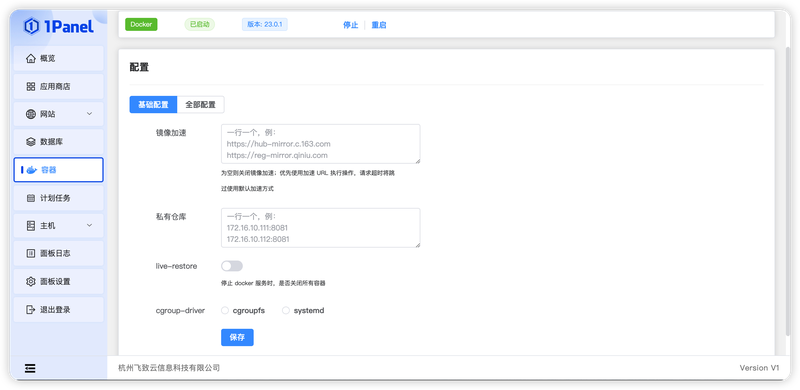
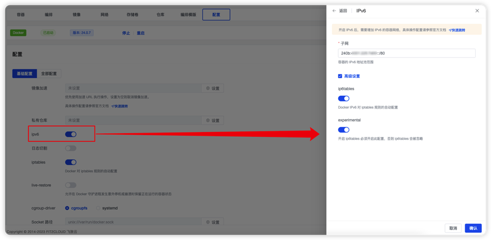
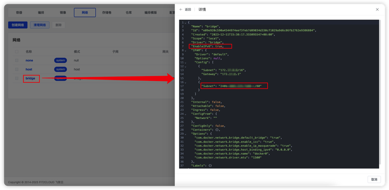
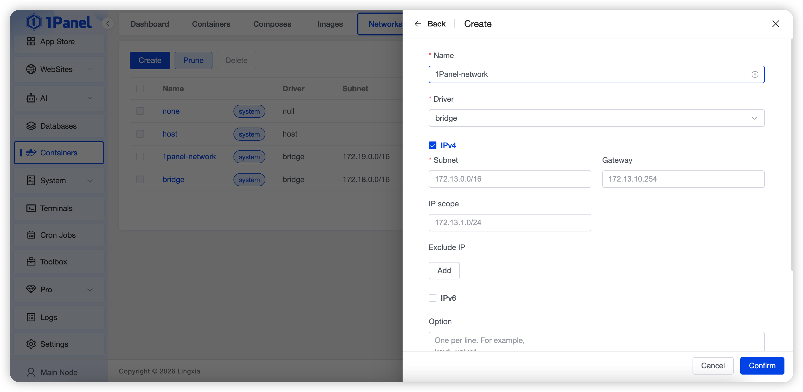

## 1 Configuration

!!! note ""
    - Supports viewing the Docker running status and performing operations such as restarting the service
    - The default configuration file path is: `/etc/docker/daemon.json`


{: .original}

!!! note ""
    - Image Acceleration: If application installation fails or image pulling times out, you can configure image accelerators to optimize the process
        - Acceleration address to configure:
            ```properties
            https://docker.1panel.live
            ```
        > After configuring the above acceleration address, if pulling application images still fails, [further discussion is available on the forum](https://bbs.fit2cloud.com/t/topic/5886)
    - Private Registry: Self-built private image registries such as Harbor, Nexus, docker-registry, etc.
    - iptables: This setting disables Docker's automatic configuration of iptables rules, which may cause containers to fail to communicate with external networks
    - live-restore: Whether to stop all containers when the Docker service is stopped
    - cgroup-driver: The default Cgroup Driver used is `cgroupfs`

## 2 Using IPv6

!!! note ""
    - Ensure your device is assigned an IPv6 address. Check the current device's IPv6 with the command `ip addr show`. If the output for the physical network card contains a line with `inet6` and `scope global`, the network card supports IPv6:
        ```properties
        eth0: <BROADCAST,MULTICAST,UP,LOWER_UP> mtu 1500 qdisc mq state UP group default qlen 1000
            link/ether 00:16:xx:xx:xx:xx brd ff:ff:ff:ff:ff:ff
            inet 172.31.168.107/20 brd 172.31.175.255 scope global dynamic eth0
                valid_lft 314955046sec preferred_lft 314955046sec
            inet6 2xxx:xxxx:xxxxx:xxxx:xxxx:xxxx:xxxx:xxxx/64 scope global dynamic 
                valid_lft 113120sec preferred_lft 69920sec
            inet6 fe80::xxxx:xxxx:xxxx:xxxx/64 scope link 
                valid_lft forever preferred_lft forever
        ```
    
    - Enable IPv6 in the panel settings, where `fixed-cidr-v6` is the subnet of the IPv6 network segment obtained in the previous step (configures the default network, with a maximum prefix length of /80)
        
    {: .original}

    - Check if it takes effect through [Networks] - [Details]. If effective, the value of `EnableIPv6` is `true`, and `IPAM.Config[1].Subnet` is the `fixed-cidr-v6` configured in the previous step
        
    {: .original}

    - Create an IPv6 network
        
    {: .original}

    - Create containers using the IPv6 network you created
