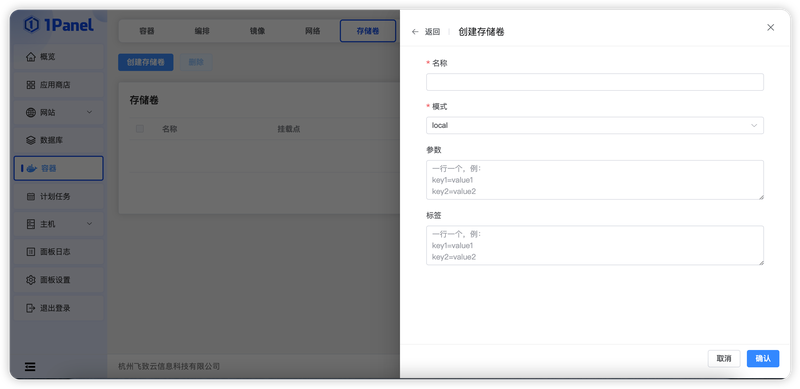

# 存储卷

!!! note ""
    Docker Volume 是由 Docker 管理的持久化存储，可挂载到容器中保存数据。入口为 **容器 -> 存储卷**，社区版、专业版和企业版均可使用。更多概念参见 [Docker Volumes 文档](https://docs.docker.com/engine/storage/volumes/)。

## 1 创建存储卷

点击 **创建**，填写名称、驱动和驱动参数。默认驱动为 `local`；使用其他驱动前，应先在当前节点安装并配置对应 Docker 插件。

{: .original}

## 2 查看和删除

!!! note ""
    列表可查看卷名称、驱动、挂载点、创建时间和详情。删除前必须确认没有容器使用该卷；删除存储卷会同时删除其中由 Docker 管理的数据。

## 3 清理存储卷

!!! note ""
    **清理存储卷** 会调用 Docker 清理未被容器引用的卷。即使卷当前没有容器引用，也可能仍保存需要保留的数据库、上传文件或历史数据。

!!! danger "数据不可恢复"
    删除或清理存储卷前，应先识别数据所属应用并完成可恢复的备份。1Panel 无法从已经删除的 Docker Volume 自动恢复业务数据。
