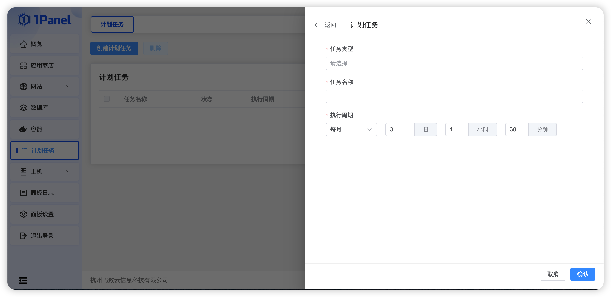
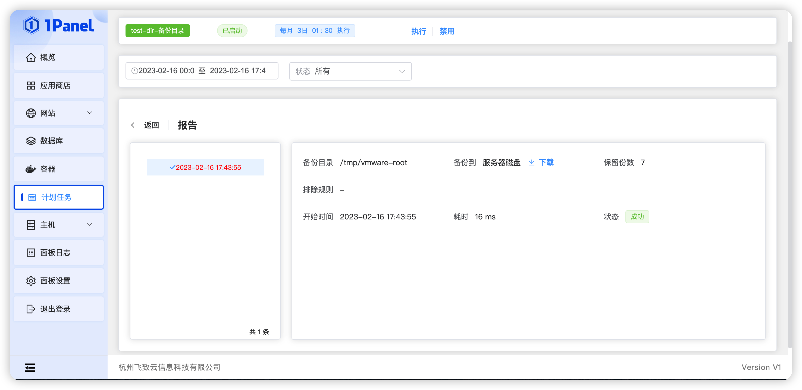

## 1 计划任务

!!! Abstract ""
    主要用于管理需要定时执行的任务，如定期执行某shell脚本、定期备份、定期访问url等，同时支持手动执行。

## 2 Shell 脚本

!!! Abstract ""
    输入任务名称，选择执行周期，输入执行的脚本内容。

## 3 备份网站

!!! Abstract ""

    - 执行周期，选择备份网站的执行时间；
    - 选择需要备份的网站，可以选择指定的网站备份，也可以备份所有网站；
    - 备份地点这里可以选择你安装存储相关的插件。如阿里云OSS、亚马逊 S3 云存储、MINIO、SFTP，和当前服务器磁盘；
    - 备份保留数量，默认保存为7份，保留就近备份文件的数量，可以减少备份所使用的空间；
    - 若是备份到服务器磁盘，则默认备份路径路径为 [安装目录]/1panel/backup/website。

## 4 备份数据库

!!! Abstract ""

    - 执行周期，选择备份网站的执行时间；
    - 选择需要备份的数据库，可以选择指定的数据库备份，也可以备份所有数据库；
    - 备份地点这里可以选择你安装存储相关的插件。如阿里云OSS、亚马逊 S3 云存储、MINIO、SFTP，和当前服务器磁盘；
    - 备份保留数量，默认保存为7份，保留就近备份文件的数量，可以减少备份所使用的空间；
    - 若是备份到服务器磁盘，则默认备份路径路径为 [安装目录]/1panel/backup/database。

## 5 备份目录

!!! Abstract ""

    - 执行周期，选择备份网站的执行时间；
    - 选择需要备份的文件目录；
    - 备份地点这里可以选择你安装存储相关的插件。如阿里云OSS、亚马逊 S3 云存储、MINIO、SFTP，和当前服务器磁盘；
    - 备份保留数量，默认保存为7份，保留就近备份文件的数量，可以减少备份所使用的空间；
    - 若是备份到服务器磁盘，则默认备份路径路径为/www/backup/database；
    - 支持设置排除文件，但是系统要求必须以换行符分隔，一行一个。

## 6 访问 URL

!!! Abstract ""
    用于自动执行URL地址访问，设置任务名称、执行周期和访问地址就可以计划访问URL地址了。

## 7 计划报告

!!! Abstract ""
    显示该任务产生的所有报告详情，支持时间、状态筛选，如果计划任务为备份，则可通过报告详情的下载按钮直接下载。

