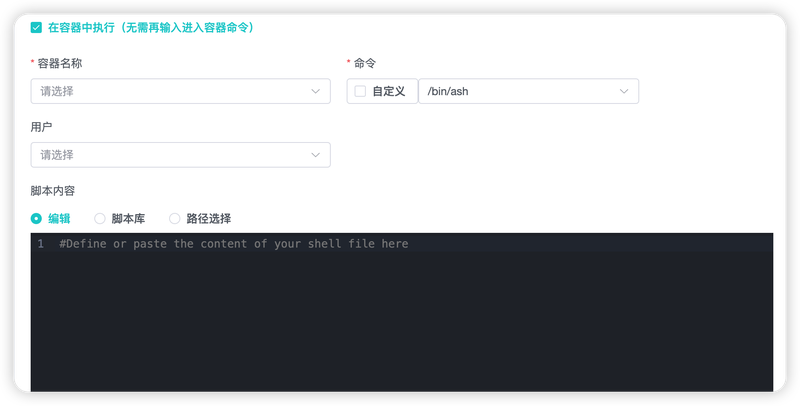

!!! note ""
    This module is mainly used to manage scheduled tasks, such as periodically running a shell script, periodic backups, periodic URL visits, etc. Manual execution is also supported.

!!! note ""
    Basic concepts:

    - **Task Type**: Supports Shell Script, App Backup, Website Backup, Database Backup, Directory/File Backup, Log Backup, URL Visit, Website Log Rotation, Cache Cleanup, System Snapshot, Server Time Sync.
    - **Group**: Classify tasks into different groups for quick filtering.
    - **Schedule**: Custom schedule uses the **minute hour day month weekday** format (e.g., `0 0 * * *`). See https://crontab.guru/ for reference. You can preview the latest 5 execution times after setting.
    - **Retention**: Keep only the latest *n* successful backups/logs to avoid unlimited growth.
    - **Backup Account**: Target storage for backup files, managed in **Panel Settings → Backup Accounts**. Multiple accounts are supported.
    - **Default Download Account**: One designated backup account used for download and file‑size checks. The task fails if this account upload fails; failures of other accounts are ignored.
    - **Compression Password**: Encrypt tar backups using openssl (disabled by default).
    - **Exclude Rules**: Skip specific files/directories during backup.
    - **Alert (✨ Pro Edition)**: Send notifications (SMS/email) if a task fails.
    - **Ignore Errors**: Continue backing up other items when one fails (e.g., backing up all databases).
    - **Timeout**: Maximum allowed execution time.
    - **Retry**: Number of retries after failure.

## 1 Task Types

### 1.1 Shell Script

!!! note "Configuration"
    - **Run in Container**: Select a container and user to run the script inside.
    - **Interpreter**: Predefined (bash, python, sh) or custom.
    - **Script**: Direct input, script library, or server script file.

{: .browser-mockup}

### 1.2 App Backup | Website Backup | Database Backup

!!! note "Configuration"
    These are similar: select the target to back up (supports “All”).

### 1.3 Directory Backup

!!! note "Configuration"
    Back up files or directories. Supports multiple files or a single directory.

### 1.4 Log Backup
!!! note ""
    Backs up:
    - 1Panel system logs
    - Server SSH login logs
    - All website logs

### 1.5 URL Visit
!!! note ""
    **URL**: The address to visit periodically.

### 1.6 Website Log Rotation
!!! note ""
    Rotates logs for the specified website and archives old logs.

### 1.7 Cache Cleanup
!!! note ""
    Runs the **Toolbox → Cache Cleanup** task on schedule.

### 1.8 System Snapshot
!!! note ""
    Runs **Panel Settings → Snapshots → Create Snapshot** on schedule.

### 1.9 Server Time Sync
!!! note ""
    Syncs time from the NTP server configured in **Toolbox → Quick Settings**.

## Execution Reports

### Download & View
!!! note ""
    For backup tasks, you can view backup count and download files directly from the list.

!!! note ""
    Shows full report history with filtering by time and status.

## Import & Export
!!! note ""
    Tasks can be imported/exported via JSON.
    - Tasks with broken associations are marked **Pending Edit**.
    - Duplicate task names are skipped during import.
