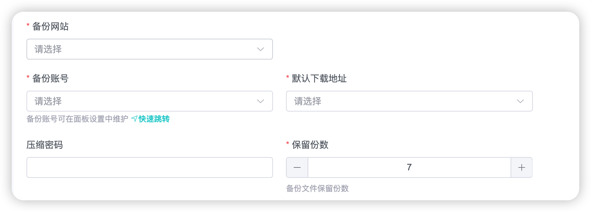
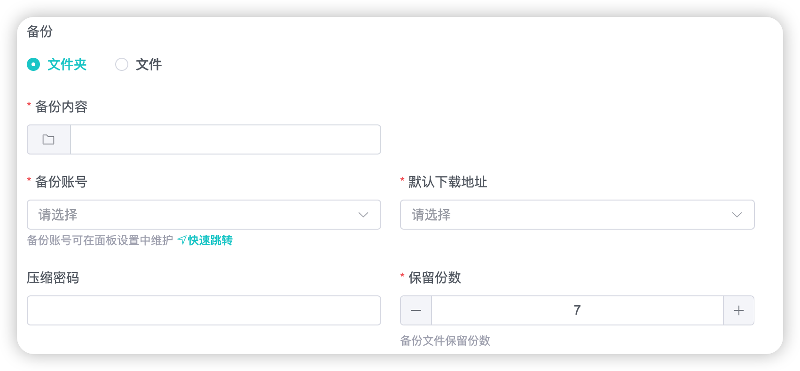
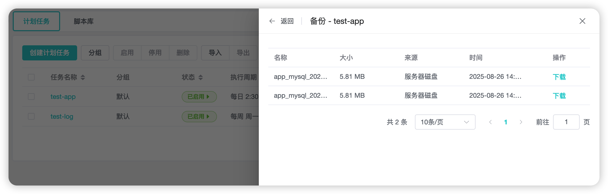
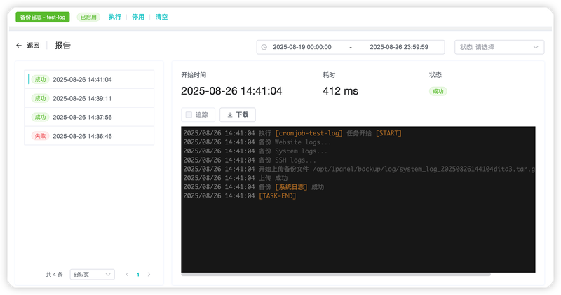

!!! note ""
    主要用于管理需要定时执行的任务，如定期执行某 shell 脚本、定期备份、定期访问 URL 等，同时支持手动执行。
    
    基础概念：
    
    - 任务类型：支持 Shell 脚本、备份应用、备份网站、备份数据库、备份目录 / 文件、备份日志、访问 URL、切割网站日志、缓存清理、系统快照、同步服务器时间； 
    - 分组：将不同的计划任务设置为不同的分组，便于计划任务的快速筛选；
    - 执行周期：自定义执行周期仅支持【 分 时 日 月 周 】格式，如 0 0 * * * ，可参考 https://crontab.guru/ 修改执行周期。选择或输入完执行周期后，可以点击行末预览查看最近 5 次执行时间；
    - 保留份数：为防止备份或者日志的无限制增加，可设置保留份数保留最新成功的 n 份；
    - 备份账号：需要将备份文件上传的位置，在 [面板设置 - 备份账号] 中维护，支持多选，可同时备份到多个备份账号；
    - 默认下载地址：备份账号中需要设置一个固定的备份账号提供下载和获取文件大小操作，当该备份账号上传失败时，任务将失败，而非默认下载地址的其他备份账号上传失败时，会被忽略并继续；
    - 压缩密码：应用备份或者网站备份使用 tar 进行压缩，支持设置压缩密码，压缩加密使用 openssl，默认为不设置密码；
    - 排除规则：备份过程中，可设置特定的文件排除规则，忽略不希望加入备份压缩的目录；
    - 是否告警（✨专业版）： 定时任务执行失败时可以触发告警通知，当前支持短信及邮箱告警；
    - 忽略错误：当任务中需要备份多个内容时，如备份所有数据库或应用，执行过程中出现错误是否需要忽略并且继续备份其他内容；
    - 超时时间：任务的执行超时时间；
    - 失败重试次数：失败后重试次数设置；

## 1 任务类型

### 1.1  Shell 脚本

!!! note "配置说明"

    - 在容器中执行：勾选后可以选择某个容器，在容器中执行指定的脚本，支持选择容器用户及命令执行器；
    - 解释器：选择不同的解释器执行脚本内容，系统预设 bash python sh，支持自定义；
    - 脚本内容：具体需要执行的脚本内容，支持编辑、选择脚本库以及选择服务器脚本执行；

{: .original}

### 2 备份应用 | 备份网站 ｜ 备份数据库 

!!! note "配置说明"

    备份应用、备份网站备份数据库大体相同，直接选择对应的备份内容，支持备份所有。

{: .original}

### 3 备份目录

!!! note "配置说明"

    备份文件或目录，支持直接选择需要备份的多个文件，或者指定单个目录。
    

{: .original}

### 4 备份日志

!!! note ""
    备份以下日志内容：

    - 1Panel 系统日志；
    - 服务器的 SSH 登录日志；
    - 所有网站日志；

### 5 访问 URL

!!! note ""
    URL 地址：需要定时访问的 URL 地址；

### 6 切割网站日志

!!! note ""

    计划任务执行时会将指定网站的日志进行切割，将之前产生的日志保存在备份目录下。

### 7 缓存清理

!!! note ""

    定时执行面板 `工具箱` 菜单中的 `缓存清理` 任务。

### 8 系统快照

!!! note ""
    定时执行面板 `面本设置`-`快照` 菜单中的 `创建快照` 任务。

### 9 同步服务器时间

!!! note ""
    定时从 `工具箱`-`快速设置` 页面配置的 NTP 服务器进行时间同步。

## 执行报告

### 下载与查看
!!! note ""
    备份类型的计划任务，可在计划任务列表直接查看备份文件份数，并支持下载操作。

{: .original}

!!! note ""
    显示该任务产生的所有报告详情，支持时间、状态筛选。

{: .original}

## 导入导出

!!! note ""
    计划任务支持通过 json 文件一键导入或导出操作，导入计划任务时，如果存在相关内容关联异常的情况将修改计划任务状态为待编辑，如果导入计划任务名称已存在将被忽略。
