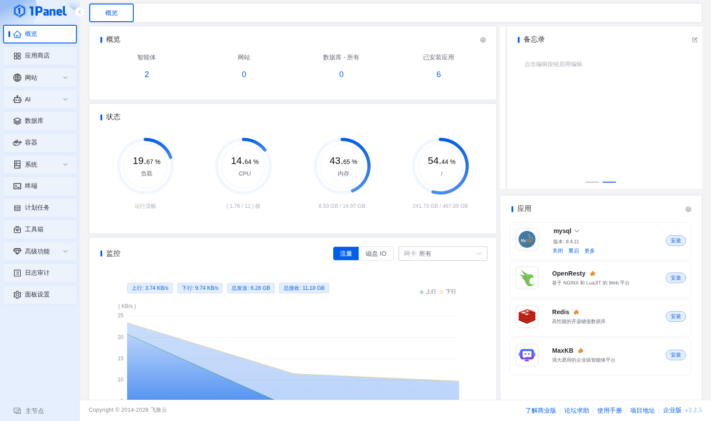

# 首页

登录 1Panel 后默认进入 **首页**。首页用于集中查看当前节点运行状态，并快速进入常用功能。

!!! note ""
    首页主要包含快捷入口、状态、监控、系统信息、备忘录和已安装应用等区域。多节点环境下，页面展示的是当前所选节点的数据。

## 1 服务器状态

!!! note "指标说明"
    首页展示主机名称、操作系统、内核、运行时长以及 CPU、内存、负载、磁盘和网络等实时信息。多节点环境下，页面展示的是当前选中节点的数据。

    CPU、内存、负载和磁盘属于不同维度。负载表示等待运行或不可中断任务的数量，不等同于 CPU 使用率；排查异常时应结合进程管理和系统监控查看。

- **负载**：反映系统等待运行或不可中断任务的数量，以环形百分比展示当前负载情况；
- **CPU**：展示当前 CPU 使用率及已用/总核数；
- **内存**：展示当前内存使用率及已用/总容量；
- **磁盘**：展示当前磁盘使用率及已用/总容量。

!!! note "系统信息"
    系统信息区域展示主机名称、发行版本、内核版本、系统类型、主机地址、启动时间和运行时间。这些信息来自当前所选节点，用于确认操作对象和排查环境问题。

## 2 快捷入口

!!! note ""
    快捷入口根据当前账号可访问的菜单生成，可用于快速进入应用商店、网站、数据库、容器、文件、计划任务等页面。无权限的菜单不会作为可用入口显示。
     
    快捷入口区域展示各功能模块的统计数字（如智能体数量、网站数量、数据库数量和已安装应用数量），点击后可直接跳转到对应功能页面。

## 3 常用应用

!!! note ""
    应用区域展示部分常用应用及其运行状态。应用存在可访问端口时，可以从页面跳转到应用服务；实际访问地址取决于 **面板设置 -> 面板 -> 默认访问地址** 和应用端口配置。
     
    应用卡片展示应用名称、版本和运行状态，并支持快速执行关闭、重启、查看日志等操作，或跳转到应用详情页进一步管理。

## 4 多节点说明

!!! note ""
    专业版和企业版启用节点管理后，可以从左侧节点选择器切换当前节点。切换节点会影响首页指标以及后续大多数功能的操作对象，执行安装、重启、删除等操作前应再次确认当前节点。
