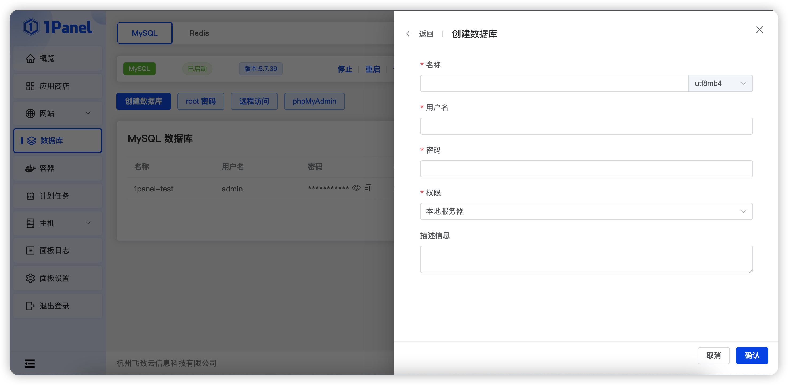
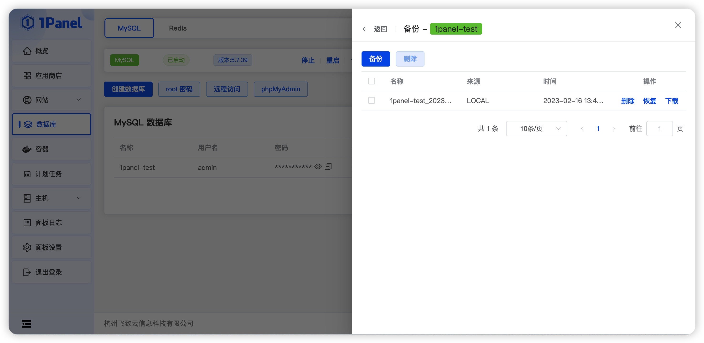
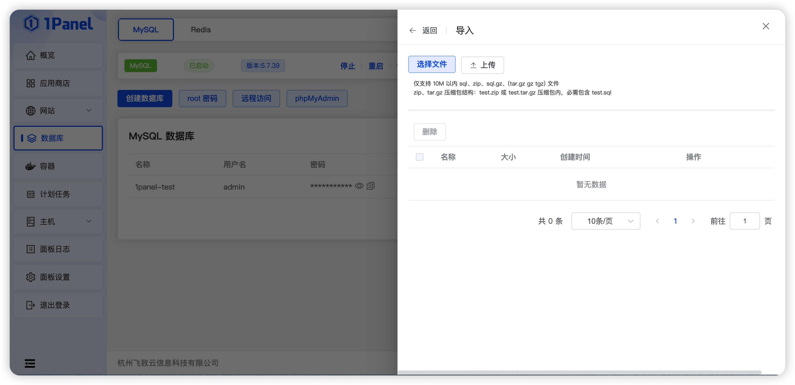
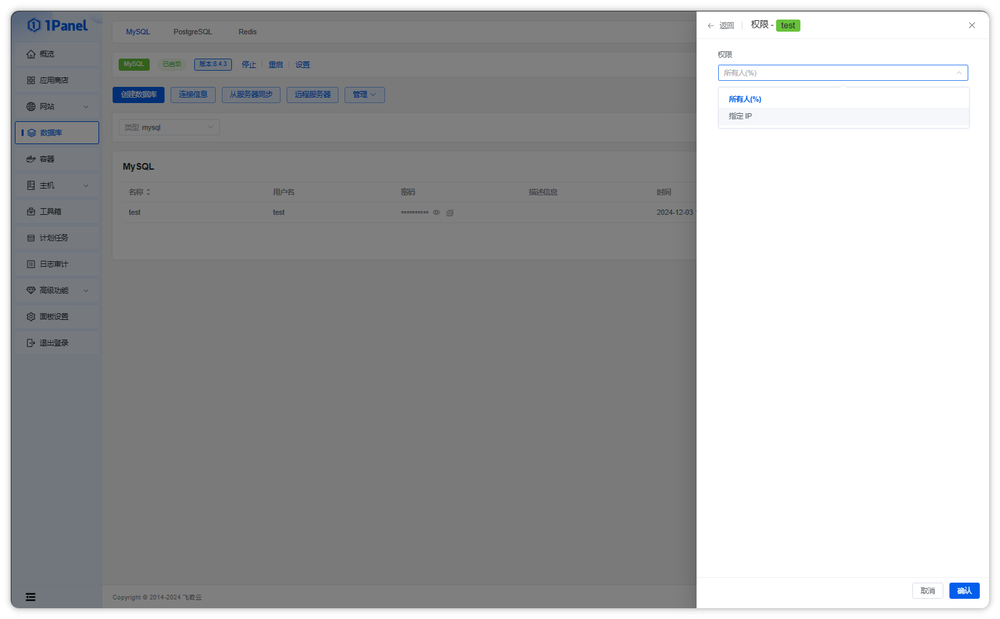
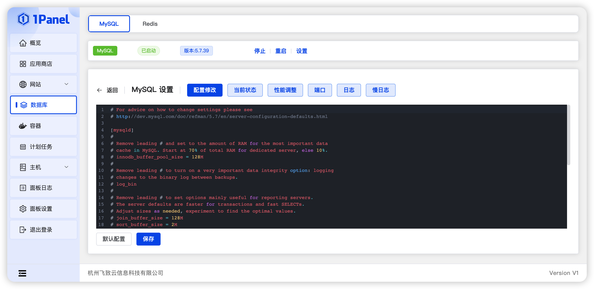
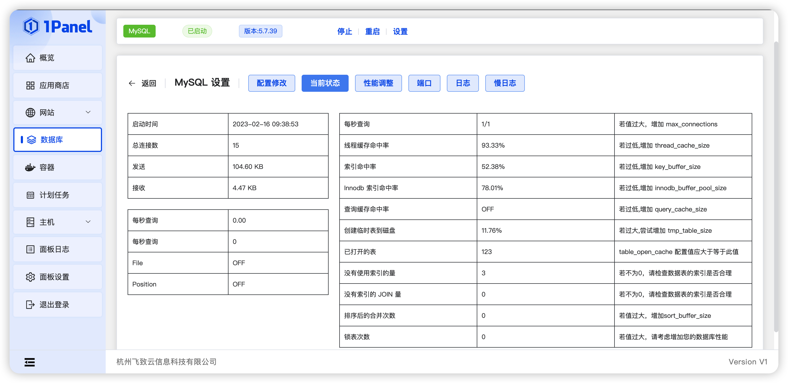
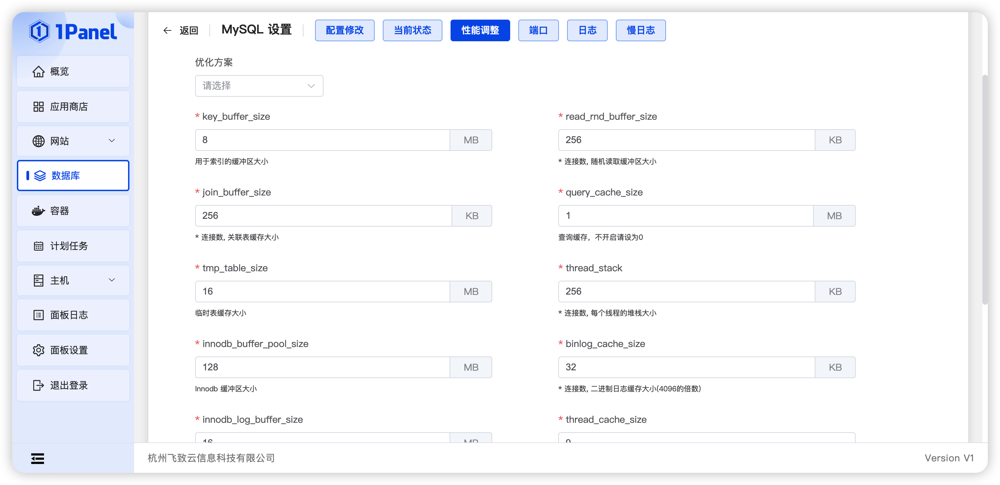
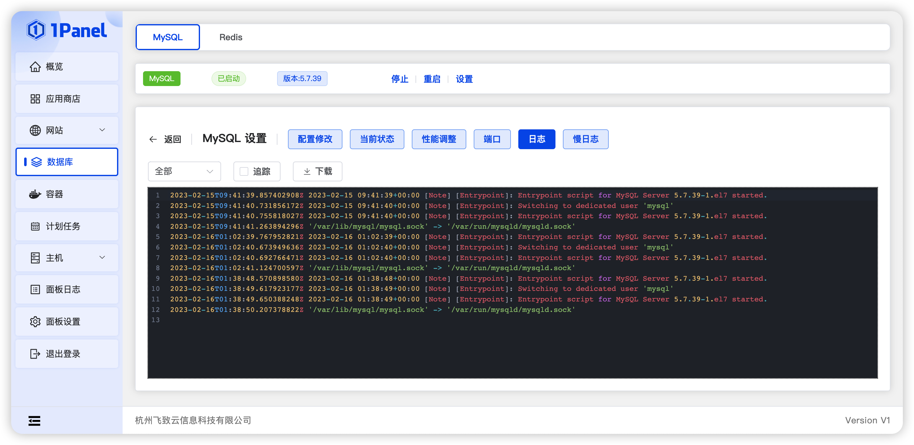

## 1 创建数据库

!!! Abstract ""
    创建一个新的数据库，首先输入数据库名称，选择编码格式，输入密码，设置访问权限，即可成功创建一个数据库。

!!! Abstract ""
    - 数据库名：新建数据库的名称，选择编码格式，默认为 UTF-8 格式。
    - 密码：默认为随机密码，需要可以自行修改。
    - 访问权限：默认权限本地服务器权限，选项有:本地服务器，所有人，指定 IP。

## 2 root 密码

!!! Abstract ""
    默认为随机密码，root 为最高权限账号密码，请谨慎操作。

## 3 phpMyAdmin

!!! Abstract ""
    WEB 图形化界面管理 MySQL 数据库的管理工具，此处不会详细讲解工具使用方法，[点击查看工具教程](https://www.wpdaxue.com/series/phpmyadmin)

## 4 备份

!!! Abstract ""
    点击备份列表按钮，选择备份，即可备份当前数据库文件。

!!! Abstract ""
    - 默认数据库路径为 /opt/1panel/backup/database/mysql。
    - 备份使用 mysqldump 方式。

## 5 恢复

!!! Abstract ""
    点击导入备份按钮，可以选择本地上传，或选择已备份的文件还原。

!!! Abstract ""

    - 如从上传文件恢复，则需要保证上传文件压缩包内存在 test.sql 文件，否则无法正确导入。
    - 导入的 sql 文件格式必须符合标准，若你使用 phpmyadmin 导出的 sql 文件，可能会缺少版本 编码等信息，导致无法通过 mysqldump 正确导入。
    - 若无法正常导入，可以尝试使用 phpmyadmin 导入。

## 6 权限设置

!!! Abstract ""
    数据的权限设置，共有三种，第一种，本地服务器。第二种，所有人。第三种，IP 地址。

!!! Abstract ""
    - 本地服务器：限制当前数据库，只能在该服务器上访问。
    - 所有人：任何人都可以远程连接至数据库。
    - IP 地址：仅限指定的 IP 访问，仅支持一个 IP。
    - 若需要开启外网访问，仍需要在防火墙中放行 MySQL 端口（默认3306）。

## 7 修改密码

!!! Abstract ""
    - 修改当前的数据库账号的密码。
    - **注意事项：** 当前修改的密码为非 root 密码。

## 8 数据库配置

!!! Abstract ""
    点击状态栏设置按钮，即可进入数据库具体设置界面，具体包括配置修改、当前状态、性能调整、端口、日志、慢日志。
    其中配置界面可对数据库配置进行手动调整。

!!! Abstract ""
    - 系统 MySQL 使用 Docker 安装，配置文件默认挂载在 /opt/1panel/apps/mysql/[数据库名称]/conf/my.cnf。
    - **注意事项：** 错误的数据库配置将导致 MySQL 服务不可用，请谨慎修改。
    - 如数据库配置不正确导致服务无法正常启动，可尝试恢复默认配置后保存。

## 9 当前状态

!!! Abstract ""
    当数据库查询缓慢时，可在数据库设置界面，点击当前状态按钮，查看当前数据库包括缓存命中数、索引命中数等各个常用指标的状态，通过这些状态对数据库进行性能优化。

## 10 性能调整

!!! Abstract ""
    系统支持表单方式直接调整数据库性能相关参数名，如索引缓冲区、连接数等，并且预设常用的优化方案，用户可根据系统环境，直接选择优化方案。

## 11 端口

!!! Abstract ""
    除了在用户安装 MySQL 应用时可自由选择端口外，设置界面也可以直接进行端口的修改操作。

## 12 日志

!!! Abstract ""
    - 系统 MySQL 使用 Docker 安装，本处产生日志为对应 MySQL 容器产生的日志。支持时间段筛选、追踪及下载操作。
    - 设置界面还支持查看 MySQL 产生的慢日志。
    

