## 1 Manage Database Instances

### 1.1 Install Database from App Store

!!! note ""
    MySQL and MariaDB databases installed through the App Store will automatically appear in the database instance list.

### 1.2 Remote Server

!!! note ""
    In addition to local databases installed from the App Store, you can also add existing database service addresses. Click the **Remote Server** button above the list to enter the remote server management page.

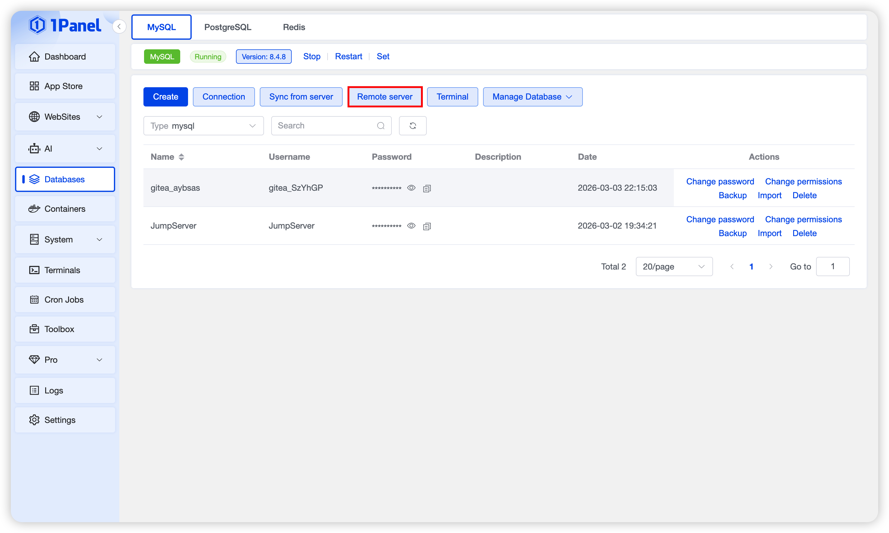
{: .browser-mockup}

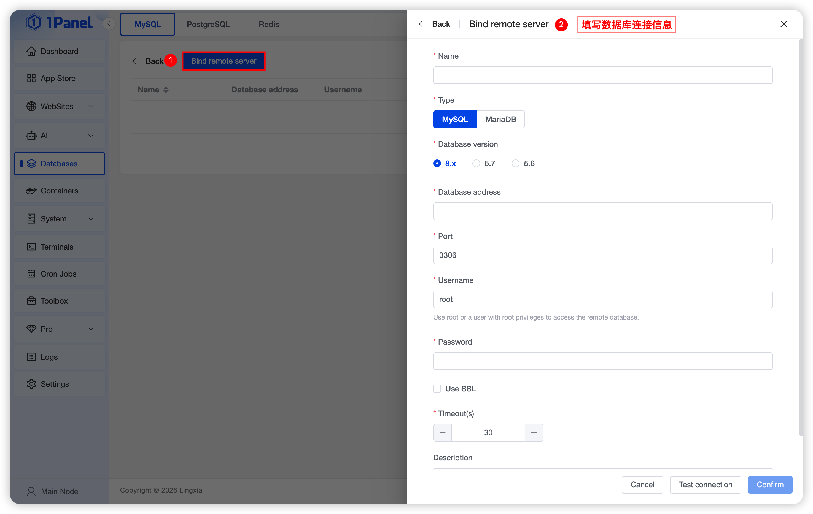
{: .browser-mockup}

### 1.3 Switch Database Instance

!!! note ""
    Click the drop-down menu above the database list to switch between different database instances and manage databases and settings under different instances.

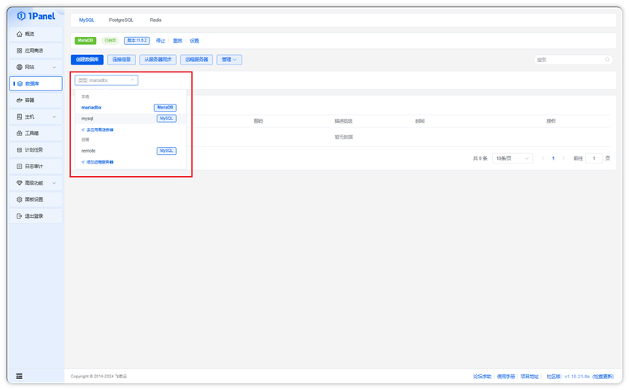
{: .browser-mockup}

## 2 Create Database

!!! note ""
    To create a new database, first enter the database name, select the encoding format, enter the password, and set access permissions.

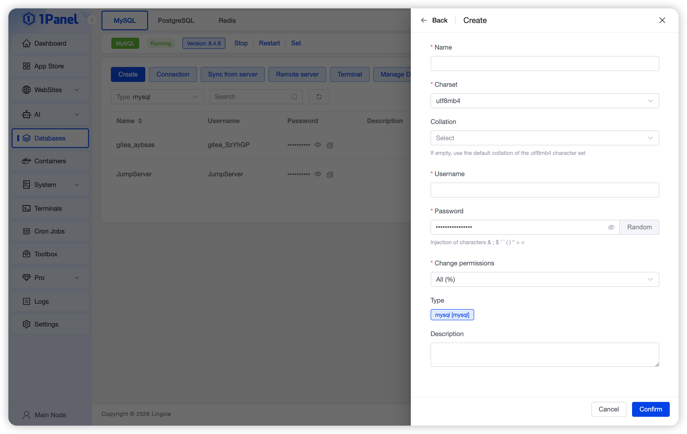
{: .browser-mockup}

!!! note ""
    - Database Name: Name of the new database, with default encoding UTF-8
    - Username: Username for accessing the database
    - Password: Random by default, can be modified manually
    - Access Permission: Defaults to local server; options: local server, all hosts, specified IP

## 3 View Connection Information

!!! note ""
    Click the **Connection Information** button above the list to view the database address, port, root password, and other connection details. You can also change the root password here.

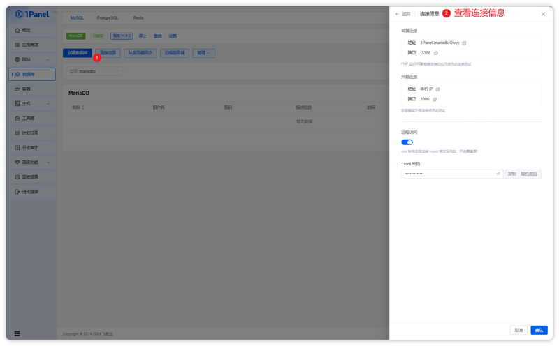
{: .browser-mockup}

!!! note "Note"
    Databases deployed from the App Store run in containers. Select the corresponding connection information according to the scenario shown on the page.

## 4 Sync from Server

!!! note ""
    If databases are modified using other tools or applications and the list becomes inconsistent, click **Sync from Server** to refresh the database list from the server.

## 5 WEB Management Tool

!!! note ""
    To manage MySQL via a web GUI, click the **Manage** button above the list to jump to the corresponding tool.

    Supported management tools:
    - [phpMyAdmin](https://www.wpdaxue.com/series/phpmyadmin)
    - Adminer

## 6 Backup

!!! note ""
    Click the backup button to back up the current database.

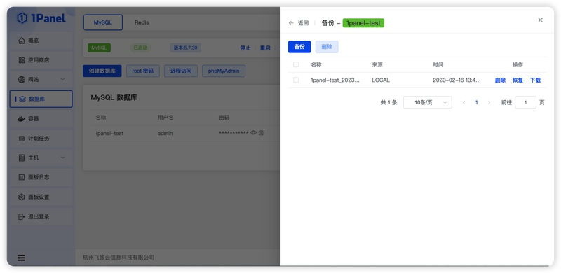
{: .browser-mockup}

!!! note ""
    - Default backup path: `/opt/1panel/backup/database/mysql`
    - Backup uses `mysqldump`

## 7 Restore

!!! note ""
    Click **Import Backup** to upload a local file or select an existing backup for restoration.

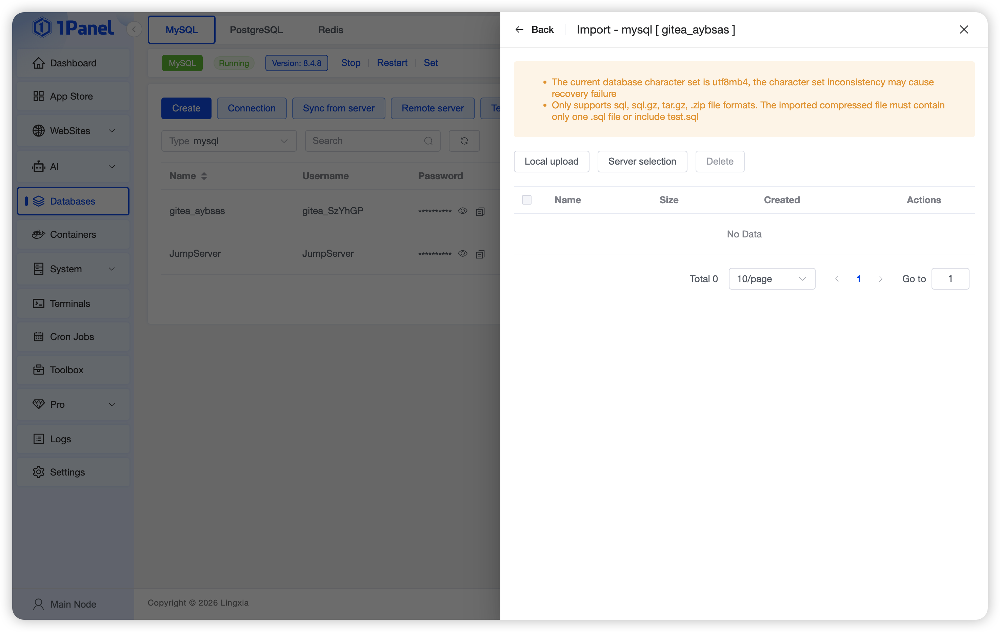
{: .browser-mockup}

!!! note ""
    - When restoring from an uploaded file, ensure the archive contains a `test.sql` file, otherwise import will fail
    - Imported SQL files must follow standard format; SQL files exported from phpMyAdmin may lack version/encoding info and fail with `mysqldump`
    - If import fails, try using phpMyAdmin instead

## 8 Permission Settings

!!! note ""
    Click the **Permissions** button in the action column to modify access permissions for a specific database. Supports access from all hosts or specified IPs.

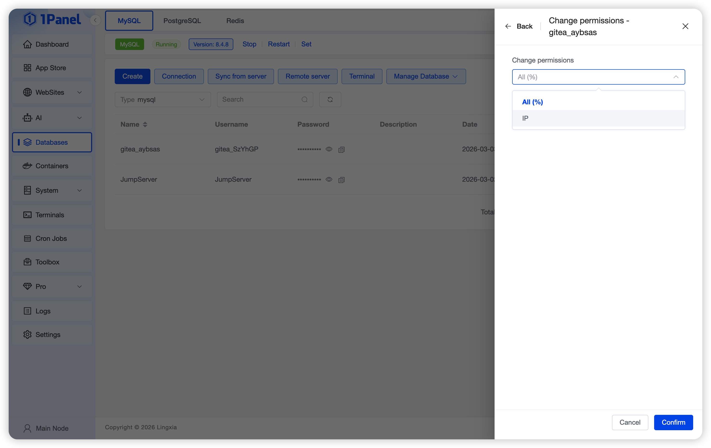
{: .browser-mockup}

!!! note ""
    - All Hosts: Anyone can connect remotely
    - IP Address: Only specified IPs are allowed; separate multiple IPs with commas
    - To enable public access, allow the MySQL port (default 3306) in the firewall

## 9 Change Password

!!! note ""
    Change the password for the current database user.
    **Note**: This does **not** change the root password.

## 10 Database Configuration

!!! note ""
    Click the settings button in the status bar to enter the database settings interface, including configuration editing, current status, performance tuning, port, logs, and slow query logs.
    You can manually adjust database configuration in the configuration interface.

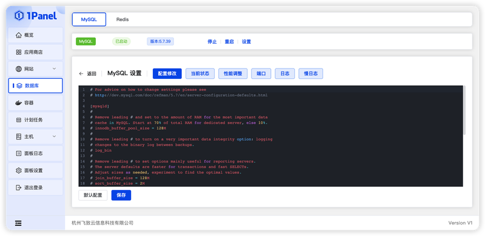
{: .browser-mockup}

!!! note ""
    - MySQL is installed via Docker; configuration file is mounted at `/opt/1panel/apps/mysql/[database-name]/conf/my.cnf`
    - **Warning**: Incorrect configuration may make MySQL unavailable; modify with caution
    - If the service fails to start due to invalid configuration, restore the default settings and save

## 11 Current Status

!!! note ""
    When database queries are slow, go to the database settings and click **Current Status** to view key metrics such as cache hit ratio and index hit ratio for performance optimization.

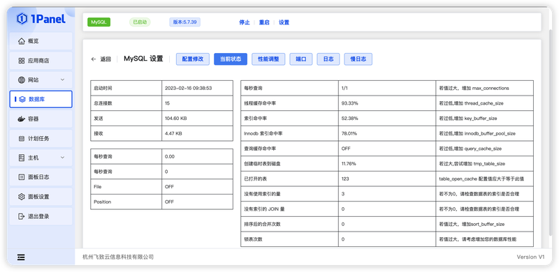
{: .browser-mockup}

## 12 Performance Tuning

!!! note ""
    The system supports form-based tuning of performance parameters such as index buffer and max connections. Common optimization presets are available for direct selection based on your environment.

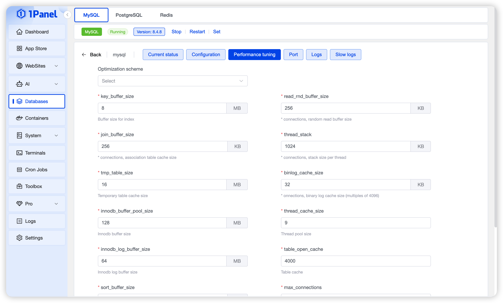
{: .browser-mockup}

## 13 Port

!!! note ""
    Besides setting the port during installation, you can modify it directly in the settings interface.

## 14 Logs

!!! note ""
    - MySQL runs in Docker; logs shown are from the corresponding container. Supports time filtering, real-time follow, and download
    - Slow query logs are also available in the settings interface

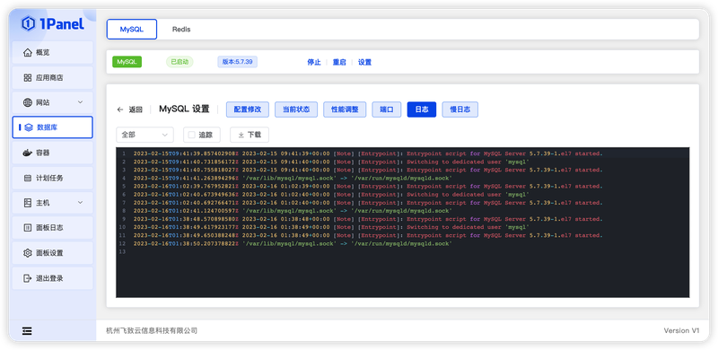
{: .browser-mockup}
