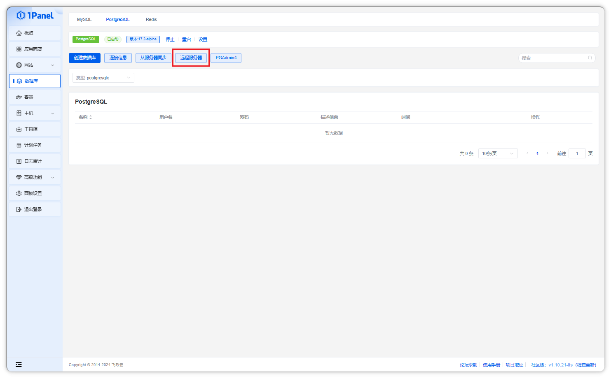
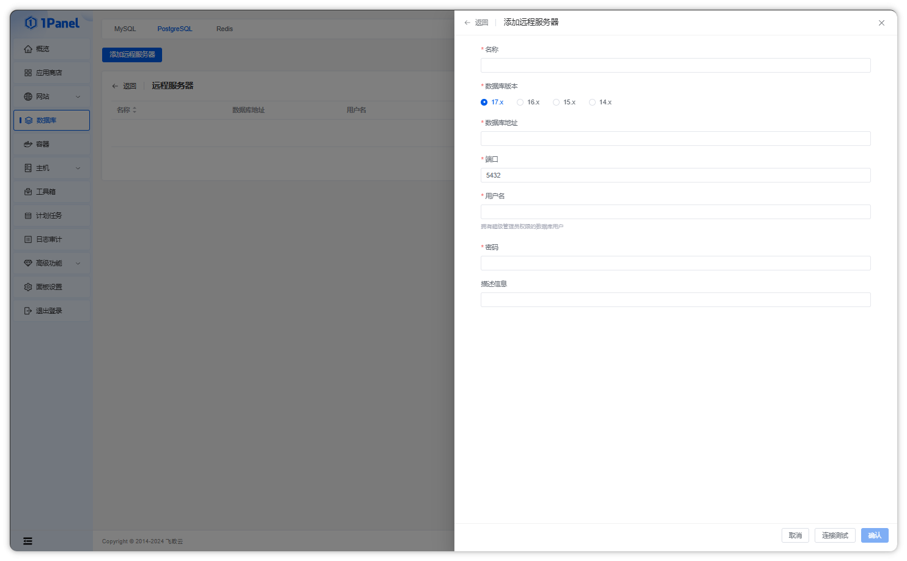
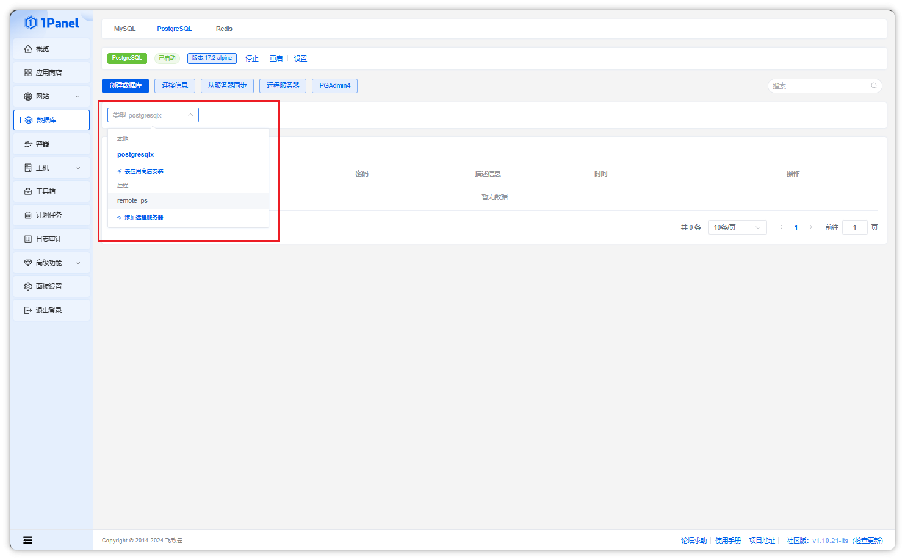
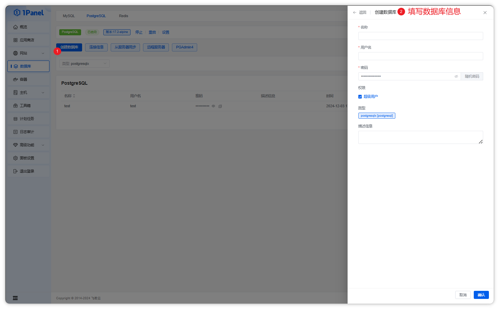
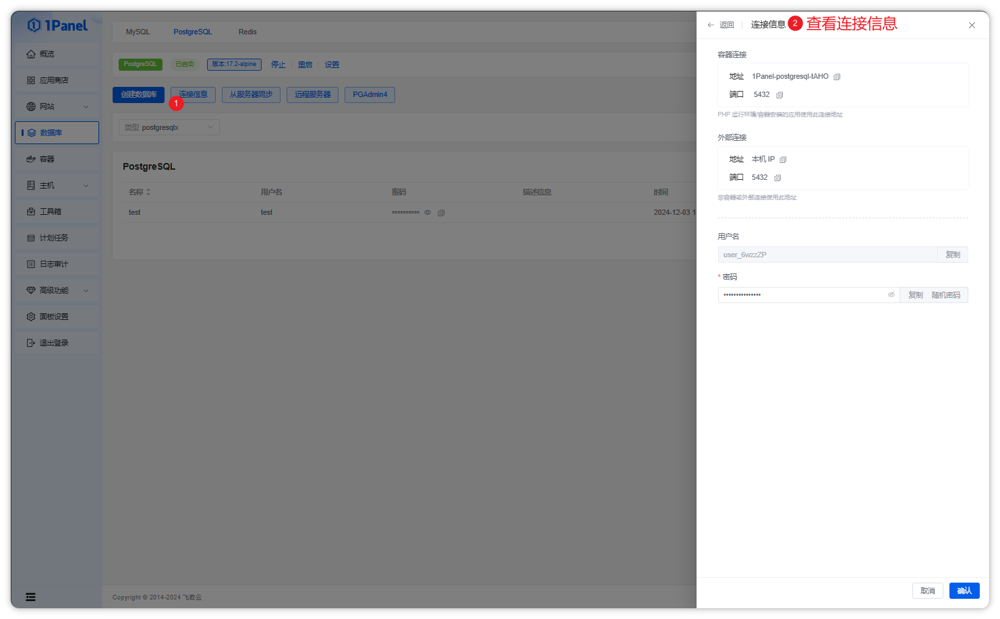
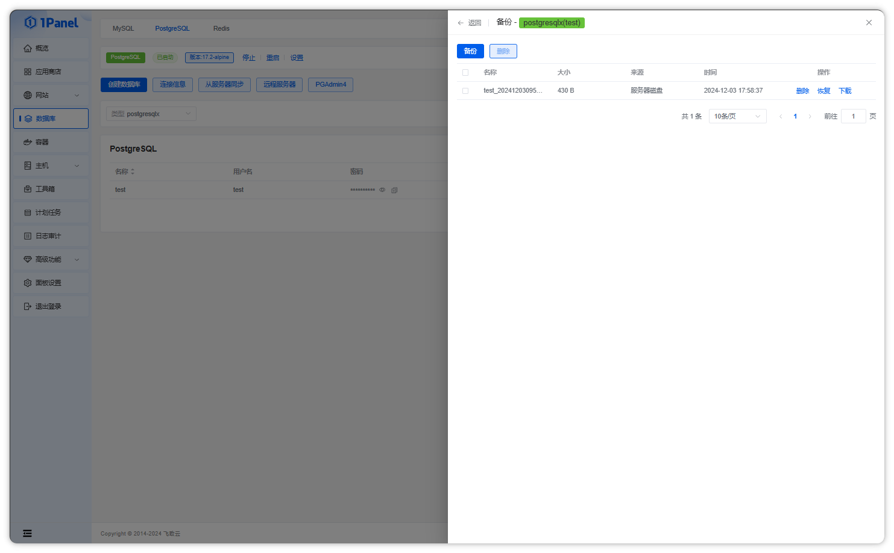
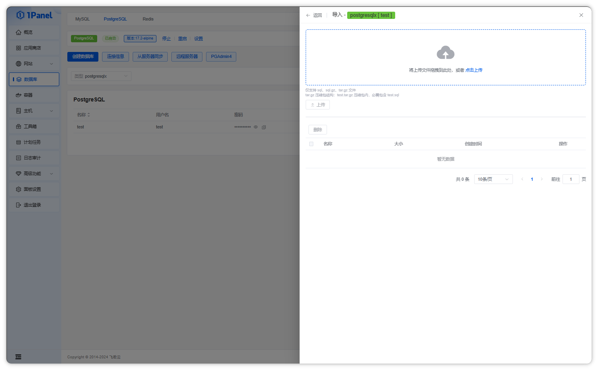
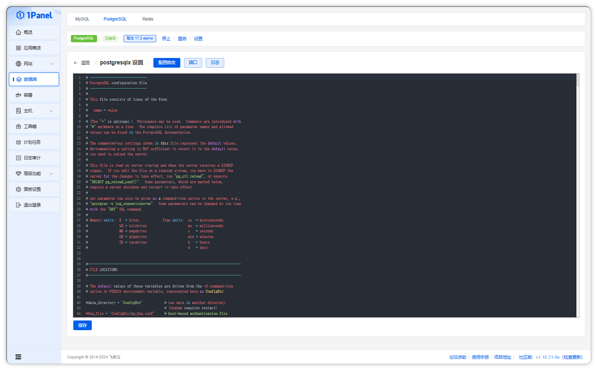
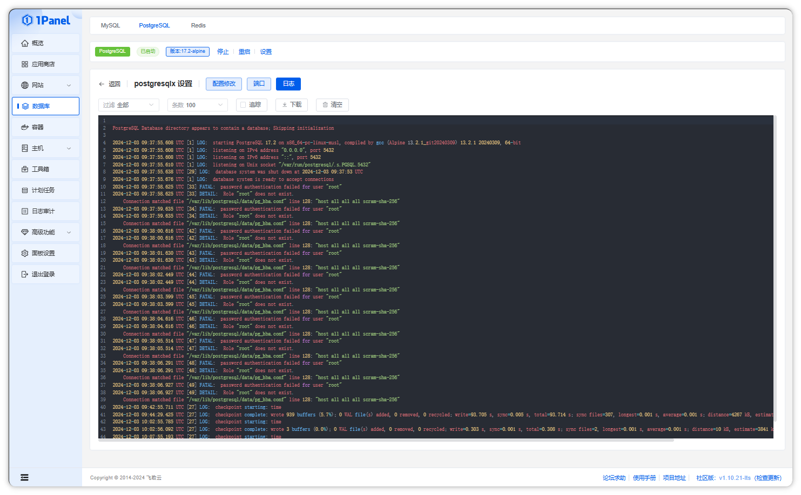

## 1 管理数据库实例

1.1 应用商店安装数据库

!!! note ""
    通过应用商店安装的 PostgreSQL 数据库应用，会自动出现在数据库实例列表中。

1.2 远程服务器

!!! note ""
    除应用商店安装的本地数据库以外，还可以添加已存在的数据库服务地址。点击列表上方的【远程服务器】按钮，即可进入远程服务器管理页面。

1.3 切换数据库实例

!!! note ""
    点击数据库列表上方的下拉菜单，即可在不同的数据库实例间进行切换，管理不同数据库实例下的数据库及设置等。

## 2 创建数据库

!!! note ""
    创建一个新的数据库，输入数据库名称、用户名、密码，设置访问权限，即可成功创建一个数据库。

!!! note ""
    - 数据库名：新建数据库的名称。
    - 用户名：访问该数据库的用户名。
    - 密码：默认为随机密码，需要可以自行修改。
    - 访问权限：默认权限本地服务器权限，选项有:本地服务器，所有人，指定 IP。

## 3 查看连接信息

!!! note ""
    点击列表上方的【连接信息】按钮，即可查看数据库的地址、端口及管理员用户名和密码等连接信息，同时可以在这里修改管理员用户密码。

!!! note "注意"
    应用商店部署的数据库采用容器化方式运行，不同的场景需要根据页面提示选择对应的连接信息。

## 4 从服务器同步

!!! note ""
    当使用了其他数据库工具或应用程序操作了数据库，数据库列表信息与实际不一致时，可以点击列表上方的【从服务器同步】按钮，主动从数据库查询当前数据库列表。

## 5 WEB 管理工具

!!! note ""
    如果需要使用 WEB 图形化界面管理 PostgreSQL 数据库，可以列表上方的【PGAdmin4】按钮，跳转到对应工具页面。

## 6 备份

!!! note ""
    点击备份列表按钮，选择备份，即可备份当前数据库文件。

!!! note ""
    - 默认数据库路径为 /opt/1panel/backup/database/postgresql。
    - 备份使用 pg_dump 方式。

## 7 恢复

!!! note ""
    点击导入备份按钮，可以选择本地上传，或选择已备份的文件还原。

!!! note ""

    - 如从上传文件恢复，则需要保证上传文件压缩包内存在 test.sql 文件，否则无法正确导入。

## 8 权限设置

!!! note ""
    点击操作列的【权限】按钮，可以修改当前数据库绑定的用户是否为超级用户。

## 9 修改密码

!!! note ""
    - 修改当前的数据库绑定用户的密码。
    - **注意事项：** 当前修改的密码为非默认管理员密码。

## 10 数据库配置

!!! note ""
    点击状态栏设置按钮，即可进入数据库具体设置界面，具体包括配置修改、端口、日志查看。
    其中配置界面可对数据库配置进行手动调整。

!!! note ""
    - 系统 PostgreSQL 使用 Docker 安装，配置文件默认挂载在 /opt/1panel/apps/postgresql/[数据库名称]/data/postgresql.cnf。
    - **注意事项：** 错误的数据库配置将导致 PostgreSQL 服务不可用，请谨慎修改。

## 11 端口

!!! note ""
    除了在用户安装 PostgreSQL 应用时可自由选择端口外，设置界面也可以直接进行端口的修改操作。

## 12 日志

!!! note ""
    - 系统 PostgreSQL 使用 Docker 安装，本处产生日志为对应 PostgreSQL 容器产生的日志。支持时间段筛选、追踪及下载操作。

