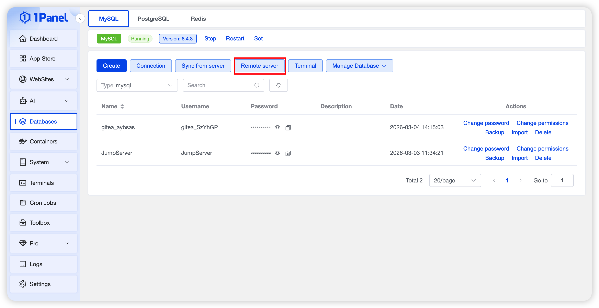
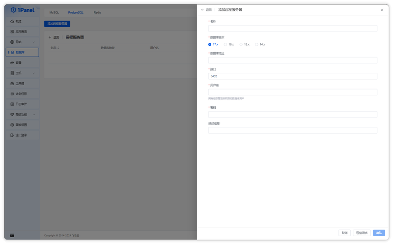
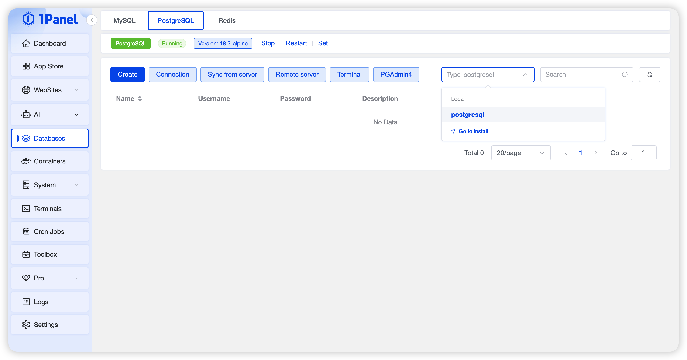
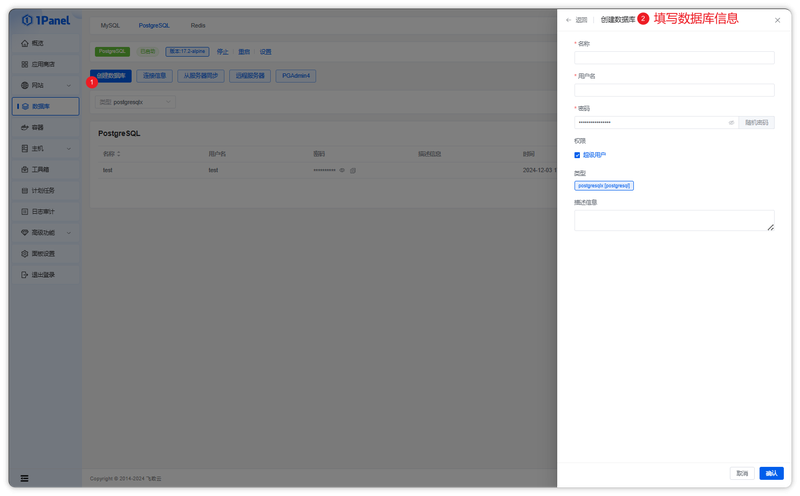
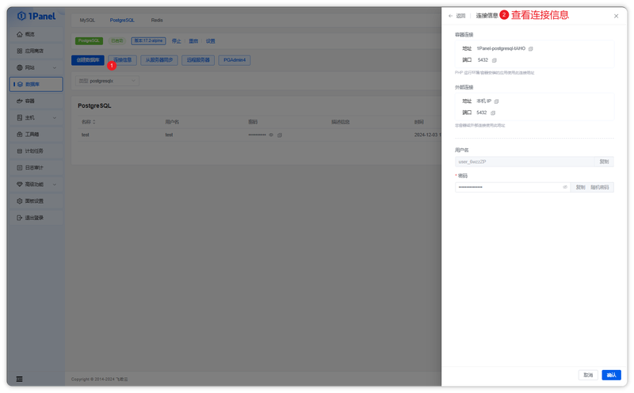
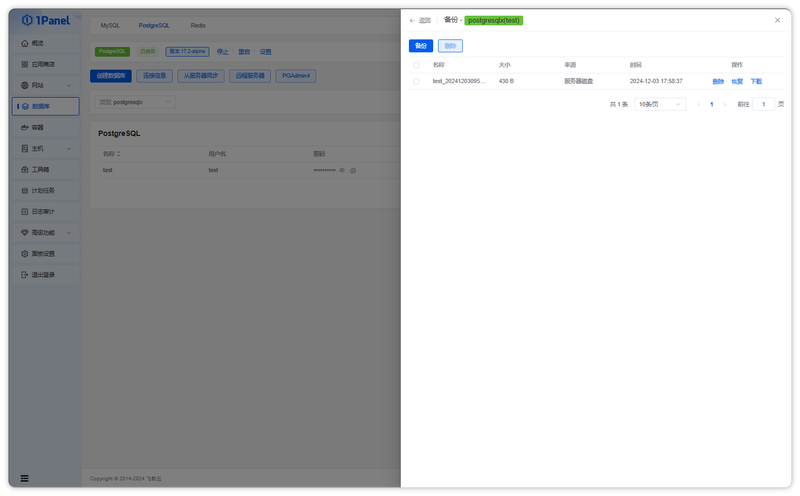
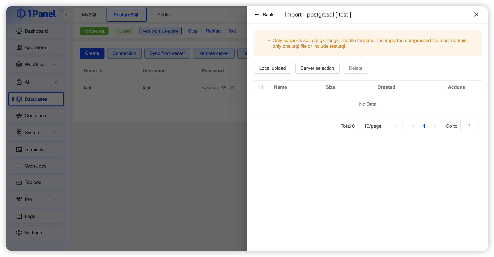
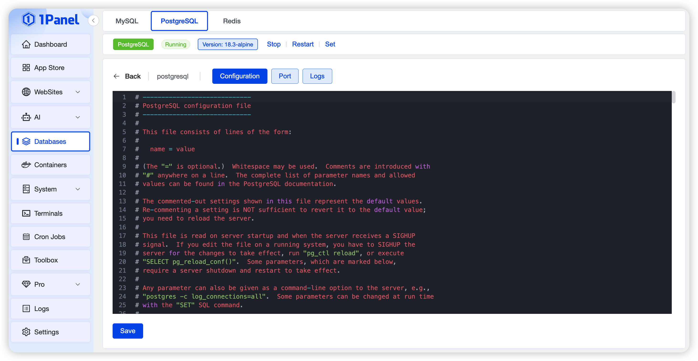
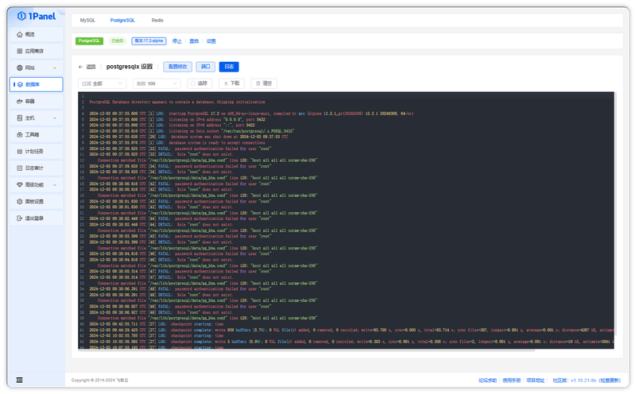

## 1 Manage Database Instances

### 1.1 Install Database from App Store

!!! note ""
    PostgreSQL databases installed through the App Store will automatically appear in the database instance list.

### 1.2 Remote Server

!!! note ""
    In addition to local databases installed from the App Store, you can also add existing database service addresses. Click the **Remote Server** button above the list to enter the remote server management page.

{: .original}

{: .original}

### 1.3 Switch Database Instance

!!! note ""
    Click the drop-down menu above the database list to switch between different database instances and manage databases and settings under different instances.

{: .original}

## 2 Create Database

!!! note ""
    To create a new database, enter the database name, username, password, and set access permissions.

{: .original}

!!! note ""
    - Database Name: Name of the new database
    - Username: Username for accessing the database
    - Password: Random by default, can be modified manually
    - Access Permission: Defaults to local server; options: local server, all hosts, specified IP

## 3 View Connection Information

!!! note ""
    Click the **Connection Information** button above the list to view the database address, port, admin username and password, and other connection details. You can also change the admin password here.

{: .original}

!!! note "Note"
    Databases deployed from the App Store run in containers. Select the corresponding connection information according to the scenario shown on the page.

## 4 Sync from Server

!!! note ""
    If databases are modified using other tools or applications and the list becomes inconsistent, click **Sync from Server** to refresh the database list from the server.

## 5 WEB Management Tool

!!! note ""
    To manage PostgreSQL via a web GUI, click the **PGAdmin4** button above the list to jump to the corresponding tool page.

## 6 Backup

!!! note ""
    Click the backup button to back up the current database.

{: .original}

!!! note ""
    - Default backup path: `/opt/1panel/backup/database/postgresql`
    - Backup uses `pg_dump`

## 7 Restore

!!! note ""
    Click **Import Backup** to upload a local file or select an existing backup for restoration.

{: .original}

!!! note ""
    - When restoring from an uploaded file, ensure the archive contains a `test.sql` file, otherwise import will fail.

## 8 Permission Settings

!!! note ""
    Click the **Permissions** button in the action column to set whether the user bound to the current database is a superuser.

## 9 Change Password

!!! note ""
    Change the password for the user bound to the current database.
    **Note**: This does **not** change the default admin password.

## 10 Database Configuration

!!! note ""
    Click the settings button in the status bar to enter the database settings interface, including configuration editing, port, and log viewing.
    You can manually adjust database configuration in the configuration interface.

{: .original}

!!! note ""
    - PostgreSQL is installed via Docker; configuration file is mounted at `/opt/1panel/apps/postgresql/[database-name]/data/postgresql.cnf`
    - **Warning**: Incorrect configuration may make PostgreSQL unavailable; modify with caution

## 11 Port

!!! note ""
    Besides setting the port during installation, you can modify it directly in the settings interface.

## 12 Logs

!!! note ""
    - PostgreSQL runs in Docker; logs shown are from the corresponding container. Supports time filtering, real-time follow, and download operations.

{: .original}
